# Multi-Agent Coordination — Technical Specification

## Overview

MaatProof supports deployments coordinated by multiple agents working in concert. Rather than a single agent making all decisions, a pipeline of specialized agents divides responsibility: one orchestrates, one evaluates security, one validates policy compliance, and one (or more) handles human approval gating.

All inter-agent communication is signed, recorded in the deployment trace, and verifiable on-chain. Child agents produce child traces that reference the parent orchestrator's `trace_id`.

---

## Agent Roles in a Deployment Pipeline

| Role | Agent Type | Responsibility |
|---|---|---|
| **Orchestrator** | `orchestrator` | Root agent; manages pipeline flow; creates and delegates to sub-agents; makes final APPROVE/REJECT decision |
| **Security Agent** | `security` | Runs supply chain checks (Cosign, SBOM, CVE scanning); produces a signed security attestation |
| **Validator Agent** | `validator` | Evaluates policy compliance (test coverage, deploy windows, stake requirements); produces a policy attestation |
| **Human-Approval Agent** | `approval` | Interfaces with human approvers; collects and verifies cryptographic human approval attestations |

---

## Coordination Protocol

The orchestrator is the **root agent** for a deployment. All sub-agents are spawned by the orchestrator and receive a scoped delegation token:

1. Orchestrator receives a deployment request and creates a root trace (`trace_id = T0`).
2. Orchestrator spawns child agents via delegation tokens (see `specs/agent-identity-spec.md`).
3. Each child agent produces a child trace (`trace_id = T0:security`, `T0:policy`, `T0:human`).
4. Child traces reference `parent_trace_id = T0`.
5. Orchestrator collects child attestations; only proceeds after all required attestations are received.
6. Orchestrator emits final `DECISION` action and submits the root trace to AVM.

---

## Inter-Agent Message Format

Messages between agents travel over gRPC. Each message is signed by the sender's Ed25519 key:

```json
{
  "@context": "https://maat.dev/agent-message/v1",
  "message_id": "msg-uuid-v4",
  "sender_did": "did:maat:agent:orchestrator-abc",
  "recipient_did": "did:maat:agent:security-xyz",
  "parent_trace_id": "trace-uuid-v4",
  "timestamp": "2025-03-15T14:30:00Z",
  "type": "DELEGATE_TASK",
  "payload": {
    "task": "security_review",
    "artifact_hash": "sha256:abc123...",
    "artifact_cid": "bafybeig...",
    "deadline_seconds": 120,
    "delegation_token": "..."
  },
  "signature": "hex-encoded-ed25519-sig-over-message-hash"
}
```

Response messages use type `TASK_RESULT` and carry the child trace reference:

```json
{
  "type": "TASK_RESULT",
  "sender_did": "did:maat:agent:security-xyz",
  "payload": {
    "task": "security_review",
    "child_trace_id": "trace-uuid-v4:security",
    "decision": "APPROVE",
    "confidence_score": 0.94,
    "attestation_ref": "sha256:def456..."
  },
  "signature": "..."
}
```

---

## Loop Termination Conditions

To prevent runaway agent loops, the orchestrator enforces hard limits:

| Limit | Value | On Breach |
|---|---|---|
| Max steps per deployment | 50 | Auto-emit `DEFER`; escalate to human |
| Max LLM cost budget | $50 USD equivalent | Auto-emit `DEFER`; escalate to human |
| Max wall-clock time | 10 minutes | Auto-emit `DEFER`; escalate to human |
| Max child agent spawns | 10 | No further delegation; orchestrator completes remaining steps |

```rust
pub struct LoopGuard {
    pub step_count:     u32,
    pub cost_usd:       f64,
    pub start_time:     std::time::Instant,
    pub child_spawns:   u32,
}

impl LoopGuard {
    pub fn check(&self) -> Option<TerminationReason> {
        if self.step_count >= 50 { return Some(TerminationReason::MaxStepsExceeded); }
        if self.cost_usd   >= 50.0 { return Some(TerminationReason::CostBudgetExceeded); }
        if self.start_time.elapsed().as_secs() >= 600 {
            return Some(TerminationReason::WallClockTimeout);
        }
        None
    }
}
```

---

## Loop Detection

The AVM detects agent feedback loops by hashing the triple `(agent_id, action_type, input_hash)` for every trace action. If the same triple appears more than once in the same trace, a loop is detected:

```rust
pub struct LoopDetector {
    seen: std::collections::HashSet<[u8; 32]>,
}

impl LoopDetector {
    pub fn check_and_record(
        &mut self,
        agent_id:    &str,
        action_type: &str,
        input:       &serde_json::Value,
    ) -> bool {
        let key = format!("{}|{}|{}", agent_id, action_type,
            sha256(serde_json::to_string(input).unwrap().as_bytes()));
        let hash = sha256(key.as_bytes());
        if self.seen.contains(&hash) {
            return true; // loop detected
        }
        self.seen.insert(hash);
        false
    }
}
```

A detected loop causes the trace to be flagged `LOOP_DETECTED` and the orchestrator to immediately emit a `DEFER` decision, escalating to human review.

---

## Full Multi-Agent Deployment Flow

```mermaid
sequenceDiagram
    participant Dev as Developer / CI
    participant Orch as Orchestrator Agent
    participant Sec as Security Agent
    participant Val as Validator Agent
    participant Human as Human Approver
    participant AVM as AVM
    participant Chain as MaatProof Chain

    Dev->>Orch: Submit deployment request\n(artifact_hash, policy_ref, env=production)
    Orch->>Orch: Create root trace T0; check loop guard

    Orch->>Sec: Delegate: security_review\n(delegation token, artifact CID)
    Sec->>Sec: Run Cosign verify, SBOM check, CVE scan
    Sec-->>Orch: TASK_RESULT: APPROVE (confidence 0.95)\nchild_trace T0:security

    Orch->>Val: Delegate: policy_validation\n(trace T0, policy_ref)
    Val->>Val: Check test coverage, deploy window, stake
    Val-->>Orch: TASK_RESULT: APPROVE (confidence 0.91)\nchild_trace T0:policy

    Orch->>Orch: Policy requires human approval for production
    Orch->>Human: Send approval request\n(trace_hash, artifact_hash, summary)
    Human->>Human: Review deployment summary
    Human-->>Orch: Signed HumanApproval attestation\n(Ed25519 sig by human DID)

    Orch->>Orch: All attestations collected; emit DECISION: APPROVE
    Orch->>AVM: Submit root trace T0\n(+ child trace refs + human_approval_ref)
    AVM->>AVM: Verify all signatures; replay trace; evaluate policy
    AVM-->>Orch: AvmAttestation (PASS)
    AVM->>Chain: Broadcast to PoD consensus
    Chain-->>Dev: DeploymentFinalized event
```

---

## Orchestrator Loop State Diagram

```mermaid
stateDiagram-v2
    [*] --> INIT: Deployment request received
    INIT --> SECURITY_REVIEW: Spawn Security Agent
    SECURITY_REVIEW --> POLICY_CHECK: Security APPROVE
    SECURITY_REVIEW --> ESCALATE_HUMAN: Security REJECT or confidence < 0.70
    POLICY_CHECK --> HUMAN_APPROVAL: Policy APPROVE + policy requires human
    POLICY_CHECK --> FINAL_DECISION: Policy APPROVE + no human required
    POLICY_CHECK --> ESCALATE_HUMAN: Policy REJECT
    HUMAN_APPROVAL --> FINAL_DECISION: Human approval received
    HUMAN_APPROVAL --> ABORT: Human rejects
    ESCALATE_HUMAN --> FINAL_DECISION: Human overrides to APPROVE
    ESCALATE_HUMAN --> ABORT: Human confirms REJECT
    FINAL_DECISION --> SUBMIT: APPROVE — submit trace to AVM
    FINAL_DECISION --> ABORT: REJECT
    SUBMIT --> DONE: AVM attestation received
    SUBMIT --> RETRY: AVM rejects (policy mismatch); max 3 retries
    RETRY --> INIT: Re-evaluate with updated context
    ABORT --> [*]
    DONE --> [*]
```



---

## Sub-Agent Spawn Model

Each sub-agent produces an independent child trace. Child traces link to the parent:

```rust
pub struct ChildTraceRef {
    pub child_trace_id:   String,
    pub child_agent_id:   String,
    pub parent_trace_id:  String,
    pub task:             String,   // "security_review" | "policy_validation" | etc.
    pub decision:         String,   // "APPROVE" | "REJECT" | "DEFER"
    pub confidence_score: f32,
    pub attestation_hash: String,   // sha256 of child trace
}
```

The orchestrator's root trace includes a `child_traces: Vec<ChildTraceRef>` field. AVM validators fetch and verify each child trace before issuing the root attestation.

---

## Cost Accounting

Each LLM token consumed by any agent (root or child) is accounted for in the deployment trace. The deploy fee is adjusted to include LLM compute costs:

```
deploy_fee = BASE_FEE × environment_multiplier + llm_compute_surcharge

llm_compute_surcharge = total_tokens_used × TOKEN_RATE_MAAT
```

`TOKEN_RATE_MAAT` is set by governance and reflects the cost of LLM inference relative to $MAAT value. Each trace action records:

```json
{
  "action_id": "...",
  "cumulative_cost_usd": 0.0234,
  "cumulative_tokens": 4821
}
```

The orchestrator checks the cost budget via `LoopGuard` after each LLM call and emits a `DEFER` if the budget is exceeded.

---

## Conflict Resolution

If two sub-agents return conflicting recommendations (e.g., Security Agent `APPROVE`, Validator Agent `REJECT`), the orchestrator applies this resolution policy:

| Conflict Type | Resolution |
|---|---|
| Any sub-agent REJECT | Orchestrator emits `REJECT` (most conservative wins) |
| Sub-agent DEFER (uncertain) | Orchestrator escalates to human review |
| Confidence scores differ > 0.3 | Orchestrator flags disagreement; escalates to human review |
| Both sub-agents APPROVE | Orchestrator proceeds autonomously |

```rust
pub fn resolve_conflict(results: &[SubAgentResult]) -> ConflictResolution {
    if results.iter().any(|r| r.decision == Decision::Reject) {
        return ConflictResolution::Reject { reason: "sub_agent_reject".into() };
    }
    if results.iter().any(|r| r.decision == Decision::Defer) {
        return ConflictResolution::EscalateHuman { reason: "sub_agent_defer".into() };
    }
    let max_conf = results.iter().map(|r| r.confidence_score).fold(0.0f32, f32::max);
    let min_conf = results.iter().map(|r| r.confidence_score).fold(1.0f32, f32::min);
    if max_conf - min_conf > 0.3 {
        return ConflictResolution::EscalateHuman { reason: "confidence_divergence".into() };
    }
    ConflictResolution::Approve
}
```
