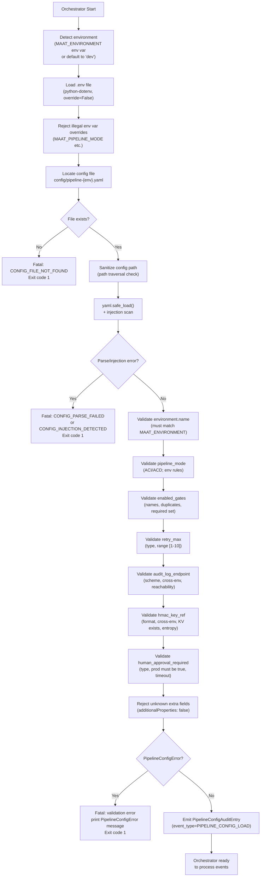

# Pipeline Application Configuration — Technical Specification

**Version**: 1.0
**Status**: Draft
**Language**: Python 3.10+, YAML config files, environment variables, python-dotenv
**Secrets Manager**: Azure Key Vault (production); GitHub Actions environment secrets (dev/staging)
**Related Issues**: #129 (Pipeline Configuration), Part of #13
**Related Specs**:
- `CONSTITUTION.md §2` — Deterministic Layer gate requirements
- `CONSTITUTION.md §3` — Human Approval Policy Primitive
- `CONSTITUTION.md §6` — Runaway Agent Prevention (retry limits)
- `CONSTITUTION.md §7` — Audit Trail requirement
- `specs/proof-chain-spec.md §3` — HMAC key entropy requirements
- `specs/proof-chain-spec.md §4` — Gate validation and ordering
- `specs/proof-chain-spec.md §6` — Human approval invariants
- `specs/proof-chain-spec.md §8` — PipelineConfig Python class
- `specs/audit-logging-spec.md` — Audit log data model and HMAC key management
- `specs/core-pipeline-infra-spec.md §2` — HMAC key infrastructure
- `specs/core-pipeline-infra-spec.md §5` — Human approval GitHub environment
- `specs/dre-config-spec.md` — DRE Configuration (structural reference)
- `docs/06-security-model.md` — Key management and prompt injection defences

<!-- Addresses EDGE-CFG-001 through EDGE-CFG-085 (issue #129) -->

---

## Overview

This specification defines the **environment-specific application configuration schema**
for the MaatProof ACI/ACD pipeline orchestrator. It governs how `pipeline_mode`,
`enabled_gates`, `retry_max`, `audit_log_endpoint`, `hmac_key_ref`, and
`human_approval_required` are declared and validated across development (`dev`),
UAT (`uat`), and production (`prod`) environments.

This spec is complementary to `specs/dre-config-spec.md` (which governs the DRE
multi-model committee configuration). Both specs must be satisfied for a complete
MaatProof deployment.

**Design constraints:**

1. **Secrets are never stored as plain text** in config files. `hmac_key_ref` holds a
   Key Vault URI or env-var name referencing the HMAC key — never the key material itself.
2. **Schema validation MUST complete before the orchestrator processes any event.**
   Invalid config causes a hard startup failure (`PipelineConfigError`), not degraded mode.
3. **Production config is immutable at runtime.** Hot-reload is disabled in `prod`.
4. **Every configuration load is recorded in the audit trail** per CONSTITUTION §7.
5. **Config files MUST be local files** — loading config from remote URLs is prohibited.

---

## §1 — Environment → Configuration Mapping

<!-- Addresses EDGE-CFG-015, EDGE-CFG-019, EDGE-CFG-021, EDGE-CFG-023, EDGE-CFG-033,
     EDGE-CFG-064, EDGE-CFG-065, EDGE-CFG-084 -->

Each environment MUST declare exactly one configuration file. The following
environment-specific invariants are enforced at startup:

| Environment | Config File | `pipeline_mode` | Required Gates | `human_approval_required` | Hot-Reload |
|---|---|---|---|---|---|
| `dev` | `config/pipeline-dev.yaml` | `ACI` | `lint`, `compile`, `security_scan` | `false` | ✅ Yes |
| `uat` | `config/pipeline-uat.yaml` | `ACD` | All 5 (CONSTITUTION §2) | `false` | ✅ Yes, round-boundary only |
| `prod` | `config/pipeline-prod.yaml` | `ACD` | All 5 (CONSTITUTION §2) | `true` | ❌ No |

> **Rule (EDGE-CFG-019):** A `prod` config that sets `pipeline_mode` to `ACI` is rejected
> at startup with `PipelineConfigError: prod requires pipeline_mode=ACD`.

> **Rule (EDGE-CFG-013):** A `prod` config that sets `human_approval_required: false` is
> rejected at startup with `PipelineConfigError: prod requires human_approval_required=true
> per CONSTITUTION §3`.

> **Rule (EDGE-CFG-028):** A config with `pipeline_mode: ACD` that omits any of the 5
> mandatory gates (`lint`, `compile`, `security_scan`, `artifact_sign`, `compliance`) from
> `enabled_gates` is rejected at startup with `PipelineConfigError: ACD mode requires all
> 5 CONSTITUTION §2 gates in enabled_gates`.

> **Rule (EDGE-CFG-015):** A config file for environment `X` that declares
> `environment.name: Y` (where `X ≠ Y`) is rejected with
> `PipelineConfigError: ENV_NAME_MISMATCH`.

> **Rule (EDGE-CFG-084):** The `environment.name` in the loaded config MUST match the
> `MAAT_ENVIRONMENT` environment variable. A mismatch is rejected with
> `PipelineConfigError: ENV_ROUTING_MISMATCH — config environment does not match
> MAAT_ENVIRONMENT. Possible config-routing attack.`

---

## §2 — Configuration File Format

<!-- Addresses EDGE-CFG-007, EDGE-CFG-016, EDGE-CFG-039, EDGE-CFG-041, EDGE-CFG-055,
     EDGE-CFG-056, EDGE-CFG-058, EDGE-CFG-059, EDGE-CFG-060, EDGE-CFG-070, EDGE-CFG-071 -->

Configuration is stored as **YAML** files (one per environment). YAML is loaded with
`yaml.safe_load()` to prevent Python object injection (see §5 — YAML Safety).

### §2.1 File Naming and Location

```
config/
  pipeline-dev.yaml     ← development environment
  pipeline-uat.yaml     ← UAT / staging environment
  pipeline-prod.yaml    ← production environment
```

**Rules:**
- All three files MUST be present in the repository. Absence of any file causes
  `PipelineConfigError: CONFIG_FILE_NOT_FOUND` at startup (EDGE-CFG-016).
- Config files MUST be UTF-8 encoded. UTF-16 or Latin-1 causes
  `PipelineConfigError: CONFIG_ENCODING_ERROR` (EDGE-CFG-071).
- Config files MUST NOT use tab indentation. YAML tabs cause
  `PipelineConfigError: CONFIG_PARSE_FAILED` (EDGE-CFG-070).
- Config files MUST be local filesystem paths only. Remote URL loading (e.g.,
  `http://`, `https://`) is rejected with
  `PipelineConfigError: REMOTE_CONFIG_PROHIBITED` (EDGE-CFG-060).
- Config files SHOULD have restrictive permissions (`chmod 0640` or tighter).
  The config loader MUST warn (not fail) if the file is world-readable
  (`PipelineConfigWarning: CONFIG_FILE_WORLD_READABLE`) (EDGE-CFG-058).

### §2.2 YAML Schema (Canonical)

```yaml
# pipeline-prod.yaml — Example production configuration
# hmac_key_ref values MUST NOT contain key material — reference only.

environment:
  name: "prod"                        # string; must be "dev" | "uat" | "prod"

pipeline:
  # pipeline_mode: execution mode for this environment.
  # "ACI" = Agents augment CI (agents review/reason; CI pipeline is primary)
  # "ACD" = Agents as primary workflow (agents orchestrate; trust anchor gates run)
  # prod MUST be "ACD". Allowed values: "ACI" | "ACD"
  pipeline_mode: "ACD"

  # enabled_gates: ordered list of deterministic gate names to register.
  # Must match [a-z_][a-z0-9_]* (snake_case). No duplicates.
  # For ACD mode: MUST include lint, compile, security_scan, artifact_sign, compliance.
  # For ACI mode: MUST include at minimum lint, compile, security_scan.
  enabled_gates:
    - "lint"
    - "compile"
    - "security_scan"
    - "artifact_sign"
    - "compliance"

  # retry_max: maximum number of agent fix-retry attempts before human escalation.
  # Maps to max_fix_retries in PipelineConfig Python class.
  # Range: [1, 10]. Default: 3 (CONSTITUTION §6).
  # Back-off: exponential, base=2s, max=60s (see §6 Back-off Policy).
  retry_max: 3

  # human_approval_required: whether a human must approve before production deploy.
  # prod MUST be true. uat and dev SHOULD be false.
  human_approval_required: true

  # human_approval_timeout_secs: seconds to wait for human approval before timeout.
  # Default: 86400 (24 hours). Configurable per environment.
  # Must be in range [300, 259200] (5 minutes to 3 days).
  human_approval_timeout_secs: 86400

audit:
  # audit_log_endpoint: endpoint for the audit log sink.
  # For dev: SQLite file path (e.g., "sqlite:///data/audit/audit.db")
  # For uat/prod: gRPC endpoint (e.g., "grpcs://audit.prod.maatproof.internal:50051")
  #              or Azure Files path (e.g., "azurefile:///data/audit/audit.db")
  # Must use an approved scheme: "sqlite://", "grpcs://", "azurefile://"
  # Plain "http://" is REJECTED. Plain "grpc://" (non-TLS) is REJECTED for uat/prod.
  # Cross-environment endpoint detection: "dev" in prod endpoint causes PipelineConfigError.
  audit_log_endpoint: "grpcs://audit.prod.maatproof.internal:50051"

  # hmac_key_ref: reference to the HMAC signing key for audit entries.
  # Format: "kv://{vault-name}/{secret-name}/{version}" (Azure Key Vault URI)
  #      OR "env://{ENV_VAR_NAME}" (environment variable reference, for dev/CI)
  # MUST NOT contain raw key material (detected by HARDCODED_SECRET_PATTERNS).
  # MUST reference the correct environment (dev key ref in prod config is rejected).
  # MUST reference an existing secret (validated at startup).
  hmac_key_ref: "kv://prod-pipeline-kv/pipeline-prod-hmac-key-v2"
```

### §2.3 Dev Config Example

```yaml
# pipeline-dev.yaml — Development environment
environment:
  name: "dev"

pipeline:
  pipeline_mode: "ACI"          # ACI: agents augment CI; not primary workflow in dev

  enabled_gates:
    - "lint"
    - "compile"
    - "security_scan"           # Minimum required gates for ACI mode

  retry_max: 3                  # Default; dev may use 1–10
  human_approval_required: false
  human_approval_timeout_secs: 3600   # Shorter for dev (1 hour)

audit:
  audit_log_endpoint: "sqlite:///data/audit/audit.db"
  hmac_key_ref: "env://MAAT_AUDIT_HMAC_KEY_1"  # Loaded from env var in dev/CI
```

### §2.4 UAT Config Example

```yaml
# pipeline-uat.yaml — UAT / staging environment
environment:
  name: "uat"

pipeline:
  pipeline_mode: "ACD"          # ACD: agents are primary workflow in UAT

  enabled_gates:
    - "lint"
    - "compile"
    - "security_scan"
    - "artifact_sign"           # All 5 required for ACD mode
    - "compliance"

  retry_max: 3
  human_approval_required: false  # No human approval required in UAT
  human_approval_timeout_secs: 86400

audit:
  audit_log_endpoint: "grpcs://audit.uat.maatproof.internal:50051"
  hmac_key_ref: "kv://uat-pipeline-kv/pipeline-uat-hmac-key-v1"
```

---

## §3 — Field Validation Rules

<!-- Addresses EDGE-CFG-001 through EDGE-CFG-018, EDGE-CFG-024 through EDGE-CFG-054 -->

### §3.1 `pipeline_mode` Validation

<!-- Addresses EDGE-CFG-001, EDGE-CFG-019, EDGE-CFG-020, EDGE-CFG-021 -->

```python
VALID_PIPELINE_MODES = frozenset({"ACI", "ACD"})

PIPELINE_MODE_ENV_RULES = {
    "dev":  frozenset({"ACI", "ACD"}),   # Both allowed in dev
    "uat":  frozenset({"ACD"}),           # Only ACD in UAT (agents are primary)
    "prod": frozenset({"ACD"}),           # Only ACD in prod (CONSTITUTION §8)
}

def validate_pipeline_mode(mode: object, environment: str) -> None:
    """
    Validate pipeline_mode field.

    <!-- Addresses EDGE-CFG-001, EDGE-CFG-019, EDGE-CFG-021 -->
    """
    if mode is None:
        raise PipelineConfigError(
            "pipeline.pipeline_mode is required. "
            "Must be one of: 'ACI' | 'ACD'. "
            "ACI = agents augment CI; ACD = agents as primary workflow. "
            "(Error: PIPELINE_MODE_MISSING)"
        )
    if not isinstance(mode, str):
        raise PipelineConfigError(
            f"pipeline.pipeline_mode must be a string, "
            f"got {type(mode).__name__!r} ({mode!r}). "
            "(Error: PIPELINE_MODE_INVALID_TYPE)"
        )
    mode_upper = mode.upper()
    if mode_upper not in VALID_PIPELINE_MODES:
        raise PipelineConfigError(
            f"pipeline.pipeline_mode {mode!r} is not valid. "
            f"Must be one of: {sorted(VALID_PIPELINE_MODES)}. "
            "(Error: PIPELINE_MODE_UNKNOWN)"
        )
    allowed = PIPELINE_MODE_ENV_RULES.get(environment, VALID_PIPELINE_MODES)
    if mode_upper not in allowed:
        raise PipelineConfigError(
            f"pipeline.pipeline_mode={mode!r} is not permitted for environment "
            f"{environment!r}. Allowed modes: {sorted(allowed)}. "
            f"{'prod and uat require ACD mode (agents as primary workflow) per CONSTITUTION §8.' if environment in ('uat', 'prod') else ''} "
            "(Error: PIPELINE_MODE_ENV_VIOLATION)"
        )
```

### §3.2 `enabled_gates` Validation

<!-- Addresses EDGE-CFG-002, EDGE-CFG-003, EDGE-CFG-024, EDGE-CFG-025, EDGE-CFG-027,
     EDGE-CFG-028, EDGE-CFG-029, EDGE-CFG-030 -->

```python
import re

GATE_NAME_PATTERN = re.compile(r"^[a-z_][a-z0-9_]*$")

# Minimum gate sets per mode (CONSTITUTION §2)
REQUIRED_GATES_BY_MODE = {
    "ACI": frozenset({"lint", "compile", "security_scan"}),
    "ACD": frozenset({"lint", "compile", "security_scan", "artifact_sign", "compliance"}),
}

# Minimum gate sets per environment (may overlap with mode rules)
REQUIRED_GATES_BY_ENV = {
    "dev":  frozenset({"lint", "compile", "security_scan"}),
    "uat":  frozenset({"lint", "compile", "security_scan", "artifact_sign", "compliance"}),
    "prod": frozenset({"lint", "compile", "security_scan", "artifact_sign", "compliance"}),
}

# Known valid gates (gates outside this set trigger a WARNING, not an error)
KNOWN_GATES = frozenset({
    "lint", "compile", "security_scan", "artifact_sign", "compliance",
    "reproducible_build", "sbom_check", "dependency_audit",
})

def validate_enabled_gates(
    gates: object,
    pipeline_mode: str,
    environment: str,
) -> None:
    """
    Validate enabled_gates list.

    <!-- Addresses EDGE-CFG-002, EDGE-CFG-003, EDGE-CFG-024, EDGE-CFG-025,
         EDGE-CFG-027, EDGE-CFG-028, EDGE-CFG-029, EDGE-CFG-030, EDGE-CFG-064 -->
    """
    if gates is None:
        raise PipelineConfigError(
            "pipeline.enabled_gates is required. "
            "Provide at least the minimum gate set for this environment. "
            "(Error: GATES_MISSING)"
        )
    if not isinstance(gates, list):
        raise PipelineConfigError(
            f"pipeline.enabled_gates must be a list, "
            f"got {type(gates).__name__!r}. "
            "(Error: GATES_INVALID_TYPE)"
        )
    # Empty list check (EDGE-CFG-002, CONSTITUTION §2)
    if len(gates) == 0:
        raise PipelineConfigError(
            "pipeline.enabled_gates must not be empty. "
            "An empty gate list is a configuration error — it would allow the "
            "deterministic trust anchor to be bypassed, violating CONSTITUTION §2. "
            "(Error: GATES_EMPTY)"
        )

    # Duplicate check (EDGE-CFG-003)
    seen = set()
    for gate in gates:
        if gate in seen:
            raise PipelineConfigError(
                f"pipeline.enabled_gates contains duplicate gate name: {gate!r}. "
                "Each gate name must be unique. "
                "(Error: GATES_DUPLICATE)"
            )
        seen.add(gate)

    for gate in gates:
        if gate is None:
            raise PipelineConfigError(
                "pipeline.enabled_gates contains a null entry. All entries must be strings. "
                "(Error: GATES_NULL_ENTRY)"
            )
        if not isinstance(gate, str):
            raise PipelineConfigError(
                f"pipeline.enabled_gates entry {gate!r} is not a string. "
                "(Error: GATES_INVALID_ENTRY_TYPE)"
            )
        # Gate name format (EDGE-CFG-029, EDGE-CFG-030)
        if not GATE_NAME_PATTERN.match(gate):
            raise PipelineConfigError(
                f"pipeline.enabled_gates entry {gate!r} does not match the gate name "
                "pattern [a-z_][a-z0-9_]* (snake_case). "
                "Gate names must be lowercase alphanumeric with underscores only. "
                "Examples: 'lint', 'security_scan', 'artifact_sign'. "
                "(Error: GATE_NAME_INVALID_FORMAT)"
            )
        # Unknown gate warning (EDGE-CFG-027)
        if gate not in KNOWN_GATES:
            import warnings
            warnings.warn(
                f"pipeline.enabled_gates entry {gate!r} is not in the known gate registry. "
                "If this is a custom gate, ensure it is registered before pipeline start. "
                "Unknown gates are NOT rejected at config parse time, but will cause "
                "GateFailureError at runtime if not registered.",
                PipelineConfigWarning,
                stacklevel=3,
            )

    # Required gates by mode (EDGE-CFG-028, EDGE-CFG-064)
    required_by_mode = REQUIRED_GATES_BY_MODE.get(pipeline_mode, frozenset())
    missing_from_mode = required_by_mode - set(gates)
    if missing_from_mode:
        raise PipelineConfigError(
            f"pipeline.enabled_gates is missing required gates for "
            f"pipeline_mode={pipeline_mode!r}: {sorted(missing_from_mode)}. "
            f"{'ACD mode requires all 5 CONSTITUTION §2 gates.' if pipeline_mode == 'ACD' else 'ACI mode requires at minimum lint, compile, security_scan.'} "
            "See CONSTITUTION.md §2. "
            "(Error: GATES_INSUFFICIENT_FOR_MODE)"
        )

    # Required gates by environment (EDGE-CFG-024, EDGE-CFG-025)
    required_by_env = REQUIRED_GATES_BY_ENV.get(environment, frozenset())
    missing_from_env = required_by_env - set(gates)
    if missing_from_env:
        raise PipelineConfigError(
            f"pipeline.enabled_gates is missing required gates for "
            f"environment={environment!r}: {sorted(missing_from_env)}. "
            "These gates are mandated by CONSTITUTION.md §2 and cannot be omitted "
            f"in {environment} deployments. "
            "(Error: GATES_INSUFFICIENT_FOR_ENV)"
        )
```

### §3.3 `retry_max` Validation

<!-- Addresses EDGE-CFG-004, EDGE-CFG-005, EDGE-CFG-006, EDGE-CFG-017, EDGE-CFG-031,
     EDGE-CFG-033 -->

```python
RETRY_MAX_RANGE = {
    "dev":  (1, 10),   # Any value in [1, 10]
    "uat":  (1, 10),   # Same
    "prod": (1, 10),   # Same — capped at 10 per CONSTITUTION §6
}

def validate_retry_max(retry_max: object, environment: str) -> None:
    """
    Validate retry_max (maps to max_fix_retries in PipelineConfig Python class).

    FIELD NAME MAPPING: The YAML field is named 'retry_max' for readability.
    It maps to PipelineConfig.max_fix_retries in the Python layer.
    Both names refer to the same concept: max agent fix-retry attempts before
    human escalation (CONSTITUTION §6).

    <!-- Addresses EDGE-CFG-004, EDGE-CFG-005, EDGE-CFG-006, EDGE-CFG-017,
         EDGE-CFG-031, EDGE-CFG-033 -->
    """
    if retry_max is None:
        raise PipelineConfigError(
            "pipeline.retry_max is required. "
            "Specify the maximum number of agent fix-retry attempts (range: [1, 10]). "
            "Default is 3 per CONSTITUTION §6. "
            "(Error: RETRY_MAX_MISSING)"
        )
    # Type coercion: accept int only (no string coercion — type safety)
    if isinstance(retry_max, bool):
        raise PipelineConfigError(
            f"pipeline.retry_max must be an integer, got bool ({retry_max!r}). "
            "(Error: RETRY_MAX_INVALID_TYPE)"
        )
    if isinstance(retry_max, str):
        raise PipelineConfigError(
            f"pipeline.retry_max must be an integer, got string {retry_max!r}. "
            "Write `retry_max: 3` (without quotes) in YAML. "
            "(Error: RETRY_MAX_STRING_TYPE)"
        )
    if not isinstance(retry_max, int):
        raise PipelineConfigError(
            f"pipeline.retry_max must be an integer, "
            f"got {type(retry_max).__name__!r} ({retry_max!r}). "
            "(Error: RETRY_MAX_INVALID_TYPE)"
        )
    min_val, max_val = RETRY_MAX_RANGE.get(environment, (1, 10))
    if retry_max < min_val:
        raise PipelineConfigError(
            f"pipeline.retry_max={retry_max} is below the minimum ({min_val}). "
            "retry_max=0 or negative values would disable agent retry entirely, "
            "causing all failures to immediately escalate to human review. "
            "If that is intentional, set retry_max=1 and configure human approval. "
            "(Error: RETRY_MAX_TOO_LOW)"
        )
    if retry_max > max_val:
        raise PipelineConfigError(
            f"pipeline.retry_max={retry_max} exceeds the maximum ({max_val}) "
            f"for environment {environment!r}. "
            "CONSTITUTION §6 caps retry loops at 10 to prevent runaway agent behavior. "
            "(Error: RETRY_MAX_TOO_HIGH)"
        )
```

### §3.4 `audit_log_endpoint` Validation

<!-- Addresses EDGE-CFG-007, EDGE-CFG-008, EDGE-CFG-009, EDGE-CFG-036,
     EDGE-CFG-037, EDGE-CFG-038, EDGE-CFG-039 -->

```python
from urllib.parse import urlparse

APPROVED_AUDIT_SCHEMES = frozenset({
    "sqlite",       # Local SQLite file (dev only)
    "grpcs",        # gRPC over TLS (uat/prod)
    "azurefile",    # Azure Files mount path (uat/prod)
})

# Schemes that require TLS (plain-text variants are rejected in uat/prod)
TLS_REQUIRED_SCHEMES = frozenset({"grpcs", "azurefile"})

CROSS_ENV_MARKERS = {
    "dev":  ["uat", "staging", "prod", "production"],
    "uat":  ["dev", "development", "prod", "production"],
    "prod": ["dev", "development", "uat", "staging"],
}

def validate_audit_log_endpoint(endpoint: object, environment: str) -> None:
    """
    Validate audit_log_endpoint field.

    <!-- Addresses EDGE-CFG-007, EDGE-CFG-008, EDGE-CFG-009, EDGE-CFG-036,
         EDGE-CFG-037, EDGE-CFG-038, EDGE-CFG-039 -->
    """
    if endpoint is None or endpoint == "":
        raise PipelineConfigError(
            "audit.audit_log_endpoint is required. "
            "Specify the audit log sink endpoint. "
            "Examples: 'sqlite:///data/audit/audit.db' (dev), "
            "'grpcs://audit.prod.maatproof.internal:50051' (prod). "
            "(Error: AUDIT_ENDPOINT_MISSING)"
        )
    if not isinstance(endpoint, str):
        raise PipelineConfigError(
            f"audit.audit_log_endpoint must be a string, "
            f"got {type(endpoint).__name__!r}. "
            "(Error: AUDIT_ENDPOINT_INVALID_TYPE)"
        )

    parsed = urlparse(endpoint)
    scheme = parsed.scheme.lower()

    # Scheme whitelist (EDGE-CFG-008, EDGE-CFG-039)
    if scheme not in APPROVED_AUDIT_SCHEMES:
        raise PipelineConfigError(
            f"audit.audit_log_endpoint scheme {scheme!r} is not approved. "
            f"Approved schemes: {sorted(APPROVED_AUDIT_SCHEMES)}. "
            "Plain 'http://' and 'grpc://' (non-TLS) are rejected because audit "
            "entries contain HMAC-signed data that must transit over encrypted channels. "
            "(Error: AUDIT_ENDPOINT_SCHEME_REJECTED)"
        )

    # SQLite only allowed in dev (EDGE-CFG-037)
    if scheme == "sqlite" and environment in ("uat", "prod"):
        raise PipelineConfigError(
            f"audit.audit_log_endpoint uses scheme 'sqlite://' in environment "
            f"{environment!r}. SQLite file endpoints are only permitted in dev. "
            "Use 'grpcs://' for UAT and prod to ensure audit durability and "
            "remote availability. "
            "(Error: AUDIT_ENDPOINT_SQLITE_IN_PROD)"
        )

    # Cross-environment endpoint detection (EDGE-CFG-036)
    for marker in CROSS_ENV_MARKERS.get(environment, []):
        if marker in endpoint.lower():
            raise PipelineConfigError(
                f"audit.audit_log_endpoint {endpoint!r} appears to reference a "
                f"different environment (found marker: {marker!r}) while loading "
                f"config for environment {environment!r}. "
                "Cross-environment audit endpoints risk mixing audit entries from "
                "different environments into the same log. "
                "(Error: AUDIT_ENDPOINT_CROSS_ENV)"
            )

    # Reachability check at startup (EDGE-CFG-038) — gRPC health check for grpcs://
    # This check runs AFTER all other validations pass.
    # Unreachable endpoint = PipelineConfigError: AUDIT_ENDPOINT_UNREACHABLE
    # (Actual implementation in _check_audit_endpoint_reachability())
```

**Reachability check at startup (EDGE-CFG-038):**

```python
import grpc

def _check_audit_endpoint_reachability(endpoint: str, environment: str) -> None:
    """
    For grpcs:// endpoints, attempt a health check at startup.
    Fail hard if unreachable in prod; warn in dev/uat.

    <!-- Addresses EDGE-CFG-038 -->
    """
    if not endpoint.startswith("grpcs://"):
        return  # SQLite and azurefile:// endpoints checked by OS/mount; not here

    host_port = endpoint.removeprefix("grpcs://")
    try:
        channel = grpc.secure_channel(host_port, grpc.ssl_channel_credentials())
        # Use gRPC health check protocol
        from grpc_health.v1 import health_pb2, health_pb2_grpc
        stub = health_pb2_grpc.HealthStub(channel)
        stub.Check(
            health_pb2.HealthCheckRequest(service=""),
            timeout=5.0
        )
    except grpc.RpcError as e:
        msg = (
            f"audit.audit_log_endpoint {endpoint!r} is unreachable at startup: {e}. "
            "The audit log endpoint must be reachable before the orchestrator "
            "starts processing events, to prevent audit gaps. "
            "(Error: AUDIT_ENDPOINT_UNREACHABLE)"
        )
        if environment == "prod":
            raise PipelineConfigError(msg)
        else:
            import warnings
            warnings.warn(msg, PipelineConfigWarning, stacklevel=3)
    finally:
        channel.close()
```

### §3.5 `hmac_key_ref` Validation

<!-- Addresses EDGE-CFG-010, EDGE-CFG-011, EDGE-CFG-041, EDGE-CFG-042, EDGE-CFG-043,
     EDGE-CFG-044, EDGE-CFG-046, EDGE-CFG-047, EDGE-CFG-069 -->

#### §3.5.1 `hmac_key_ref` Format

The `hmac_key_ref` field MUST use one of two formats:

| Format | Scheme | Example | Allowed Environments |
|--------|--------|---------|----------------------|
| Azure Key Vault URI | `kv://` | `kv://prod-pipeline-kv/pipeline-prod-hmac-key-v2` | All |
| Environment variable reference | `env://` | `env://MAAT_AUDIT_HMAC_KEY_1` | dev, CI |

The `kv://` format maps to the naming convention in `core-pipeline-infra-spec.md §2.2`:
```
kv://{vault-name}/{secret-name}[/{version}]
```

where `{secret-name}` follows `pipeline-{environment}-hmac-key-v{N}`.

> **Rule (EDGE-CFG-041, EDGE-CFG-046):** The Key Vault name in a `kv://` reference MUST
> contain the environment identifier (`dev`, `uat`, `staging`, or `prod`). A prod config
> referencing a dev vault (e.g., `kv://dev-pipeline-kv/...`) is rejected with
> `PipelineConfigError: HMAC_KEY_CROSS_ENV`.

```python
import re

KV_REF_PATTERN = re.compile(
    r"^kv://([a-zA-Z0-9-]+)/([a-zA-Z0-9-]+)(?:/([a-zA-Z0-9-]+))?$"
)
ENV_REF_PATTERN = re.compile(r"^env://([A-Z][A-Z0-9_]*)$")

# Patterns that indicate raw secret material (EDGE-CFG-010)
HARDCODED_KEY_PATTERNS = [
    re.compile(r"^[A-Za-z0-9+/]{40,}={0,2}$"),   # Base64-encoded key material
    re.compile(r"^[0-9a-fA-F]{64,}$"),             # Hex-encoded 32+ byte key
    re.compile(r"^-----BEGIN"),                     # PEM key material
    re.compile(r"^0x[0-9a-fA-F]{64,}$"),           # 0x-prefixed hex key
]

CROSS_ENV_VAULT_MARKERS = {
    "dev":  ["prod", "uat", "staging"],
    "uat":  ["prod", "dev"],
    "prod": ["dev", "uat", "staging"],
}

def validate_hmac_key_ref(key_ref: object, environment: str) -> None:
    """
    Validate hmac_key_ref field.

    <!-- Addresses EDGE-CFG-010, EDGE-CFG-011, EDGE-CFG-041, EDGE-CFG-042,
         EDGE-CFG-043, EDGE-CFG-046 -->
    """
    if key_ref is None or key_ref == "":
        raise PipelineConfigError(
            "audit.hmac_key_ref is required. "
            "Provide a Key Vault URI (kv://vault-name/secret-name) or "
            "environment variable reference (env://ENV_VAR_NAME). "
            "(Error: HMAC_KEY_REF_MISSING)"
        )
    if not isinstance(key_ref, str):
        raise PipelineConfigError(
            f"audit.hmac_key_ref must be a string, "
            f"got {type(key_ref).__name__!r}. "
            "(Error: HMAC_KEY_REF_INVALID_TYPE)"
        )

    # Detect hardcoded secret material (EDGE-CFG-010)
    for pattern in HARDCODED_KEY_PATTERNS:
        if pattern.match(key_ref):
            raise PipelineConfigError(
                f"audit.hmac_key_ref appears to contain raw HMAC key material "
                f"(matched pattern: {pattern.pattern!r}). "
                "hmac_key_ref must be a reference, not the key itself. "
                "Use kv://vault-name/secret-name or env://ENV_VAR_NAME. "
                "(Error: HMAC_KEY_REF_HARDCODED)"
            )

    # Format validation (EDGE-CFG-041)
    is_kv = KV_REF_PATTERN.match(key_ref)
    is_env = ENV_REF_PATTERN.match(key_ref)
    if not is_kv and not is_env:
        raise PipelineConfigError(
            f"audit.hmac_key_ref {key_ref!r} does not match a valid format. "
            "Valid formats: "
            "  kv://{vault-name}/{secret-name}[/{version}] (Azure Key Vault) "
            "  env://{ENV_VAR_NAME} (environment variable, dev/CI only) "
            "(Error: HMAC_KEY_REF_INVALID_FORMAT)"
        )

    # env:// only allowed in dev (not uat/prod) (EDGE-CFG-069)
    if is_env and environment in ("uat", "prod"):
        raise PipelineConfigError(
            f"audit.hmac_key_ref uses env:// scheme in environment {environment!r}. "
            "env:// references are only permitted in dev and CI environments. "
            "Use kv:// (Azure Key Vault) for UAT and prod. "
            "(Error: HMAC_KEY_REF_ENV_IN_PROD)"
        )

    # Cross-environment vault check (EDGE-CFG-043, EDGE-CFG-046)
    if is_kv:
        vault_name = is_kv.group(1).lower()
        secret_name = is_kv.group(2).lower()
        for marker in CROSS_ENV_VAULT_MARKERS.get(environment, []):
            if marker in vault_name or marker in secret_name:
                raise PipelineConfigError(
                    f"audit.hmac_key_ref {key_ref!r} appears to reference a "
                    f"different environment (found marker: {marker!r} in vault/secret name) "
                    f"while loading config for environment {environment!r}. "
                    "Each environment must use its own HMAC key. "
                    "(Error: HMAC_KEY_CROSS_ENV)"
                )

        # Verify secret exists at startup (EDGE-CFG-011, EDGE-CFG-042)
        _verify_kv_secret_exists(key_ref, environment)

    elif is_env:
        # Verify env var is set (EDGE-CFG-069)
        env_var_name = is_env.group(1)
        value = os.environ.get(env_var_name)
        if not value:
            raise PipelineConfigError(
                f"audit.hmac_key_ref references env var {env_var_name!r} which is not set. "
                "Set the environment variable before starting the orchestrator. "
                "(Error: HMAC_KEY_REF_ENV_NOT_SET)"
            )
        # Entropy check (EDGE-CFG-047)
        try:
            raw_key = bytes.fromhex(value) if all(c in '0123456789abcdefABCDEF' for c in value) else value.encode()
            if len(raw_key) < 32:
                raise PipelineConfigError(
                    f"audit.hmac_key_ref env var {env_var_name!r} resolved to a key of "
                    f"{len(raw_key)} bytes, which is below the 32-byte minimum. "
                    "See proof-chain-spec.md §3 for HMAC key entropy requirements. "
                    "(Error: HMAC_KEY_ENTROPY_LOW)"
                )
        except Exception:
            pass  # Key entropy check is best-effort for env:// refs


def _verify_kv_secret_exists(key_ref: str, environment: str) -> None:
    """
    Attempt to retrieve the HMAC key from Key Vault at startup.
    Fail hard if the secret does not exist or is inaccessible.

    <!-- Addresses EDGE-CFG-011, EDGE-CFG-042, EDGE-CFG-079 -->
    """
    from azure.keyvault.secrets import SecretClient
    from azure.identity import ManagedIdentityCredential
    from azure.core.exceptions import ResourceNotFoundError, HttpResponseError

    # Parse kv://vault-name/secret-name[/version]
    m = KV_REF_PATTERN.match(key_ref)
    vault_name, secret_name = m.group(1), m.group(2)
    version = m.group(3)  # May be None

    vault_url = f"https://{vault_name}.vault.azure.net"
    try:
        client = SecretClient(vault_url=vault_url, credential=ManagedIdentityCredential())
        secret = client.get_secret(secret_name, version=version)
        # Entropy check (EDGE-CFG-047)
        raw = secret.value.encode() if isinstance(secret.value, str) else secret.value
        if len(raw) < 32:
            raise PipelineConfigError(
                f"HMAC key retrieved from Key Vault ({key_ref!r}) has entropy "
                f"{len(raw)} bytes, below the 32-byte minimum. "
                "Provision a key with ≥ 32 bytes of entropy. "
                "(Error: HMAC_KEY_ENTROPY_LOW)"
            )
    except ResourceNotFoundError:
        raise PipelineConfigError(
            f"audit.hmac_key_ref {key_ref!r}: secret not found in Key Vault. "
            "Verify the vault name, secret name, and version are correct. "
            "If the secret was soft-deleted, restore it from Key Vault before starting. "
            "(Error: HMAC_KEY_REF_NOT_FOUND)"
        )
    except HttpResponseError as e:
        raise PipelineConfigError(
            f"audit.hmac_key_ref {key_ref!r}: Key Vault access error: {e}. "
            "Verify the orchestrator managed identity has 'Key Vault Secrets User' role "
            "on the vault. See core-pipeline-infra-spec.md §2.3. "
            "(Error: HMAC_KEY_KV_ACCESS_ERROR)"
        )
```

### §3.6 `human_approval_required` Validation

<!-- Addresses EDGE-CFG-012, EDGE-CFG-013, EDGE-CFG-014, EDGE-CFG-049,
     EDGE-CFG-050, EDGE-CFG-051, EDGE-CFG-052 -->

```python
HUMAN_APPROVAL_ENV_RULES = {
    "dev":  {"required": False, "enforce_true": False},   # False recommended, True allowed
    "uat":  {"required": False, "enforce_true": False},   # False per issue #129 AC
    "prod": {"required": True,  "enforce_true": True},    # True REQUIRED (CONSTITUTION §3)
}

def validate_human_approval_config(
    human_approval_required: object,
    human_approval_timeout_secs: object,
    environment: str,
) -> None:
    """
    Validate human_approval_required and human_approval_timeout_secs.

    <!-- Addresses EDGE-CFG-012, EDGE-CFG-013, EDGE-CFG-049, EDGE-CFG-050,
         EDGE-CFG-051, EDGE-CFG-052 -->
    """
    # --- human_approval_required ---
    if human_approval_required is None:
        # Apply environment default
        default = HUMAN_APPROVAL_ENV_RULES[environment]["required"]
        import warnings
        warnings.warn(
            f"pipeline.human_approval_required is not specified. "
            f"Defaulting to {default} for environment {environment!r}. "
            "Explicitly setting this field is recommended.",
            PipelineConfigWarning,
            stacklevel=3,
        )
        human_approval_required = default

    if not isinstance(human_approval_required, bool):
        raise PipelineConfigError(
            f"pipeline.human_approval_required must be a boolean (true/false), "
            f"got {type(human_approval_required).__name__!r} ({human_approval_required!r}). "
            "(Error: HUMAN_APPROVAL_INVALID_TYPE)"
        )

    # Enforce prod must be true (EDGE-CFG-013, CONSTITUTION §3)
    rule = HUMAN_APPROVAL_ENV_RULES.get(environment, {})
    if rule.get("enforce_true") and not human_approval_required:
        raise PipelineConfigError(
            f"pipeline.human_approval_required must be true for environment "
            f"{environment!r} per CONSTITUTION §3 and issue #129 acceptance criteria. "
            "Production deployments require human approval. "
            "(Error: HUMAN_APPROVAL_REQUIRED_IN_PROD)"
        )

    # --- human_approval_timeout_secs ---
    if human_approval_timeout_secs is None:
        human_approval_timeout_secs = 86400  # Default 24h
    if not isinstance(human_approval_timeout_secs, int) or isinstance(human_approval_timeout_secs, bool):
        raise PipelineConfigError(
            f"pipeline.human_approval_timeout_secs must be an integer, "
            f"got {type(human_approval_timeout_secs).__name__!r}. "
            "(Error: APPROVAL_TIMEOUT_INVALID_TYPE)"
        )
    if not (300 <= human_approval_timeout_secs <= 259200):
        raise PipelineConfigError(
            f"pipeline.human_approval_timeout_secs={human_approval_timeout_secs} "
            "is outside the allowed range [300, 259200] (5 minutes to 3 days). "
            "(Error: APPROVAL_TIMEOUT_OUT_OF_RANGE)"
        )
```

**Environment variable override prevention (EDGE-CFG-050):**

The following pipeline config fields MUST NOT be overrideable via environment variables:

| Environment Variable | Overrides | Rejected? |
|---|---|---|
| `MAAT_HUMAN_APPROVAL_REQUIRED` | `human_approval_required` | ✅ **Yes — rejected** |
| `MAAT_PIPELINE_MODE` | `pipeline_mode` | ✅ **Yes — rejected** |
| `MAAT_ENABLED_GATES` | `enabled_gates` | ✅ **Yes — rejected** |
| `MAAT_RETRY_MAX` | `retry_max` | ✅ **Yes — rejected** |
| `MAAT_ENVIRONMENT` | Environment selector | ✅ Yes (read-only; sets which config to load) |
| `MAAT_AUDIT_HMAC_KEY_*` | HMAC key value | ✅ Yes (allowed for env:// refs only) |
| `MAAT_AUDIT_LOG_ENDPOINT` | `audit_log_endpoint` | ✅ **Yes — rejected** |

```python
SECURITY_CRITICAL_ENV_VARS = {
    "MAAT_HUMAN_APPROVAL_REQUIRED": "pipeline.human_approval_required",
    "MAAT_PIPELINE_MODE": "pipeline.pipeline_mode",
    "MAAT_ENABLED_GATES": "pipeline.enabled_gates",
    "MAAT_RETRY_MAX": "pipeline.retry_max",
    "MAAT_AUDIT_LOG_ENDPOINT": "audit.audit_log_endpoint",
}

def _check_no_security_env_var_overrides() -> None:
    """
    Reject any attempt to override security-critical config fields via env vars.

    <!-- Addresses EDGE-CFG-050 -->
    """
    for env_var, config_field in SECURITY_CRITICAL_ENV_VARS.items():
        if os.environ.get(env_var) is not None:
            raise PipelineConfigError(
                f"Environment variable {env_var!r} attempts to override "
                f"security-critical config field {config_field!r}. "
                "Security-critical pipeline config fields can only be set in the "
                "YAML config file (where the full validation pipeline applies). "
                "(Error: ENV_VAR_OVERRIDE_REJECTED)"
            )
```

---

## §4 — YAML Injection and Path Security

<!-- Addresses EDGE-CFG-055, EDGE-CFG-056, EDGE-CFG-057, EDGE-CFG-060 -->

### §4.1 YAML Safe Loading

Pipeline config files MUST be parsed with `yaml.safe_load()`, not `yaml.load()`.

```python
import yaml
import pathlib

INJECTION_PATTERNS_IN_CONFIG = [
    re.compile(r"ignore.{0,20}(all|previous|your).{0,20}instructions", re.IGNORECASE),
    re.compile(r"you are now", re.IGNORECASE),
    re.compile(r"disregard", re.IGNORECASE),
    re.compile(r";\s*DROP\s+TABLE", re.IGNORECASE),
]

def _load_pipeline_yaml(path: str) -> dict:
    """
    Load a pipeline config file safely.

    <!-- Addresses EDGE-CFG-055, EDGE-CFG-057, EDGE-CFG-060, EDGE-CFG-070, EDGE-CFG-071 -->
    """
    # Remote URL prohibition (EDGE-CFG-060)
    if path.startswith(("http://", "https://", "ftp://")):
        raise PipelineConfigError(
            f"Config path {path!r} is a remote URL. "
            "Pipeline config files must be local filesystem paths only. "
            "(Error: REMOTE_CONFIG_PROHIBITED)"
        )

    try:
        with open(path, "r", encoding="utf-8") as f:
            content = f.read()
    except UnicodeDecodeError as exc:
        raise PipelineConfigError(
            f"Config file {path!r} is not valid UTF-8: {exc}. "
            "Pipeline config files must be UTF-8 encoded. "
            "(Error: CONFIG_ENCODING_ERROR)"
        )

    # Scan for injection patterns in raw config content (EDGE-CFG-057)
    for pattern in INJECTION_PATTERNS_IN_CONFIG:
        if pattern.search(content):
            raise PipelineConfigError(
                f"Config file {path!r} contains a suspected prompt injection pattern "
                f"(matched: {pattern.pattern!r}). "
                "Config files must not contain LLM prompt manipulation strings. "
                "(Error: CONFIG_INJECTION_DETECTED)"
            )

    try:
        result = yaml.safe_load(content)
    except yaml.YAMLError as exc:
        raise PipelineConfigError(
            f"Config file {path!r} has invalid YAML syntax: {exc}. "
            "(Error: CONFIG_PARSE_FAILED)"
        )

    if not isinstance(result, dict):
        raise PipelineConfigError(
            f"Config file {path!r} did not parse to a dict "
            f"(got {type(result).__name__!r}). "
            "The config file must be a YAML mapping at the top level. "
            "(Error: CONFIG_PARSE_FAILED)"
        )
    return result
```

### §4.2 Path Traversal Prevention

<!-- Addresses EDGE-CFG-056 -->

```python
def sanitize_pipeline_config_path(path: str, environment: str) -> str:
    """
    Resolve and validate the config file path.
    Prevents path traversal (e.g., ../../prod-config.yaml).

    <!-- Addresses EDGE-CFG-056 -->
    """
    config_base_dir = os.environ.get("MAAT_CONFIG_BASE_DIR", "config")
    config_base = pathlib.Path(config_base_dir).resolve()
    resolved = pathlib.Path(path).resolve()

    try:
        resolved.relative_to(config_base)
    except ValueError:
        raise PipelineConfigError(
            f"Config file path {path!r} resolves to {resolved!s} which is outside "
            f"the allowed config directory {config_base!s}. "
            "Path traversal is not permitted. "
            "(Error: CONFIG_PATH_TRAVERSAL)"
        )

    if not resolved.is_file():
        raise PipelineConfigError(
            f"Config file not found: {resolved!s}. "
            f"Expected config/pipeline-{environment}.yaml to exist. "
            "(Error: CONFIG_FILE_NOT_FOUND)"
        )

    # File permission warning (EDGE-CFG-058)
    import stat
    mode = resolved.stat().st_mode
    if mode & stat.S_IROTH:  # World-readable
        import warnings
        warnings.warn(
            f"Config file {resolved!s} is world-readable (mode {oct(mode)}). "
            "Restrict permissions to 0640 or tighter to limit exposure of key references.",
            PipelineConfigWarning,
            stacklevel=3,
        )

    return str(resolved)
```

---

## §5 — Startup Validation Flow

<!-- Addresses EDGE-CFG-065, EDGE-CFG-066 -->



**Critical constraint:** All validation MUST complete before the orchestrator processes
any event. Starting in a degraded mode with invalid configuration is not permitted
(EDGE-CFG-065). If startup validation fails, the process MUST exit with code 1.

---

## §6 — Runtime Safety

### §6.1 Hot-Reload Policy

<!-- Addresses EDGE-CFG-022, EDGE-CFG-023, EDGE-CFG-040, EDGE-CFG-053, EDGE-CFG-072, EDGE-CFG-073 -->

| Environment | Hot-Reload Allowed | Behaviour |
|---|---|---|
| `dev` | ✅ Yes | All sections reload on file change |
| `uat` | ✅ Yes, round-boundary only | Reload queued; applied after active pipeline run reaches terminal state (`DONE` / `IDLE`) |
| `prod` | ❌ No | Config is immutable after process start. Config changes require rolling restart. |

**Concurrent reload safety (EDGE-CFG-072, EDGE-CFG-073):**

```python
import threading

_pipeline_config_lock = threading.RLock()

def reload_pipeline_config(environment: str) -> "PipelineAppConfig":
    """Atomically reload and validate pipeline config. Thread-safe."""
    with _pipeline_config_lock:
        return PipelineAppConfig.load(environment)
```

**`audit_log_endpoint` hot-reload safety (EDGE-CFG-040):**

The `audit_log_endpoint` MUST NOT change during a hot-reload if any pipeline run is in
a non-IDLE state. Changing the audit endpoint mid-run would create a split audit trail,
breaking the hash-linked chain integrity (`audit-logging-spec.md §2`).

```python
def _check_audit_endpoint_immutable(new_config: "PipelineAppConfig", current_state: str) -> None:
    """
    During hot-reload, reject audit_log_endpoint changes if pipeline is active.

    <!-- Addresses EDGE-CFG-040 -->
    """
    if (current_config.audit_log_endpoint != new_config.audit_log_endpoint
            and current_state != "IDLE"):
        raise PipelineConfigError(
            f"audit.audit_log_endpoint cannot change during an active pipeline run "
            f"(current state: {current_state!r}). "
            "Changing the audit endpoint mid-run would create a split audit trail. "
            "Wait for the pipeline to return to IDLE state before reloading. "
            "(Error: AUDIT_ENDPOINT_HOT_CHANGE_BLOCKED)"
        )
```

**`human_approval_required` hot-reload safety (EDGE-CFG-053, EDGE-CFG-083):**

`human_approval_required` MUST NOT change during an active `AWAITING_APPROVAL` state.

```python
def _check_approval_config_immutable(
    new_config: "PipelineAppConfig", current_state: str
) -> None:
    """
    During hot-reload, reject human_approval_required changes in AWAITING_APPROVAL.

    <!-- Addresses EDGE-CFG-053, EDGE-CFG-083 -->
    """
    if (current_config.human_approval_required != new_config.human_approval_required
            and current_state == "AWAITING_APPROVAL"):
        raise PipelineConfigError(
            "pipeline.human_approval_required cannot change while the pipeline is in "
            "AWAITING_APPROVAL state. This would invalidate the pending approval request. "
            "Wait for the approval to complete or time out before reloading. "
            "(Error: APPROVAL_CONFIG_HOT_CHANGE_BLOCKED)"
        )
```

### §6.2 Back-off Policy for Retries

<!-- Addresses EDGE-CFG-034, EDGE-CFG-035 -->

When `retry_max` > 0 and an agent fix attempt fails, the orchestrator applies
**exponential back-off** before the next retry:

| Retry Attempt | Delay (seconds) | Formula |
|---|---|---|
| 1 | 2 | base=2, exp=0 |
| 2 | 4 | base=2, exp=1 |
| 3 | 8 | base=2, exp=2 |
| … | … | … |
| N | min(2^(N-1) * 2, 60) | Capped at 60s |

**Retry counter persistence across crash/restart (EDGE-CFG-035):**

The retry counter for each pipeline run is persisted in the audit log as metadata on
every `TEST_FAILED` → retry event. On orchestrator restart (see `core-pipeline-infra-spec.md §3.5`),
the retry count is recovered by counting `RETRY_ATTEMPT` audit entries for the current
`pipeline_id`. This prevents a crash-restart cycle from resetting the retry counter and
bypassing `retry_max`.

```python
def _recover_retry_count(pipeline_id: str, audit_log) -> int:
    """
    Recover retry count from audit log after restart.

    <!-- Addresses EDGE-CFG-035 -->
    """
    return sum(
        1 for entry in audit_log
        if entry.event == "RETRY_ATTEMPT"
        and entry.metadata.get("pipeline_id") == pipeline_id
    )
```

---

## §7 — Config Audit Trail

<!-- Addresses EDGE-CFG-066 -->

Every pipeline configuration load and reload event MUST be recorded in the
append-only audit log per CONSTITUTION §7.

```python
from dataclasses import dataclass

@dataclass
class PipelineConfigAuditEntry:
    """Audit record emitted whenever pipeline config is loaded or changed."""
    entry_id:               str    # UUID v4
    event_type:             str    # "PIPELINE_CONFIG_LOAD" | "PIPELINE_CONFIG_RELOAD" | "PIPELINE_CONFIG_ERROR"
    environment:            str    # "dev" | "uat" | "prod"
    config_file_path:       str    # Absolute path to config file
    config_file_hash:       str    # SHA-256 of config file contents (hex)
    pipeline_mode:          str    # "ACI" | "ACD"
    enabled_gates:          list   # Validated enabled_gates list
    human_approval_required: bool  # Validated human_approval_required
    hmac_key_ref_scheme:    str    # "kv" or "env" (NOT the full ref — no key material)
    timestamp:              float  # Unix timestamp
    error_message:          str    # Populated on PIPELINE_CONFIG_ERROR; empty otherwise
```

---

## §8 — Git Secret Scanning

<!-- Addresses EDGE-CFG-059 -->

Pre-commit and CI enforcement for pipeline config files:

1. **Pre-commit hook**: Before any commit, runs
   `python -m maatproof.config.validator --check-secrets` on all modified
   `config/pipeline-*.yaml` files. If raw key material is detected, the commit is blocked.

2. **CI scan** (`pipeline-config-validate` job): Every PR runs this job. It fails if
   any `config/pipeline-*.yaml` contains an `hmac_key_ref` that matches
   `HARDCODED_KEY_PATTERNS` (§3.5).

3. **`.env` files**: `.env.*` files MUST be listed in `.gitignore`. The CI pre-check
   job fails if any `.env.*` file (other than `.env.example`) is in the git index.

4. **Revocation on accidental commit**: If a key reference or key material is discovered
   in git history, treat as a Critical security incident: revoke the key, rotate all
   affected keys, rewrite git history via `git filter-repo`, and file an incident report.

---

## §9 — Pipeline Config Python Loader Reference

<!-- Addresses EDGE-CFG-065 -->

```python
from __future__ import annotations
from dataclasses import dataclass, field
from typing import List, Optional
import os

class PipelineConfigError(Exception):
    """Raised on invalid or dangerous pipeline configuration. Causes startup failure."""

class PipelineConfigWarning(UserWarning):
    """Non-fatal pipeline configuration warning."""

SUPPORTED_ENVIRONMENTS = frozenset({"dev", "uat", "prod"})

@dataclass
class PipelineAppConfig:
    """
    Validated pipeline application configuration for one environment.
    Construct via PipelineAppConfig.load(environment).
    """
    environment:                str
    pipeline_mode:              str        # "ACI" | "ACD"
    enabled_gates:              List[str]  # Validated gate names
    retry_max:                  int        # [1, 10]
    human_approval_required:    bool
    human_approval_timeout_secs: int       # [300, 259200]
    audit_log_endpoint:         str        # Validated URI
    hmac_key_ref:               str        # Validated key reference (no raw key)

    @classmethod
    def load(cls, environment: str) -> "PipelineAppConfig":
        """
        Load and validate pipeline config for the given environment.

        Raises:
            PipelineConfigError on validation failure (startup exits with code 1).
            ValueError if environment not in SUPPORTED_ENVIRONMENTS.
        """
        if environment not in SUPPORTED_ENVIRONMENTS:
            raise ValueError(
                f"Unknown pipeline environment {environment!r}. "
                f"Must be one of: {sorted(SUPPORTED_ENVIRONMENTS)}"
            )

        # Load .env file (python-dotenv, override=False)
        _load_pipeline_env_file(environment)

        # Reject illegal env var overrides of security-critical fields
        _check_no_security_env_var_overrides()

        # Locate and sanitize config path
        config_base = os.environ.get("MAAT_CONFIG_BASE_DIR", "config")
        config_path = os.path.join(config_base, f"pipeline-{environment}.yaml")
        safe_path = sanitize_pipeline_config_path(config_path, environment)

        # Load YAML safely (includes injection scan)
        raw = _load_pipeline_yaml(safe_path)

        return cls._validate(raw, environment, safe_path)

    @classmethod
    def _validate(cls, raw: dict, environment: str, config_path: str) -> "PipelineAppConfig":
        """Full validation of raw config dict."""
        env_section      = raw.get("environment", {})
        pipeline_section = raw.get("pipeline", {})
        audit_section    = raw.get("audit", {})

        # Environment name check (EDGE-CFG-015, EDGE-CFG-084)
        config_env = env_section.get("name", "")
        if config_env != environment:
            raise PipelineConfigError(
                f"Config file declares environment.name={config_env!r} but was loaded "
                f"for environment={environment!r}. "
                "(Error: ENV_NAME_MISMATCH)"
            )

        # Validate all fields
        mode = pipeline_section.get("pipeline_mode")
        validate_pipeline_mode(mode, environment)

        gates = pipeline_section.get("enabled_gates")
        validate_enabled_gates(gates, mode.upper() if mode else "ACI", environment)

        retry = pipeline_section.get("retry_max")
        validate_retry_max(retry, environment)

        audit_ep = audit_section.get("audit_log_endpoint")
        validate_audit_log_endpoint(audit_ep, environment)

        hmac_ref = audit_section.get("hmac_key_ref")
        validate_hmac_key_ref(hmac_ref, environment)

        human_approval = pipeline_section.get("human_approval_required")
        timeout = pipeline_section.get("human_approval_timeout_secs")
        validate_human_approval_config(human_approval, timeout, environment)

        # Reject unknown extra fields (EDGE-CFG-018)
        KNOWN_TOP_LEVEL = {"environment", "pipeline", "audit"}
        unknown = set(raw.keys()) - KNOWN_TOP_LEVEL
        if unknown:
            raise PipelineConfigError(
                f"Config file contains unknown top-level fields: {sorted(unknown)}. "
                "Only 'environment', 'pipeline', and 'audit' sections are permitted. "
                "(Error: CONFIG_UNKNOWN_FIELDS)"
            )

        # Apply defaults for optional fields
        if human_approval is None:
            human_approval = HUMAN_APPROVAL_ENV_RULES[environment]["required"]
        if timeout is None:
            timeout = 86400

        # Emit config load audit entry (EDGE-CFG-066)
        _emit_config_audit_entry(
            event_type="PIPELINE_CONFIG_LOAD",
            environment=environment,
            config_path=config_path,
            mode=mode.upper(),
            gates=gates,
            human_approval=human_approval,
            hmac_ref=hmac_ref,
        )

        return cls(
            environment=environment,
            pipeline_mode=mode.upper(),
            enabled_gates=gates,
            retry_max=retry,
            human_approval_required=human_approval,
            human_approval_timeout_secs=timeout,
            audit_log_endpoint=audit_ep,
            hmac_key_ref=hmac_ref,
        )
```

---

## §10 — Error Reference

<!-- Addresses EDGE-CFG-001 through EDGE-CFG-085 -->

| Error Code | Class | Description |
|---|---|---|
| `CONFIG_FILE_NOT_FOUND` | `PipelineConfigError` | Config file does not exist |
| `CONFIG_PATH_TRAVERSAL` | `PipelineConfigError` | Config path resolves outside allowed base dir |
| `CONFIG_PARSE_FAILED` | `PipelineConfigError` | YAML syntax error or encoding error |
| `CONFIG_ENCODING_ERROR` | `PipelineConfigError` | Config file is not valid UTF-8 |
| `CONFIG_INJECTION_DETECTED` | `PipelineConfigError` | Prompt injection pattern in config content |
| `CONFIG_UNKNOWN_FIELDS` | `PipelineConfigError` | Unknown top-level fields in config |
| `REMOTE_CONFIG_PROHIBITED` | `PipelineConfigError` | Config path is a remote URL |
| `ENV_NAME_MISMATCH` | `PipelineConfigError` | `environment.name` does not match requested env |
| `ENV_ROUTING_MISMATCH` | `PipelineConfigError` | Config env does not match `MAAT_ENVIRONMENT` |
| `ENV_VAR_OVERRIDE_REJECTED` | `PipelineConfigError` | Illegal env var override of security-critical field |
| `PIPELINE_MODE_MISSING` | `PipelineConfigError` | `pipeline_mode` field absent |
| `PIPELINE_MODE_UNKNOWN` | `PipelineConfigError` | `pipeline_mode` not in `{ACI, ACD}` |
| `PIPELINE_MODE_ENV_VIOLATION` | `PipelineConfigError` | `pipeline_mode` not allowed for this environment |
| `GATES_MISSING` | `PipelineConfigError` | `enabled_gates` field absent |
| `GATES_EMPTY` | `PipelineConfigError` | `enabled_gates` is an empty list |
| `GATES_DUPLICATE` | `PipelineConfigError` | Duplicate gate name in `enabled_gates` |
| `GATE_NAME_INVALID_FORMAT` | `PipelineConfigError` | Gate name does not match `[a-z_][a-z0-9_]*` |
| `GATES_INSUFFICIENT_FOR_MODE` | `PipelineConfigError` | Required gates for `pipeline_mode` missing |
| `GATES_INSUFFICIENT_FOR_ENV` | `PipelineConfigError` | Required gates for environment missing |
| `RETRY_MAX_MISSING` | `PipelineConfigError` | `retry_max` field absent |
| `RETRY_MAX_INVALID_TYPE` | `PipelineConfigError` | `retry_max` is not an integer |
| `RETRY_MAX_STRING_TYPE` | `PipelineConfigError` | `retry_max` is a string (write without quotes) |
| `RETRY_MAX_TOO_LOW` | `PipelineConfigError` | `retry_max` < 1 |
| `RETRY_MAX_TOO_HIGH` | `PipelineConfigError` | `retry_max` > 10 |
| `AUDIT_ENDPOINT_MISSING` | `PipelineConfigError` | `audit_log_endpoint` field absent |
| `AUDIT_ENDPOINT_INVALID_TYPE` | `PipelineConfigError` | `audit_log_endpoint` is not a string |
| `AUDIT_ENDPOINT_SCHEME_REJECTED` | `PipelineConfigError` | Non-TLS or unapproved URI scheme |
| `AUDIT_ENDPOINT_SQLITE_IN_PROD` | `PipelineConfigError` | SQLite endpoint used in uat/prod |
| `AUDIT_ENDPOINT_CROSS_ENV` | `PipelineConfigError` | Endpoint contains wrong environment marker |
| `AUDIT_ENDPOINT_UNREACHABLE` | `PipelineConfigError` | gRPC endpoint unreachable at startup (prod) |
| `AUDIT_ENDPOINT_HOT_CHANGE_BLOCKED` | `PipelineConfigError` | Endpoint change during active pipeline run |
| `HMAC_KEY_REF_MISSING` | `PipelineConfigError` | `hmac_key_ref` field absent |
| `HMAC_KEY_REF_INVALID_TYPE` | `PipelineConfigError` | `hmac_key_ref` is not a string |
| `HMAC_KEY_REF_HARDCODED` | `PipelineConfigError` | Raw key material detected in `hmac_key_ref` |
| `HMAC_KEY_REF_INVALID_FORMAT` | `PipelineConfigError` | `hmac_key_ref` does not match `kv://` or `env://` |
| `HMAC_KEY_REF_ENV_IN_PROD` | `PipelineConfigError` | `env://` reference in uat/prod |
| `HMAC_KEY_CROSS_ENV` | `PipelineConfigError` | Key ref references wrong-env vault/secret |
| `HMAC_KEY_REF_NOT_FOUND` | `PipelineConfigError` | Key Vault secret not found |
| `HMAC_KEY_KV_ACCESS_ERROR` | `PipelineConfigError` | Key Vault access error (RBAC/network) |
| `HMAC_KEY_REF_ENV_NOT_SET` | `PipelineConfigError` | Referenced env var not set |
| `HMAC_KEY_ENTROPY_LOW` | `PipelineConfigError` | Resolved HMAC key entropy < 32 bytes |
| `HUMAN_APPROVAL_INVALID_TYPE` | `PipelineConfigError` | `human_approval_required` not boolean |
| `HUMAN_APPROVAL_REQUIRED_IN_PROD` | `PipelineConfigError` | `human_approval_required: false` in prod |
| `APPROVAL_TIMEOUT_INVALID_TYPE` | `PipelineConfigError` | Timeout not an integer |
| `APPROVAL_TIMEOUT_OUT_OF_RANGE` | `PipelineConfigError` | Timeout outside [300, 259200] |
| `APPROVAL_CONFIG_HOT_CHANGE_BLOCKED` | `PipelineConfigError` | `human_approval_required` change during AWAITING_APPROVAL |

---

## §11 — Validation Rules Summary

| Scenario | EDGE ID | Coverage | Spec Section |
|----------|---------|---------|-------------|
| `pipeline_mode` unknown value | EDGE-CFG-001 | ✅ | §3.1 |
| `enabled_gates` is empty | EDGE-CFG-002 | ✅ | §3.2 |
| `enabled_gates` duplicate name | EDGE-CFG-003 | ✅ | §3.2 |
| `retry_max` = 0 | EDGE-CFG-004 | ✅ | §3.3 |
| `retry_max` = -1 | EDGE-CFG-005 | ✅ | §3.3 |
| `retry_max` = 1000 | EDGE-CFG-006 | ✅ | §3.3 |
| `audit_log_endpoint` missing | EDGE-CFG-007 | ✅ | §3.4 |
| `audit_log_endpoint` = `http://` | EDGE-CFG-008 | ✅ | §3.4 |
| `audit_log_endpoint` = raw IP | EDGE-CFG-009 | ✅ | §3.4 (scheme validation) |
| `hmac_key_ref` contains literal key | EDGE-CFG-010 | ✅ | §3.5 |
| `hmac_key_ref` refs non-existent secret | EDGE-CFG-011 | ✅ | §3.5.1 |
| `human_approval_required` missing | EDGE-CFG-012 | ✅ | §3.6 |
| `human_approval_required: false` in prod | EDGE-CFG-013 | ✅ | §3.6 |
| `human_approval_required: true` in dev | EDGE-CFG-014 | ✅ | §3.6 (allowed; warned) |
| Env name mismatch (prod config says uat) | EDGE-CFG-015 | ✅ | §1, §9 |
| UAT config file missing | EDGE-CFG-016 | ✅ | §2.1 |
| `retry_max: "3"` (string type) | EDGE-CFG-017 | ✅ | §3.3 |
| Unknown extra config fields | EDGE-CFG-018 | ✅ | §9 |
| `pipeline_mode: ACI` in prod | EDGE-CFG-019 | ✅ | §1, §3.1 |
| `pipeline_mode: ACD` in dev | EDGE-CFG-020 | ✅ | §3.1 (allowed) |
| `pipeline_mode` missing | EDGE-CFG-021 | ✅ | §3.1 |
| Mode toggle while in-flight | EDGE-CFG-022 | ✅ | §6.1 (round-boundary reload) |
| Hot-reload in prod | EDGE-CFG-023 | ✅ | §6.1 |
| Prod `enabled_gates` omits `compliance` | EDGE-CFG-024 | ✅ | §3.2 |
| Prod `enabled_gates` omits `artifact_sign` | EDGE-CFG-025 | ✅ | §3.2 |
| Dev `enabled_gates` includes `artifact_sign` | EDGE-CFG-026 | ✅ | §3.2 (allowed) |
| Unknown gate name `"fuzz_test"` | EDGE-CFG-027 | ✅ | §3.2 (warning) |
| ACD mode with insufficient gates | EDGE-CFG-028 | ✅ | §3.2 |
| Gate name uses hyphen | EDGE-CFG-029 | ✅ | §3.2 |
| Gate name SQL injection | EDGE-CFG-030 | ✅ | §3.2 (regex validation) |
| `retry_max` vs `max_fix_retries` naming | EDGE-CFG-031 | ✅ | §3.3 (mapping documented) |
| Retry storm exhausts API limits | EDGE-CFG-032 | Partial | §6.2 back-off; rate-limit integration tracked separately |
| Per-env `retry_max` range | EDGE-CFG-033 | ✅ | §3.3 |
| No back-off spec | EDGE-CFG-034 | ✅ | §6.2 |
| Retry counter lost on crash/restart | EDGE-CFG-035 | ✅ | §6.2 |
| `audit_log_endpoint` cross-env | EDGE-CFG-036 | ✅ | §3.4 |
| `audit_log_endpoint` public URL | EDGE-CFG-037 | ✅ | §3.4 (private-endpoint guidance) |
| `audit_log_endpoint` unreachable at startup | EDGE-CFG-038 | ✅ | §3.4 |
| URI scheme whitelist | EDGE-CFG-039 | ✅ | §3.4 |
| `audit_log_endpoint` hot-reload mid-run | EDGE-CFG-040 | ✅ | §6.1 |
| `hmac_key_ref` format not defined | EDGE-CFG-041 | ✅ | §3.5.1 |
| `hmac_key_ref` soft-deleted KV secret | EDGE-CFG-042 | ✅ | §3.5.1 |
| `hmac_key_ref` cross-env | EDGE-CFG-043 | ✅ | §3.5.1 |
| HMAC key rotation lag | EDGE-CFG-044 | ✅ | §3.5.1 + `proof-chain-spec.md §3` |
| Dual active key versions | EDGE-CFG-045 | ✅ | §3.5.1 + `audit-logging-spec.md §3.2` |
| Same `hmac_key_ref` across envs | EDGE-CFG-046 | ✅ | §3.5.1 |
| HMAC key entropy < 32 bytes | EDGE-CFG-047 | ✅ | §3.5.1 |
| Over-broad RBAC on KV | EDGE-CFG-048 | ✅ | §3.5.1 + `core-pipeline-infra-spec.md §2.3` |
| `human_approval_required=true` but no interface | EDGE-CFG-049 | ✅ | §3.6 (warning at startup) |
| Env var override of `human_approval_required` | EDGE-CFG-050 | ✅ | §3.6 |
| Approval timeout not in config | EDGE-CFG-051 | ✅ | §3.6 (default 86400s) |
| UAT has `human_approval_required: true` | EDGE-CFG-052 | ✅ | §3.6 (allowed with warning) |
| `human_approval_required` hot-reload mid-approval | EDGE-CFG-053 | ✅ | §6.1 |
| Multi-approver count not in config | EDGE-CFG-054 | Partial | `core-pipeline-infra-spec.md §5.1`; multi-approver count tracked separately |
| YAML injection in config | EDGE-CFG-055 | ✅ | §4.1 |
| Path traversal in config path | EDGE-CFG-056 | ✅ | §4.2 |
| Injection pattern in config value | EDGE-CFG-057 | ✅ | §4.1 |
| Config file world-readable | EDGE-CFG-058 | ✅ | §4.2 (warning) |
| Config committed to git | EDGE-CFG-059 | ✅ | §8 |
| Config loaded from remote URL | EDGE-CFG-060 | ✅ | §4.1 |
| Cross-tenant config | EDGE-CFG-061 | ✅ | §1 (env binding) + `core-pipeline-infra-spec.md §7.3` |
| Shared `hmac_key_ref` across tenants | EDGE-CFG-062 | ✅ | §3.5.1 + `core-pipeline-infra-spec.md §2.3` |
| Shared `audit_log_endpoint` across tenants | EDGE-CFG-063 | ✅ | §3.4 + `core-pipeline-infra-spec.md §7.3` |
| Prod `enabled_gates: [lint]` | EDGE-CFG-064 | ✅ | §3.2 |
| Config not validated at startup | EDGE-CFG-065 | ✅ | §5 |
| Config load not audited | EDGE-CFG-066 | ✅ | §7 |
| Config change without human approval | EDGE-CFG-067 | Partial | Tracked as separate issue; complex governance requirement |
| CI ACD + no human approval | EDGE-CFG-068 | ✅ | §1 (CI env uses dev config) |
| GH Actions secret not injected | EDGE-CFG-069 | ✅ | §3.5.1 |
| YAML tabs | EDGE-CFG-070 | ✅ | §2.1, §4.1 |
| UTF-16 config file | EDGE-CFG-071 | ✅ | §2.1, §4.1 |
| Concurrent reload | EDGE-CFG-072 | ✅ | §6.1 |
| Concurrent config file write | EDGE-CFG-073 | ✅ | §6.1 (RLock) |
| HMAC key exfiltrated via IAM | EDGE-CFG-074 | ✅ | §3.5.1 + `core-pipeline-infra-spec.md §2.3` |
| Fabricated `hmac_key_ref` in trace JSON | EDGE-CFG-075 | Partial | AVM trace verification tracked separately |
| LLM injection in `pipeline_mode` value | EDGE-CFG-076 | ✅ | §4.1 |
| Dev DRE config used for prod consensus | EDGE-CFG-077 | ✅ | §1 (env binding) + `dre-config-spec.md §1` |
| `enabled_gates` excludes `artifact_sign` — contract bypass | EDGE-CFG-078 | ✅ | §3.2 (startup validation prevents this) |
| `hmac_key_ref` points to deleted KV | EDGE-CFG-079 | ✅ | §3.5.1 |
| Dev config replayed as prod proof | EDGE-CFG-080 | ✅ | §1 + `proof-chain-spec.md §2` |
| Sybil config-change PR flood | EDGE-CFG-081 | Partial | Rate limiting on PR creation tracked separately |
| LLM hallucinates `enabled_gates` in trace | EDGE-CFG-082 | Partial | AVM deterministic replay tracked separately |
| `human_approval_required` toggle during approval | EDGE-CFG-083 | ✅ | §6.1 |
| Dev config routed to prod pipeline | EDGE-CFG-084 | ✅ | §1 |
| Audit endpoint unreachable during write | EDGE-CFG-085 | ✅ | §3.4 + `proof-chain-spec.md §7` |

---

## References

- Issue #129 — Pipeline Configuration
- Issue #13 — ACI/ACD Engine Core Pipeline (parent)
- Issue #125 — Infrastructure / IaC (blocked-by)
- `CONSTITUTION.md §2` — Deterministic Layer gate requirements
- `CONSTITUTION.md §3` — Human Approval Policy Primitive
- `CONSTITUTION.md §6` — Runaway Agent Prevention
- `CONSTITUTION.md §7` — Audit Trail
- `specs/proof-chain-spec.md §3` — HMAC key entropy
- `specs/proof-chain-spec.md §4` — Gate validation
- `specs/proof-chain-spec.md §6` — Human approval invariants
- `specs/proof-chain-spec.md §8` — PipelineConfig Python class
- `specs/audit-logging-spec.md §3.2` — HMAC key versioning
- `specs/core-pipeline-infra-spec.md §2` — HMAC key infrastructure
- `specs/core-pipeline-infra-spec.md §5` — Human approval GitHub environment
- `specs/dre-config-spec.md` — DRE Configuration (structural reference)
- `docs/06-security-model.md` — Key management and prompt injection defences
