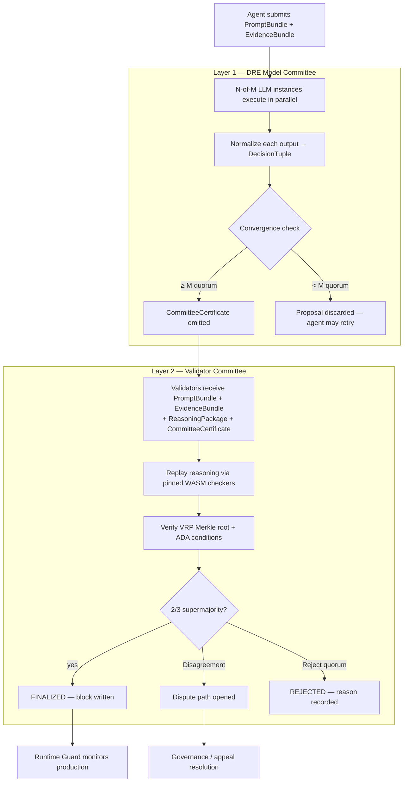
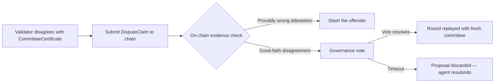

# Proof-of-Deploy Consensus — Technical Specification

## Overview

This document specifies the PoD consensus protocol in detail: two-layer consensus architecture, validator set management, round lifecycle state machine, quorum computation, finality guarantees, and economic incentives.

**Implementation language**: Rust (consensus engine)  
**Transport**: gRPC  
**Finality**: Deterministic (BFT)  
**Layer 1 quorum**: N-of-M LLM model committee (DRE convergence)  
**Layer 2 quorum**: 2/3 stake-weighted supermajority (validator committee)  

---

## Two-Layer Consensus Architecture

PoD uses a two-layer consensus model introduced in whitepaper §3.6. Layer 1 produces
a deterministic decision tuple; Layer 2 verifies the reasoning package that produced it.



### Layer 1: DRE Model Committee

The DRE (Deterministic Reasoning Engine) runs N-of-M identical LLM instances against a
canonical `PromptBundle`. Determinism is a system property of the canonicalization +
quorum — not a property of any single LLM call.

```rust
/// Canonical serialization of all deployment context — content-addressed.
#[derive(Serialize, Deserialize, Clone, Debug)]
pub struct PromptBundle {
    pub bundle_id:        [u8; 32],   // SHA-256 of canonical serialization
    pub agent_id:         String,     // submitting agent DID
    pub system_prompt:    String,     // pinned system prompt version
    pub deployment_ctx:   DeploymentContext,
    pub policy_ref:       [u8; 32],   // content-address of DeploymentContract
    pub evidence_root:    [u8; 32],   // Merkle root of EvidenceBundle
    pub dre_epoch_key:    [u8; 32],   // epoch key for seed derivation
    pub created_at:       i64,        // Unix timestamp
}

/// Content-addressed collection of all deployment artifacts.
#[derive(Serialize, Deserialize, Clone, Debug)]
pub struct EvidenceBundle {
    pub bundle_id:     [u8; 32],
    pub artifacts:     Vec<ArtifactRef>,   // (path, sha256, ipfs_cid) tuples
    pub test_results:  Vec<TestResultRef>,
    pub scan_reports:  Vec<ScanReportRef>,
    pub git_ref:       GitRef,
    pub build_env:     BuildEnv,
}

/// Normalized decision output from a single LLM instance.
#[derive(Serialize, Deserialize, Clone, Debug, PartialEq)]
pub struct DecisionTuple {
    pub deploy:          bool,
    pub risk_score:      u8,           // 0–100, deterministic function
    pub blocking_issues: Vec<String>,
    pub reasoning_root:  [u8; 32],     // Merkle root of VRP ReasoningRecord set
}

/// Certificate issued when ≥ M instances reach the same DecisionTuple.
#[derive(Serialize, Deserialize, Clone, Debug)]
pub struct CommitteeCertificate {
    pub bundle_id:        [u8; 32],
    pub decision:         DecisionTuple,
    pub quorum_size:      u8,           // M in N-of-M
    pub instance_sigs:    Vec<InstanceAttestation>,
    pub epoch:            u64,
    pub issued_at:        i64,
}

#[derive(Serialize, Deserialize, Clone, Debug)]
pub struct InstanceAttestation {
    pub instance_id:  String,
    pub model_id:     String,          // pinned model version
    pub decision:     DecisionTuple,
    pub signature:    [u8; 64],        // Ed25519 over decision
}
```

### Layer 2: Validator Committee

Validators receive the full reasoning package from Layer 1 and replay it using
pinned WASM checkers from the on-chain checker registry. A validator disagreement
triggers the **dispute path** — it does **not** automatically slash.

```rust
/// Full package passed from Layer 1 to Layer 2 validators.
#[derive(Serialize, Deserialize, Clone, Debug)]
pub struct ValidatorInputPackage {
    pub prompt_bundle:        PromptBundle,
    pub evidence_bundle:      EvidenceBundle,
    pub reasoning_package:    ReasoningPackage,  // from VRP spec
    pub committee_cert:       CommitteeCertificate,
    pub ada_conditions:       AdaConditionSet,   // from ADA spec
}
```

### Dispute Path

When validators disagree with the DRE committee decision, a dispute is opened — the
chain does **not** auto-slash. Slashing requires an **objectively proven** malicious or
incorrect attestation (e.g., a validator signed a vote that contradicts on-chain
evidence; a DRE instance submitted a tampered reasoning root).



```rust
#[derive(Serialize, Deserialize, Clone, Debug)]
pub struct DisputeClaim {
    pub round_id:         String,
    pub claimant_id:      String,    // validator DID
    pub disputed_cert:    [u8; 32], // CommitteeCertificate hash
    pub evidence:         Vec<[u8; 32]>,  // on-chain artifact hashes
    pub claim_type:       DisputeClaimType,
    pub signature:        [u8; 64],
}

#[derive(Serialize, Deserialize, Clone, Debug)]
pub enum DisputeClaimType {
    TamperedReasoningRoot,
    PolicyViolationNotFlagged,
    CVENotFlagged { cve_id: String },
    RiskScoreMiscalculated { expected: u8, got: u8 },
    GoodFaithDisagreement,
}
```

---

## Validator Set

### Validator Registration

Validators register on-chain by:
1. Staking a minimum of 100,000 $MAAT
2. Registering their node DID and Ed25519 public key
3. Passing a liveness check (must be online and responsive)

Validator set is updated at the start of each **epoch** (every 1000 blocks). Validators that go offline mid-epoch are marked as `INACTIVE` and excluded from quorum computation.

### Stake-Weighted Quorum

Quorum is computed by stake weight, not validator count:

```
finalize_threshold = total_active_stake * 2 / 3 + 1

finalize if: sum(stake[v] for v in FINALIZE_votes) >= finalize_threshold
reject    if: sum(stake[v] for v in REJECT_votes)   >= finalize_threshold
```

If neither threshold is reached within the round timeout, the proposal is discarded (not rejected — the agent may resubmit).

---

## Round Lifecycle

Each consensus round processes one deployment proposal.

### State Diagram

```mermaid
stateDiagram-v2
    [*] --> IDLE

    IDLE --> PROPOSED : Agent submits PromptBundle + EvidenceBundle
    PROPOSED --> DRE_EXECUTING : DRE epoch started; N instances run in parallel
    DRE_EXECUTING --> DRE_CONVERGED : ≥ M instances agree on DecisionTuple
    DRE_EXECUTING --> DISCARDED : Convergence timeout / no quorum
    DRE_CONVERGED --> DISTRIBUTING : CommitteeCertificate emitted; round leader selected (VRF)
    DISTRIBUTING --> VERIFYING : ValidatorInputPackage distributed to all validators
    VERIFYING --> VOTING : Validators complete VRP replay + ADA condition check
    VOTING --> TALLYING : Round timeout or all votes received
    TALLYING --> FINALIZED : FINALIZE supermajority reached
    TALLYING --> DISPUTED : Validator(s) submitted DisputeClaim
    TALLYING --> REJECTED : REJECT supermajority reached
    TALLYING --> DISCARDED : Timeout / no supermajority
    DISPUTED --> GOVERNANCE : Good-faith disagreement → governance vote
    DISPUTED --> SLASHED : Provably malicious attestation → slash
    GOVERNANCE --> DISCARDED : Round replayed or proposal dropped
    FINALIZED --> [*]
    REJECTED --> [*]
    DISCARDED --> [*]

    note right of DRE_EXECUTING : N-of-M LLM instances\nSeeds from HMAC-SHA256\n(bundle_id, epoch_key)
    note right of VERIFYING : Validators replay via\npinned WASM checkers\nTimeout: 20s
```

### Round Phases

| Phase | Duration | Description |
|---|---|---|
| `PROPOSED` | — | Agent submits signed PromptBundle + EvidenceBundle to mempool |
| `DRE_EXECUTING` | 30s | N LLM instances run in parallel; seeds derived from HMAC-SHA256(bundle_id, epoch_key) |
| `DRE_CONVERGED` | — | ≥ M instances agree; CommitteeCertificate emitted |
| `DISTRIBUTING` | 2s | Round leader distributes ValidatorInputPackage to all active validators |
| `VERIFYING` | 20s | Validators replay reasoning via pinned WASM checkers; evaluate ADA conditions |
| `VOTING` | 10s | Validators submit signed votes with reasoning_root confirmation |
| `TALLYING` | 2s | Leader computes stake-weighted quorum; handles any DisputeClaims |
| `FINALIZED/REJECTED` | — | Terminal state; block written or rejection recorded |

Total round duration: ~64 seconds worst case (DRE + validator layers).

---

## Vote Structure

```rust
#[derive(Serialize, Deserialize, Clone, Debug)]
pub enum VoteDecision {
    Finalize,
    Reject { reason: String },
    Dispute { claim: DisputeClaim },
}

#[derive(Serialize, Deserialize, Clone, Debug)]
pub struct ValidatorVote {
    pub round_id:              String,       // proposal ID
    pub validator_id:          String,       // DID
    pub decision:              VoteDecision,
    pub prompt_bundle_hash:    [u8; 32],     // must match PromptBundle.bundle_id
    pub committee_cert_hash:   [u8; 32],     // must match CommitteeCertificate hash
    pub reasoning_root:        [u8; 32],     // VRP Merkle root validator verified
    pub ada_conditions_met:    bool,
    pub policy_result:         PolicyResult,
    pub timestamp:             DateTime<Utc>,
    pub signature:             [u8; 64],     // Ed25519 over vote contents
}
```

---

## Round Leader Selection

The round leader is selected deterministically using a Verifiable Random Function (VRF):

```
leader_seed = hash(epoch_seed || block_height || proposal_id)
leader      = validators[leader_seed % len(validators)]
              weighted by stake
```

This prevents leader manipulation while keeping selection verifiable by all participants.

---

## Finality Guarantees

MaatProof provides **deterministic finality** (no forks):

- Once a block is finalized, it cannot be reverted
- Byzantine fault tolerance: system tolerates up to `f < n/3` malicious validators (by stake weight)
- A malicious actor controlling >2/3 of staked validator weight could approve invalid deployments — but would be subject to 100% slash, making this economically irrational if the slash value exceeds the attacker's gain

---

## Validator Rewards

Rewards are distributed at block finalization:

```rust
pub fn compute_validator_reward(
    base_block_reward: u128,   // in $MAAT (wei)
    validator_stake: u128,
    total_active_stake: u128,
    participation_rate: f64,   // 0.0 - 1.0, recent round participation
) -> u128 {
    let stake_share = validator_stake as f64 / total_active_stake as f64;
    let reward = base_block_reward as f64 * stake_share * participation_rate;
    reward as u128
}
```

Validators who vote on the minority side (REJECT when block is finalized, or FINALIZE when rejected) receive no reward for that round.

---

## Slashing Integration

Slashing events are triggered by the `Slashing.sol` contract and processed by the consensus engine:

| Event | Trigger | Slash |
|---|---|---|
| Double-vote | Validator submits two different votes for same round | 100% stake |
| Tampered reasoning root | Validator signs a `reasoning_root` that doesn't match on-chain VRP Merkle root | 50% stake |
| Invalid committee cert | Validator signs FINALIZE against a cert later proven tampered | 50% stake |
| Collusion | ≥2/3 validators approve provably-invalid deployment | 100% each |
| Liveness failure | >10% missed rounds in current epoch | 5% stake |
| **Good-faith disagreement** | Validator raises DisputeClaim; claim assessed as good-faith | **No slash — dispute path** |

---

## gRPC API

```protobuf
service PoDConsensus {
  // Layer 1: DRE
  rpc SubmitPromptBundle   (PromptBundleRequest)   returns (BundleAck);
  rpc GetCommitteeCert     (CertRequest)            returns (CommitteeCertificate);

  // Layer 2: Validator
  rpc SubmitVote           (ValidatorVote)          returns (VoteAck);
  rpc SubmitDisputeClaim   (DisputeClaim)           returns (DisputeAck);
  rpc GetRoundStatus       (RoundStatusRequest)     returns (RoundStatus);
  rpc GetFinalizedBlock    (BlockRequest)           returns (FinalizedBlock);
  rpc StreamRounds         (StreamRequest)          returns (stream RoundEvent);
  rpc GetDisputeStatus     (DisputeRequest)         returns (DisputeStatus);
}

message PromptBundleRequest {
  bytes  prompt_bundle   = 1;   // serialized PromptBundle (canonical CBOR)
  bytes  evidence_bundle = 2;   // serialized EvidenceBundle
  string agent_id        = 3;
  string signature       = 4;   // Ed25519 over bundle_id
}
```

---

## Mempool Management

The MaatProof mempool holds pending deployment proposals awaiting consensus.

### Mempool Properties

| Property | Value |
|---|---|
| Max pending proposals | 10,000 |
| Proposal TTL | 5 minutes (evicted if not included in a round) |
| Ordering | Priority queue: stake-weighted + deploy-environment weight |
| Deduplication | trace_id uniqueness enforced; duplicates dropped |
| Max proposal size | 10 MB (full trace JSON-LD) |

### Priority Ordering

```
proposal_priority = (agent_stake_weight × env_weight) + time_in_mempool_bonus
```

| Environment | env_weight |
|---|---|
| Development | 0.1 |
| Staging | 1.0 |
| Production | 10.0 |

Production deployments are prioritized in consensus rounds. Time-in-mempool bonus (+0.1 per minute) prevents starvation of low-stake agents.

---

## Block Structure

Each MaatProof finalized block has the following structure:

```rust
pub struct MaatBlock {
    pub header:       BlockHeader,
    pub body:         BlockBody,
    pub finalization: BlockFinalization,
}

pub struct BlockHeader {
    pub block_height:         u64,
    pub prev_block_hash:      [u8; 32],
    pub merkle_root:          [u8; 32],   // Merkle root of deployments
    pub reasoning_root:       [u8; 32],   // VRP Merkle root (all reasoning records)
    pub timestamp:            i64,
    pub validator_set_hash:   [u8; 32],
    pub chain_id:             u32,
}

pub struct BlockBody {
    pub deployments:          Vec<FinalizedDeployment>,
    pub slashings:            Vec<SlashRecord>,
    pub key_rotations:        Vec<KeyRotationRecord>,
    pub human_approvals:      Vec<HumanApprovalRecord>,  // populated only when policy requires
    pub dispute_resolutions:  Vec<DisputeResolution>,
}

pub struct FinalizedDeployment {
    pub proposal_id:          String,
    pub agent_id:             String,
    pub environment:          DeployEnvironment,
    pub prompt_bundle_hash:   [u8; 32],
    pub evidence_bundle_hash: [u8; 32],
    pub committee_cert_hash:  [u8; 32],
    pub reasoning_root:       [u8; 32],
    pub ada_authorization:    AdaAuthorization,          // from ADA spec
    pub runtime_guard_hash:   [u8; 32],
    pub human_approval_ref:   Option<[u8; 32]>,         // None when ADA is sole authority
}

pub struct BlockFinalization {
    pub round_id:             String,
    pub leader_id:            String,
    pub validator_signatures: Vec<ValidatorSig>,
    pub quorum_weight:        u128,
    pub total_weight:         u128,
    pub committee_cert_hash:  [u8; 32],   // Layer 1 cert that validators verified
}
```

### Block Hash Computation

```
block_hash = sha256(
  block_height ‖ prev_block_hash ‖ merkle_root ‖ reasoning_root ‖ timestamp ‖ chain_id
)
```

---

## Chain Sync Protocol

New validators joining the network must sync the full chain history:

### Sync Modes

| Mode | Description | Use Case |
|---|---|---|
| **Full sync** | Download and verify all blocks from genesis | New validators |
| **Fast sync** | Download state snapshot at a trusted checkpoint; verify headers | Quick validator onboarding |
| **Light sync** | Download block headers only; verify proofs on demand | API nodes, auditors |

### Fast Sync Flow

```mermaid
sequenceDiagram
    participant NewNode as New Validator
    participant Peers as Existing Peers
    participant Chain as Chain State

    NewNode->>Peers: Request latest checkpoint (block hash + height)
    Peers-->>NewNode: Checkpoint: block 500,000 hash=0xabc...
    NewNode->>Peers: Download state snapshot at block 500,000
    Peers-->>NewNode: State snapshot (IPFS CID)
    NewNode->>NewNode: Verify snapshot hash matches checkpoint
    NewNode->>Peers: Sync block headers from 500,000 to current
    Peers-->>NewNode: Headers (batch of 1,000)
    NewNode->>NewNode: Verify each header's prev_block_hash chain
    NewNode->>NewNode: Join validator set; participate in next round
```

---

## Fork Handling

MaatProof uses BFT consensus with deterministic finality. **Forks do not occur** under normal operation. However, network partition scenarios are handled:

| Scenario | Behavior |
|---|---|
| Network partition < 1/3 validators isolated | Remaining 2/3 continue producing blocks; isolated validators halt |
| Network partition ≥ 1/3 validators isolated | Chain halts — no block can achieve 2/3 supermajority |
| Partition resolves | Isolated validators sync from the canonical chain; their missed rounds are counted for liveness slashing |
| Byzantine leader | Round times out (30s); VRF selects new leader; proposal is re-added to mempool |
