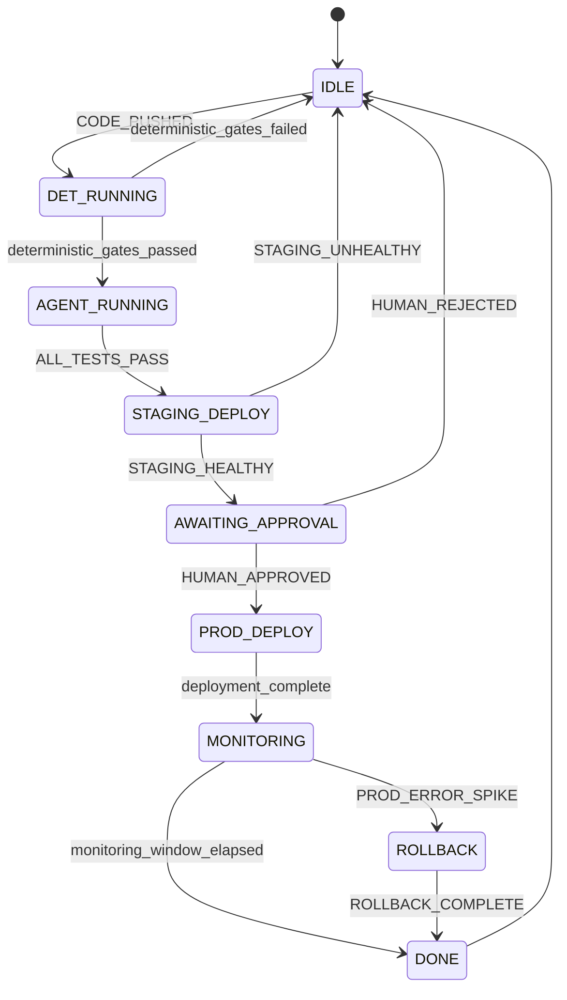

# Proof Chain — Python Layer Technical Specification

<!-- Addresses EDGE-102, EDGE-106, EDGE-112, EDGE-113, EDGE-115, EDGE-117,
     EDGE-119, EDGE-124, EDGE-126, EDGE-127, EDGE-129, EDGE-132, EDGE-135,
     EDGE-137, EDGE-139, EDGE-140, EDGE-142, EDGE-144, EDGE-146, EDGE-149,
     EDGE-151, EDGE-153, EDGE-154, EDGE-155, EDGE-160, EDGE-162, EDGE-163,
     EDGE-165, EDGE-167, EDGE-168, EDGE-172, EDGE-174, EDGE-175,
     EDGE-139-004, EDGE-139-012, EDGE-139-014, EDGE-139-018, EDGE-139-033,
     EDGE-139-043, EDGE-139-048, EDGE-139-057, EDGE-139-058, EDGE-139-061 -->

## Overview

This document specifies the Python-layer cryptographic proof chain used in the
MaatProof ACI/ACD pipeline. The proof chain is the on-the-wire complement to the
Rust/AVM trace system: it records every agent reasoning decision, signs the result
with HMAC-SHA256, and forms the append-only audit trail mandated by
`CONSTITUTION.md §4` and `§7`.

**Language**: Python 3.10+
**Signing**: HMAC-SHA256 (`hashlib`, `hmac`)
**Hashing**: SHA-256 (`hashlib`)
**Serialization**: Canonical JSON (sorted keys, no whitespace, UTF-8)
**Implementation files**: `maatproof/proof.py`, `maatproof/chain.py`,
  `maatproof/orchestrator.py`, `maatproof/pipeline.py`

---

## §1 — ReasoningStep

A `ReasoningStep` captures one logical step in an agent's reasoning chain.

### Field Constraints

<!-- Addresses EDGE-112, EDGE-113 -->

| Field | Type | Constraint |
|---|---|---|
| `step_id` | `int` | Monotonically increasing from 0; assigned by `ReasoningChain` |
| `context` | `str` | 1–4,096 characters (UTF-8 code points); empty string raises `ValueError` |
| `reasoning` | `str` | 1–4,096 characters; empty string raises `ValueError` |
| `conclusion` | `str` | 1–4,096 characters; empty string raises `ValueError` |
| `timestamp` | `float` | POSIX seconds; must be > 0 |
| `step_hash` | `str` | Set by `ProofBuilder`; empty string if not yet computed |

> **Rationale for 4,096-character limit**: matches the AVM input sanitization limit
> defined in `specs/avm-spec.md §Prompt Injection Mitigations`. Longer inputs are
> truncated to 4,096 characters and a `CONTEXT_TRUNCATED` flag is set in step
> metadata.

### step_id Assignment and Validation

<!-- Addresses EDGE-139-018, EDGE-139-057, EDGE-139-058 -->

`step_id` values MUST be non-negative integers (`≥ 0`). When constructed via
`ReasoningChain.step()`, they are assigned automatically as 0, 1, 2, … (monotonically
increasing from 0). When `ReasoningStep` objects are constructed **manually** and passed
directly to `ProofBuilder.build()`:

- The `step_id` values are NOT validated for ordering or uniqueness at the `ReasoningStep`
  level; validation happens at `ProofBuilder.build()` (see §2 — Proof Size Limits).
- Negative `step_id` values will result in a proof that cannot be replayed in canonical
  order; callers MUST use non-negative, monotonically increasing IDs.
- Out-of-order `step_id` values do not affect hash correctness (each hash covers content,
  not ordering) but SHOULD be avoided for auditability. Validators may flag out-of-order
  step_ids as suspicious.

> **EDGE-139-018 / EDGE-139-057 / EDGE-139-058**: Negative and out-of-order step_ids
> are not rejected by the Python layer. They produce a valid cryptographic chain but
> violate the convention. The `ReasoningChain` builder enforces sequential assignment;
> direct `ProofBuilder.build()` callers are responsible for correctness.

### Step Hashing

Each step's `step_hash` is the SHA-256 of the canonical JSON of:
`{ step_id, context, reasoning, conclusion, timestamp, previous_hash }`,
with keys sorted and no whitespace. This encodes the full prior chain into every
hash, making the chain tamper-evident.

Unicode characters (including emoji) are encoded as UTF-8 before hashing.
No NFC normalization is applied at this layer (the AVM DRE layer normalizes).

---

## §2 — ReasoningProof

### Verification Result

<!-- Addresses EDGE-106 -->

`ProofVerifier.verify()` returns a **`bool`**:

- `True` — all three checks passed (chain integrity + root hash + HMAC signature).
- `False` — any check failed; the reason is NOT disclosed to prevent oracle attacks.
- `False` — if `proof` is `None` or has an empty `steps` list.

<!-- Addresses EDGE-139-012 -->

> **EDGE-139-012 — None proof**: `ProofVerifier.verify(None)` MUST return `False`
> (not raise `AttributeError`). Callers that pass `None` receive a safe negative result.
> Implementations MUST guard with `if proof is None: return False` before any attribute
> access.

The `bool` return value IS the "structured verification result" referred to in
`CONSTITUTION.md §4`. It is intentionally minimal so that callers cannot distinguish
*which* check failed, reducing the attack surface for adversarial proof forgery.

For audit purposes, `ProofVerifier.verify_with_detail()` returns a
`VerificationDetail` dataclass with:

```python
@dataclass
class VerificationDetail:
    valid: bool
    chain_integrity_ok: bool
    root_hash_ok: bool
    signature_ok: bool
    failure_reason: str  # empty string if valid=True
```

> Callers that need failure reason (e.g., audit tooling) use `verify_with_detail()`.
> Production orchestrator code MUST use `verify()` only, to avoid leaking information.

### Proof Size Limits

<!-- Addresses EDGE-115, EDGE-174 -->

| Limit | Value | On Breach |
|---|---|---|
| Max steps per proof | 500 | `ProofBuilder.build()` raises `ValueError` |
| Max `metadata` keys | 50 | `ProofBuilder.build()` raises `ValueError` |
| Max `metadata` value length | 1,024 characters | Truncated with `METADATA_TRUNCATED` flag |

> 500 steps at 4,096 chars each = ~2 MB maximum serialized proof. This is within
> the 10 MB mempool limit in `specs/pod-consensus-spec.md §Mempool Management`.

### chain_id Uniqueness

<!-- Addresses EDGE-117 -->

`chain_id` is a logical identifier grouping related reasoning steps. Two proofs
may share the same `chain_id` (e.g., consecutive fix attempts on the same PR);
they are distinguished by their unique `proof_id` (UUID v4).

The HMAC signature covers `chain_id + root_hash`, so two proofs with the same
`chain_id` but different steps will have different root hashes and therefore
different signatures. There is NO collision attack vector from shared `chain_id`.

### Replay Attack Prevention

<!-- Addresses EDGE-165 -->

The HMAC signature over `chain_id + root_hash` does NOT bind the proof to a
specific deployment environment. To prevent a staging proof from being replayed
as a production proof, the **orchestrator layer** MUST include `"environment"`
in the proof's `metadata` field when creating deployment proofs:

```python
proof = chain.seal(metadata={
    "environment": environment,   # REQUIRED for deployment proofs
    "context": context,
})
```

`ProofVerifier` will check that `proof.metadata.get("environment")` matches the
declared deployment target when called from `ACDPipeline.request_deployment()`.
A proof with missing or mismatched `environment` metadata is rejected with
`PROOF_ENV_MISMATCH`.

---

## §3 — ProofBuilder HMAC Key Requirements

<!-- Addresses EDGE-102, EDGE-168 -->

| Requirement | Value |
|---|---|
| Minimum key length | 32 bytes |
| Maximum key length | No hard limit; recommended 64 bytes (512-bit) |
| Key format | Raw bytes — NOT base64, NOT hex |
| Key storage (production) | KMS secret (Azure Key Vault / AWS Secrets Manager / GCP Secret Manager) |
| Key storage (testing) | Hardcoded bytes are acceptable in test fixtures only |

`ProofBuilder.__init__()` raises `ValueError` if `len(secret_key) < 32`.

`ProofBuilder.__init__()` raises `TypeError` if `secret_key` is not of type `bytes`.
The error message MUST be: `"secret_key must be bytes, got {type(secret_key).__name__}"`.

<!-- Addresses EDGE-139-004 -->

> **EDGE-139-004 — Non-bytes key type**: Passing a `str` or `int` as `secret_key` raises
> `TypeError` immediately at construction time — not a cryptographic failure at signing time.
> This prevents silent encoding errors where `str.encode()` is accidentally omitted.

`ProofVerifier.__init__()` applies the same `TypeError` check.

> **Rationale**: HMAC-SHA256 has a 256-bit security level. Keys shorter than 32
> bytes reduce security below that bound. This matches the key entropy requirement
> in `docs/06-security-model.md §Multi-Cloud Key Management`.

### HMAC Key Rotation

<!-- Addresses EDGE-167 -->

When the HMAC key is rotated, a **24-hour overlap window** is observed (matching
the Ed25519 key rotation overlap in `docs/06-security-model.md §Key Rotation`):

1. The new key is provisioned in KMS.
2. `ProofVerifier` is updated to accept **both** old and new key (tries new key first,
   falls back to old key if new key fails).
3. After 24 hours, the old key is retired from the verifier's key set.
4. All proofs signed during the overlap window are re-signed with the new key
   at the next pipeline run (or at audit-log compaction time).

Key rotation events MUST be logged as `HMAC_KEY_ROTATED` in the audit trail.

---

## §4 — DeterministicLayer Invariants

### SKIPPED Gate Status and `all_passed()`

<!-- Addresses EDGE-139-033 -->

`DeterministicLayer.all_passed(results)` returns `True` if and only if every
`GateResult` in `results` has `status == GateStatus.PASSED`. The `SKIPPED` status
is NOT equivalent to `PASSED`:

| status | counts as passed? |
|---|---|
| `PASSED` | ✅ Yes |
| `FAILED` | ❌ No |
| `SKIPPED` | ❌ No |

A gate with `status=SKIPPED` causes `all_passed()` to return `False`. If a caller
legitimately needs to skip a gate for a given pipeline run, the gate MUST either
not be registered for that run or MUST return `PASSED` with a `details` string
explaining why it was effectively skipped (e.g., `"gate not applicable — README-only change"`).

> **EDGE-139-033**: Tests MUST verify that a layer with a SKIPPED gate returns
> `all_passed=False` and the gate name appears in `failed_gates()`.

### Minimum Gate Requirement

<!-- Addresses EDGE-119, EDGE-132 -->

A `DeterministicLayer` with **zero registered gates** MUST NOT vacuously return
`all_passed = True`. The layer MUST raise `GateFailureError` if invoked with an
empty gate list, with message: `"DeterministicLayer has no registered gates — this
is a configuration error"`.

> **Rationale**: An empty gate list is almost certainly a misconfiguration and would
> allow all agents to proceed without any deterministic checks, violating
> `CONSTITUTION.md §2`. Fail-closed is the safe default.

Required minimum gate set for ACI/ACD pipelines (CONSTITUTION §2):

| Gate | Required For |
|---|---|
| `lint` | All environments |
| `compile` | All environments |
| `security_scan` | All environments |
| `artifact_sign` | Staging + Production |
| `compliance` | Production |

### Gate Name Uniqueness

<!-- Addresses EDGE-135 -->

`DeterministicLayer.register()` raises `ValueError` if a gate with the same `name`
is already registered: `"Gate '{name}' is already registered — use a unique name"`.

Gate names MUST match `[a-z_][a-z0-9_]*` (snake_case). Any other format raises
`ValueError` at registration time.

### Gate Execution Ordering

<!-- Addresses EDGE-129 -->

The `DeterministicLayer` MUST execute before any `AgentLayer` gate. The
`OrchestratingAgent` enforces this ordering:

1. `DeterministicLayer.run_all()` is called first, on every `CODE_PUSHED` event.
2. `AgentLayer` gates are only invoked if `DeterministicLayer.all_passed()` returns
   `True` (or when specifically handling a failure event like `TEST_FAILED`).
3. An `AgentLayer.run_gate()` call MUST NOT be issued if the deterministic layer
   has not yet produced a result for the current pipeline run.

Enforcement: the `OrchestratingAgent` tracks `_det_layer_passed: bool` per pipeline
run, initialized to `False`. Any attempt to invoke an agent gate before the
deterministic layer sets this flag to `True` raises `GateFailureError`.

> Exception: the `rollback_agent` gate is explicitly permitted to run without a
> prior deterministic pass (rollbacks are always allowed — `CONSTITUTION.md §5`).

### Exception Handling in Gates

<!-- Addresses EDGE-137 -->

`DeterministicGate.run()` catches all exceptions from `check_fn` and returns a
`GateResult` with `status=FAILED`. This is already implemented and this spec
formalizes the behavior.

`AgentGate.run()` does NOT catch exceptions from `reasoning_fn`. If `reasoning_fn`
raises an exception:

1. The exception propagates to the caller (`AgentLayer.run_gate()`).
2. The orchestrator catches the exception and emits a `PIPELINE_ERROR` audit entry.
3. The pipeline does NOT halt; the event result is set to
   `f"agent_exception:{type(e).__name__}:{e}"`.
4. The orchestrator treats an agent exception as equivalent to `AgentDecision.DEFER`
   (escalate to human).

---

## §5 — AgentLayer Invariants

### Agent Gate Name Uniqueness

<!-- Addresses EDGE-142 -->

`AgentLayer.register()` raises `ValueError` if a gate with the same `name` is
already registered: `"Agent gate '{name}' already registered"`.

### Agent Decision Semantics per Gate Type

<!-- Addresses EDGE-140 -->

Each agent gate has a permitted set of `AgentDecision` values it may return. Returning
a decision outside the permitted set raises `ValueError` at the `AgentGate.run()` level:

| Gate Name Pattern | Permitted Decisions |
|---|---|
| `test_fixer` | `FIX_AND_RETRY`, `APPROVE`, `REJECT` |
| `code_reviewer` | `APPROVE`, `REJECT`, `DEFER` |
| `deployment_decision` | `APPROVE`, `REJECT`, `DEFER` |
| `rollback_agent` | `APPROVE` (= execute rollback), `DEFER` |
| `*` (any other) | All decisions permitted |

### Chain_id Namespace Isolation

<!-- Addresses EDGE-144 -->

Child agent gate proofs MUST use a `chain_id` that is namespaced under the root
orchestrator's `chain_id`. Convention:

```
child_chain_id = f"{root_chain_id}:{agent_gate_name}:{uuid4_short}"
```

This ensures child trace chain_ids never collide with the root chain and are
traceable back to their parent.

### Prompt Injection Mitigations — Python Layer

<!-- Addresses EDGE-139, EDGE-172 -->

The Python agent layer applies the following sanitizations before passing any
external input to an `AgentGate.run()`:

1. **Input length truncation**: `context` strings longer than 4,096 characters are
   truncated. A `CONTEXT_TRUNCATED` warning is logged to the audit trail.

2. **Injection pattern detection**: Before calling `reasoning_fn`, the context is
   scanned for known injection patterns:
   - `"ignore (all|previous|your) (instructions|system|prompt)"` (case-insensitive)
   - `"you are now"`, `"disregard"`, `"forget"`, `"new persona"`
   - SQL injection markers: `"'; "`, `"--"`, `"DROP "`, `"SELECT "` (in model_id only)

   If a pattern is detected:
   - The context is passed through unchanged (the pattern is NOT removed).
   - A `PROMPT_INJECTION_SUSPECTED` entry is added to the audit log with the matched
     pattern and full context (for audit/forensics).
   - The gate execution continues — injection detection does NOT halt the pipeline.
   - The resulting `AgentResult` carries `metadata["injection_suspected"] = True`.
   - If the gate returns `AgentDecision.APPROVE` with `injection_suspected = True`,
     the orchestrator escalates to human review (`AgentDecision.DEFER`).

3. **model_id sanitization**: `ProofBuilder` validates that `model_id` matches
   `[a-zA-Z0-9._/-]{1,128}`. Any other value raises `ValueError` at construction.

> **Reference**: `specs/avm-spec.md §Prompt Injection Mitigations in AVM` covers the
> Rust/WASM layer. This section covers the Python orchestrator layer.

---

## §6 — OrchestratingAgent Invariants

### Default Registered Handlers

<!-- Addresses EDGE-127 -->

`OrchestratingAgent.__init__()` registers these handlers by default:

| Event | Built-in Handler |
|---|---|
| `CODE_PUSHED` | `_handle_code_pushed` — runs deterministic layer |
| `TEST_FAILED` | `_handle_test_failed` — bounded retries (CONSTITUTION §6) |
| `PROD_ERROR_SPIKE` | `_handle_prod_error_spike` — rollback agent |
| `STAGING_HEALTHY` | `_handle_staging_healthy` — triggers human approval request |
| `ALL_TESTS_PASS` | `_handle_all_tests_pass` — triggers staging deployment |
| `HUMAN_APPROVED` | `_handle_human_approved` — records approval; unblocks production |
| `HUMAN_REJECTED` | `_handle_human_rejected` — records rejection; blocks pipeline |
| `ROLLBACK_COMPLETE` | `_handle_rollback_complete` — records rollback proof |

### Handler Replacement Policy

<!-- Addresses EDGE-124 -->

`OrchestratingAgent.on()` allows replacement of any handler, including built-in
handlers. When a built-in handler is replaced:

1. A `HANDLER_OVERRIDDEN` entry is logged to the audit trail with the event name.
2. The new handler is used from the next `emit()` call onwards.
3. No error is raised — this is intentional to allow pipeline customization.

Callers replacing built-in handlers are responsible for preserving constitutional
invariants (e.g., a replacement `STAGING_HEALTHY` handler MUST still enforce the
human approval gate for production).

### Pipeline Event State Machine

<!-- Addresses EDGE-160 -->

The orchestrator enforces event ordering via a state machine:



Events emitted out of sequence (e.g., `HUMAN_APPROVED` before `STAGING_HEALTHY`)
are recorded in the audit log with result `"out_of_sequence_event"` and ignored
(do not change pipeline state).

### Human Approval Invariants

<!-- Addresses EDGE-162, EDGE-163 -->

When `require_human_approval = True`:

1. **Timeout**: Human approval has a configurable `human_approval_timeout_secs`
   (default: 86,400 seconds = 24 hours). If no `HUMAN_APPROVED` or `HUMAN_REJECTED`
   event is received within the timeout window, the pipeline emits `APPROVAL_TIMEOUT`
   to the audit log and transitions back to `IDLE`. The deployment is blocked.

2. **Deduplication**: If multiple `HUMAN_APPROVED` events are emitted for the same
   pipeline run, only the first is accepted. Subsequent duplicates are logged as
   `DUPLICATE_HUMAN_APPROVAL` and ignored.

3. **Proof reference**: The `HUMAN_APPROVED` event SHOULD carry a `proof_id` kwarg
   referencing the `ReasoningProof` the human reviewed. The orchestrator records this
   in the audit trail as `"approved_proof_id"` metadata.

### HumanApprovalRequiredError Structured Data

<!-- Addresses EDGE-149 -->

`HumanApprovalRequiredError` is raised with a `proof_id` parameter that references
the `ReasoningProof` the human must review:

```python
raise HumanApprovalRequiredError(
    f"Production deployment to '{environment}' requires human approval. "
    f"Review proof_id={proof.proof_id} before approving.",
    proof_id=proof.proof_id,
)
```

`HumanApprovalRequiredError` gains a `proof_id: Optional[str]` attribute.
This links the exception to the audit trail entry.

---

## §7 — AuditEntry Signing

### CONSTITUTION §7 Compliance

<!-- Addresses EDGE-153 -->

`CONSTITUTION.md §7` mandates "signed entries" in the audit log. For the Python
layer, each `AuditEntry` MUST be signed with the pipeline's HMAC-SHA256 key:

```python
@dataclass
class AuditEntry:
    entry_id:  str
    event:     str
    timestamp: float
    result:    str
    metadata:  Dict[str, Any]
    signature: str              # HMAC-SHA256 over canonical JSON (excl. signature)
```

The signature is computed over the canonical JSON of the entry with the `signature`
field excluded (same pattern as `RollbackProof` in `specs/autonomous-deployment-authority.md §RollbackProof`):

```python
def sign_entry(entry: AuditEntry, secret_key: bytes) -> str:
    d = entry.to_dict()
    d.pop("signature", None)
    canonical = json.dumps(d, sort_keys=True, separators=(",", ":")).encode("utf-8")
    return hmac.new(secret_key, canonical, hashlib.sha256).hexdigest()
```

`OrchestratingAgent._record_audit()` always calls `sign_entry()` before appending.
The `ProofBuilder`'s HMAC key is reused for audit signing (same `secret_key`).

### Audit Log Immutability

<!-- Addresses EDGE-154 -->

`OrchestratingAgent.get_audit_log()` returns a **deep copy** of the internal
`_audit_log` list (using `copy.deepcopy`), not a reference. Callers cannot mutate
the internal state through the returned list.

Direct access to `_audit_log` is discouraged; the property is prefixed with `_` to
signal this. The internal list is an implementation detail and must NOT be accessed
by callers.

### Audit Log Persistence

<!-- Addresses EDGE-155 -->

In the current Python implementation (Phase 1–2 of the roadmap), the audit log is
**in-memory only**. Persistence between process restarts is the responsibility of the
deployment infrastructure.

Recommended approaches:
- **Development**: write audit log to a JSONL file on `ROLLBACK_COMPLETE` or
  `PROD_ERROR_SPIKE` events.
- **Production**: ship audit entries to the on-chain AVM audit layer via the gRPC
  API defined in `specs/api-spec.md`. The on-chain record is the authoritative audit
  trail per `CONSTITUTION.md §7`.
- **Compliance (SOX/HIPAA)**: audit entries MUST be persisted to the on-chain layer
  before a production deployment is considered `FINALIZED`.

### Audit Log Retention and Size Limits

<!-- Addresses EDGE-126, EDGE-175 -->

| Property | Value |
|---|---|
| Max in-memory entries (hot) | 10,000 |
| Eviction policy | Oldest-first (FIFO) when limit reached |
| Eviction warning | `AUDIT_LOG_EVICTION` entry logged before eviction |
| Minimum retention (compliance) | 90 days (on-chain or cold storage) |
| Recommended retention | 365 days |

When the in-memory limit is reached, entries are flushed to a configurable sink
(file / gRPC / on-chain) before eviction. If no sink is configured, a
`AUDIT_SINK_UNCONFIGURED` warning is emitted and entries are evicted without
persistence (unsafe for production).

### In-Memory AuditEntry Tamper Detection

<!-- Addresses EDGE-139-043, EDGE-139-061 -->

The Python in-memory `AuditEntry` objects (stored in `OrchestratingAgent._audit_log`)
are NOT tamper-protected at the Python object level. An attacker with access to the
Python process memory can mutate fields directly.

The HMAC-signed tamper detection described in CONSTITUTION.md §7 and §7 of this spec
(AuditEntry Signing) protects against **external storage tampering** (disk, database).
It does NOT protect against in-process mutation.

Full tamper protection requires:
1. The HMAC signature stored alongside each entry (see §7 — AuditEntry Signing).
2. Verification of the HMAC chain when entries are read back from persistent storage.
3. The in-memory list serves as a fast read-cache; the authoritative record is the
   signed, persisted storage (SQLite with `entry_hmac` chain per `specs/audit-logging-spec.md §2`).

**Required fields for `AuditEntry` in the Python layer:**

<!-- Addresses EDGE-139-061 -->

| Field | Type | Required | Notes |
|---|---|---|---|
| `entry_id` | `str` (UUID4) | ✅ Yes | Unique identifier |
| `event` | `str` | ✅ Yes | Pipeline event name |
| `timestamp` | `float` | ✅ Yes | POSIX timestamp |
| `result` | `str` | ✅ Yes | Handler result string |
| `metadata` | `Dict[str, Any]` | ✅ Yes | Forwarded kwargs (default: `{}`) |
| `signature` | `str` | ✅ Yes (Phase 2) | HMAC-SHA256 hex signature (see §7) |

> **Phase 1 note**: The current Python implementation does not yet include the
> `signature` field on `AuditEntry`. This is tracked as a **critical implementation
> gap** — see GitHub issue filed for EDGE-139-041. The field MUST be added before
> production deployment to satisfy CONSTITUTION.md §7.

> **EDGE-139-043**: Tests that check AuditEntry tamper detection MUST use the
> SQLite layer (`audit-logging-spec.md §2`), not the in-memory Python list, for
> meaningful tamper detection assertions.

---

## §8 — PipelineConfig Validation

<!-- Addresses EDGE-151 -->

`PipelineConfig` validates all fields at construction time:

| Field | Constraint |
|---|---|
| `name` | Non-empty string, 1–256 characters, matches `[a-zA-Z0-9._-]+` |
| `secret_key` | `bytes`, minimum 32 bytes (see §3 above) |
| `model_id` | Non-empty string matching `[a-zA-Z0-9._/-]{1,128}` |
| `require_human_approval` | `bool`; defaults to `True` |
| `max_fix_retries` | `int`, 1–10; defaults to 3 |

`PipelineConfig.__post_init__()` raises `ValueError` with a descriptive message for
any constraint violation.

---

## §8b — ReasoningChain Post-Seal Behavior

<!-- Addresses EDGE-139-014 -->

`ReasoningChain` is **intentionally NOT immutable** after calling `.seal()`. This
is a deliberate design choice to support the fix-and-retry pattern:

```python
chain = ReasoningChain(builder=builder)
chain.step(context="First attempt", reasoning="Applied fix A.", conclusion="Retry.")
proof1 = chain.seal()  # Proof of attempt 1

# After seal(), more steps can be added and seal() called again
chain.step(context="Second attempt", reasoning="Fix A failed; trying B.", conclusion="Retry.")
proof2 = chain.seal()  # Proof of attempt 2 (includes all 3 steps)
```

**Behavior after `.seal()`:**

| Question | Answer |
|---|---|
| Can `.step()` be called after `.seal()`? | ✅ Yes — `_steps` is not frozen |
| Does a second `.seal()` include all accumulated steps? | ✅ Yes — `_steps` is cumulative |
| Does calling `.seal()` twice produce the same proof? | ✅ Yes — if no new steps were added |
| Is `_steps` cleared after `.seal()`? | ❌ No — the list is NOT cleared |
| Can a caller obtain the pre-seal proof independently? | ✅ Yes — the returned `ReasoningProof` is an independent object |

> **Immutability requirement from AC**: The acceptance criterion for "immutability
> after build" refers to the **returned `ReasoningProof` object** being immutable
> (callers cannot retroactively change the proof's content), NOT to the
> `ReasoningChain` being locked. `ReasoningProof` fields are dataclass fields
> without enforced immutability — tests MUST verify that tampering with a returned
> proof does not alter other proofs produced by the same chain.

---

## §9 — ACDPipeline Deployment Gate Ordering

<!-- Addresses EDGE-146 -->

`ACDPipeline.request_deployment()` MUST verify that the deterministic layer has
passed for the current pipeline run before generating a deployment proof:

1. The pipeline tracks `_last_det_pass_at: Optional[float]` (timestamp of last
   successful deterministic layer pass).
2. If `_last_det_pass_at` is `None` or older than `det_validity_window_secs`
   (default: 3,600 seconds = 1 hour), `request_deployment()` raises
   `GateFailureError("Deterministic gates must pass before requesting deployment")`.
3. This prevents an agent from requesting a production deployment without running
   the trust anchor layer.

---

## §10 — Known Complex Gaps (tracked as GitHub Issues)

The following scenarios require architectural changes and are tracked separately:

| Scenario(s) | Issue | Description |
|---|---|---|
| EDGE-125, EDGE-158 | To be filed | Thread safety for `OrchestratingAgent` concurrent emit/audit |
| EDGE-148 | To be filed | ACDPipeline integration with 7-condition ADA authorization check |
| EDGE-159, EDGE-164 | To be filed | Human approval on-chain transaction reference in Python layer |
| EDGE-173 | To be filed | Scale testing: 10,000 concurrent pipeline events |
| EDGE-139-041 | Filed (issue #140) | `AuditEntry` missing HMAC `signature` field — CONSTITUTION §7 violation |
| EDGE-139-029 | Filed (issue #141) | `DeterministicLayer.run_all()` does not raise `GateFailureError` on empty gate list |
| EDGE-139-001 | Filed (issue #142) | `ProofBuilder.__init__()` does not enforce 32-byte minimum key length |
| EDGE-139-031 | Filed (issue #143) | `DeterministicLayer.register()` does not enforce gate name uniqueness |
| EDGE-139-064 | Filed (issue #144) | `PipelineConfig` missing `__post_init__` field validation |
| EDGE-139-035 | Filed (issue #145) | `ACDPipeline.request_deployment()` should raise `HumanApprovalRequiredError` for production |

### Metadata Key Safety in Python Layer

<!-- Addresses EDGE-139-048 -->

The `metadata` dictionary passed to `ProofBuilder.build()`, `AuditEntry`, and
`ReasoningStep` is **NOT sanitized for injection payloads** at the Python layer.
Keys and values are arbitrary Python strings/objects that will be JSON-serialized.

- SQL injection is prevented because the Python layer does NOT execute SQL directly;
  all SQL is in the `specs/audit-logging-spec.md` SQLite layer which uses parameterized queries.
- Prompt injection via metadata values is mitigated by the `proof-chain-spec.md §5`
  injection pattern detection in `AgentGate.run()`.
- Metadata keys MUST NOT contain null bytes or control characters (rejected by
  `json.dumps` if non-serializable, or silently passed as valid JSON strings otherwise).

> **EDGE-139-048**: Tests for metadata injection MUST focus on the SQLite layer
> (parameterized queries prevent SQL injection) and the AgentGate layer (injection
> pattern detection). The `ProofBuilder` itself is not the injection boundary.

<!-- Addresses EDGE-102, EDGE-106, EDGE-112, EDGE-113, EDGE-115, EDGE-117,
     EDGE-119, EDGE-124, EDGE-126, EDGE-127, EDGE-129, EDGE-132, EDGE-135,
     EDGE-137, EDGE-139, EDGE-140, EDGE-142, EDGE-144, EDGE-146, EDGE-149,
     EDGE-151, EDGE-153, EDGE-154, EDGE-155, EDGE-160, EDGE-162, EDGE-163,
     EDGE-165, EDGE-167, EDGE-168, EDGE-172, EDGE-174, EDGE-175,
     EDGE-139-004, EDGE-139-012, EDGE-139-014, EDGE-139-018, EDGE-139-033,
     EDGE-139-043, EDGE-139-048, EDGE-139-057, EDGE-139-058, EDGE-139-061 -->
