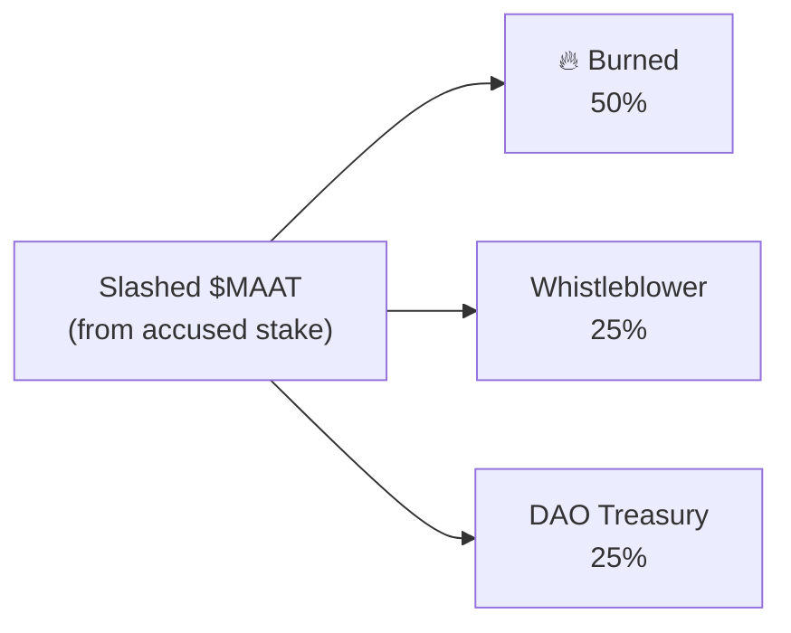
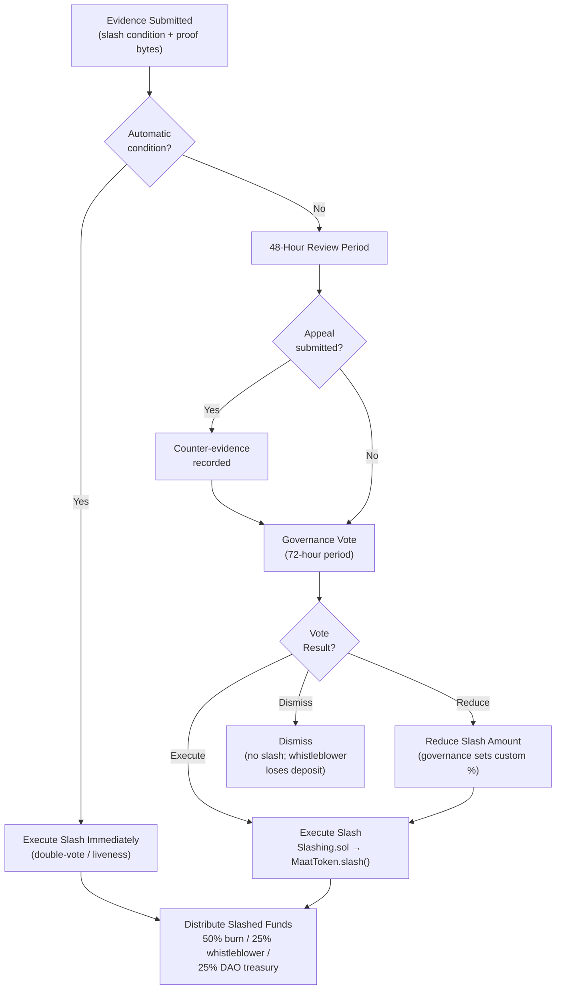

# Slashing — Technical Specification

## Overview

The slashing mechanism provides economic accountability for malicious, negligent, or policy-violating behavior by agents and validators. Slashing destroys staked $MAAT, creating a direct economic disincentive for bad actors.

**Contract**: `Slashing.sol`  
**Dependencies**: `MaatToken.sol` (for `slash()` execution)  
**Governance**: On-chain vote required for slash execution (except automatic liveness slashes)  

---

## Slash Conditions

### Agent Slash Conditions

| Condition ID | Description | Slash Amount | Detection |
|---|---|---|---|
| `AGENT_MALICIOUS_DEPLOY` | Agent deployed malicious code proven on-chain | 50% of stake | Post-finalization evidence |
| `AGENT_POLICY_VIOLATION` | Deploy violated policy rules not caught pre-finalization | 25% of stake | On-chain evidence + vote |
| `AGENT_FALSE_ATTESTATION` | Agent submitted fraudulent trace | 50% of stake | Trace hash mismatch proof |

### Validator Slash Conditions

| Condition ID | Description | Slash Amount | Detection |
|---|---|---|---|
| `VAL_DOUBLE_VOTE` | Validator submitted two conflicting votes in same round | 100% of stake | Automatic (on-chain proof) |
| `VAL_INVALID_ATTESTATION` | Validator attested a provably invalid trace | 50% of stake | Governance vote |
| `VAL_COLLUSION` | Validator colluded to approve policy-violating deploy | 100% of stake | Governance vote |
| `VAL_LIVENESS` | >10% missed rounds in current epoch | 5% of stake | Automatic (epoch end) |

---

## Slash Process

### Normal Slash (Requires Governance Vote)

```
1. Evidence Submission
   └── Any account submits evidence transaction to Slashing.sol
   └── Evidence: slash condition ID + proof bytes + accused DID

2. Review Period (48 hours)
   └── Accused may submit appeal evidence
   └── DAO token holders review evidence

3. Governance Vote
   └── $MAAT holders vote: EXECUTE_SLASH / DISMISS / REDUCE_SLASH
   └── Voting period: 72 hours
   └── Quorum: 10% of circulating supply
   └── Supermajority: 60% of voting weight

4. Slash Execution (if vote passes)
   └── Slashing.sol calls MaatToken.slash(accused, amount)
   └── Slashed funds distributed:
       ├── 50% → burned
       ├── 25% → whistleblower (evidence submitter)
       └── 25% → DAO treasury
```

### Automatic Slash (No Vote Required)

`VAL_DOUBLE_VOTE` and `VAL_LIVENESS` are slashed automatically:

- **Double-vote**: Slashing contract validates the two conflicting signed votes on-chain and executes immediately
- **Liveness**: Computed automatically at epoch end based on participation records

---

## Slash Amounts

Slashes are calculated as a percentage of the **total staked amount at the time of the slash**. Partial slashes leave the remainder staked (actor may continue with reduced stake if above minimum).

```solidity
function computeSlashAmount(
    uint256 currentStake,
    SlashCondition condition
) public pure returns (uint256) {
    if (condition == SlashCondition.VAL_DOUBLE_VOTE)       return currentStake;
    if (condition == SlashCondition.VAL_COLLUSION)         return currentStake;
    if (condition == SlashCondition.VAL_INVALID_ATTESTATION) return currentStake / 2;
    if (condition == SlashCondition.AGENT_MALICIOUS_DEPLOY)  return currentStake / 2;
    if (condition == SlashCondition.AGENT_POLICY_VIOLATION)  return currentStake / 4;
    if (condition == SlashCondition.AGENT_FALSE_ATTESTATION) return currentStake / 2;
    if (condition == SlashCondition.VAL_LIVENESS)            return currentStake / 20;
    return 0;
}
```

---

## Appeal Mechanism

During the 48-hour review period, the accused may submit counter-evidence:

```solidity
function submitAppeal(
    uint256 evidenceId,
    bytes calldata counterEvidence,
    string calldata explanation
) external {
    Evidence storage ev = evidences[evidenceId];
    require(ev.accused == msg.sender, "Not the accused");
    require(block.timestamp < ev.reviewDeadline, "Review period expired");
    require(!ev.appealed, "Already appealed");

    ev.counterEvidence = counterEvidence;
    ev.appealed = true;
    emit AppealSubmitted(evidenceId, msg.sender, block.timestamp);
}
```

If the governance vote results in `DISMISS`, the whistleblower loses their filing deposit (anti-spam).

---

## Distribution of Slashed Funds



For automatic slashes (double-vote, liveness), the 25% whistleblower share goes to the DAO treasury instead (no individual whistleblower).

---

## Slashing Flow Diagram



---

## Events

```solidity
event EvidenceSubmitted(
    uint256 indexed evidenceId,
    address indexed whistleblower,
    string  accused,             // DID
    bytes32 slashCondition,
    uint256 timestamp
);
event AppealSubmitted(uint256 indexed evidenceId, address accused, uint256 timestamp);
event SlashVoted(uint256 indexed evidenceId, address voter, bool executeSlash, uint256 weight);
event SlashExecuted(
    uint256 indexed evidenceId,
    string  accused,
    uint256 slashedAmount,
    uint256 burnedAmount,
    uint256 whistleblowerAmount,
    uint256 daoAmount
);
event SlashDismissed(uint256 indexed evidenceId, uint256 depositForfeited);
```
