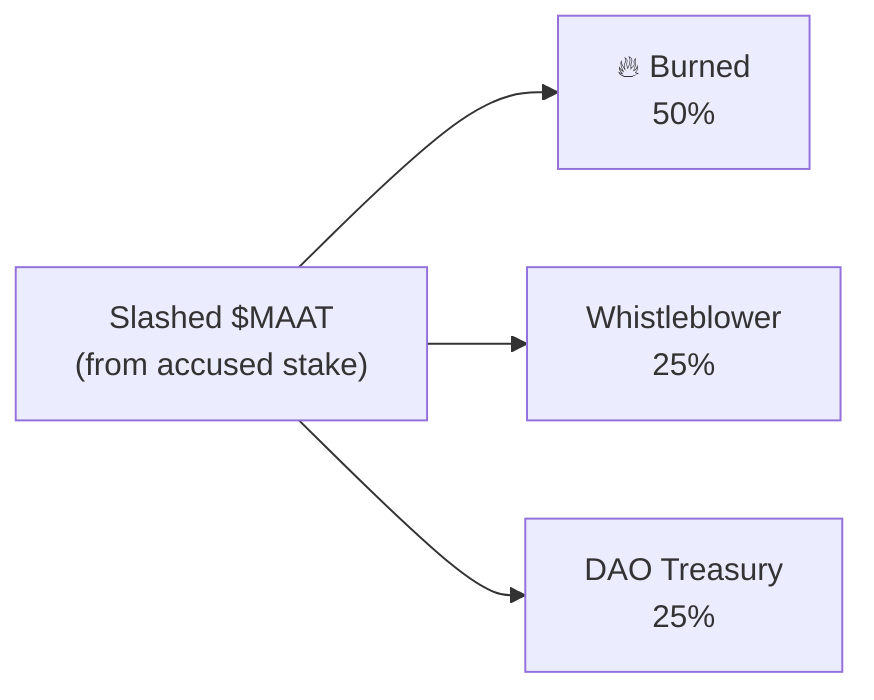
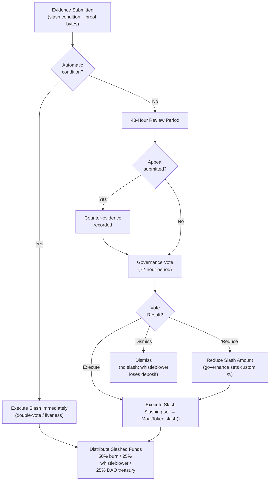
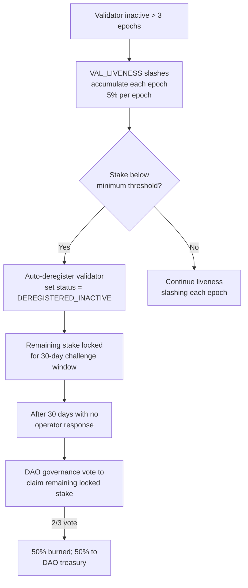

# Slashing — Technical Specification

## Overview

The slashing mechanism provides economic accountability for malicious, negligent, or policy-violating behavior by agents and validators. Slashing destroys staked $MAAT, creating a direct economic disincentive for bad actors.

**Contract**: `Slashing.sol`  
**Dependencies**: `MaatToken.sol` (for `slash()` execution)  
**Governance**: On-chain vote required for slash execution (except automatic liveness slashes)  

---

## Slash Conditions

### Agent Slash Conditions

| Condition ID | Description | Slash Amount | Detection |
|---|---|---|---|
| `AGENT_MALICIOUS_DEPLOY` | Agent deployed malicious code proven on-chain | 50% of stake | Post-finalization evidence |
| `AGENT_POLICY_VIOLATION` | Deploy violated policy rules not caught pre-finalization | 25% of stake | On-chain evidence + vote |
| `AGENT_FALSE_ATTESTATION` | Agent submitted fraudulent trace | 50% of stake | Trace hash mismatch proof |

### Validator Slash Conditions

| Condition ID | Description | Slash Amount | Detection |
|---|---|---|---|
| `VAL_DOUBLE_VOTE` | Validator submitted two conflicting votes in same round | 100% of stake | Automatic (on-chain proof) |
| `VAL_INVALID_ATTESTATION` | Validator attested a provably invalid trace | 50% of stake | Governance vote |
| `VAL_COLLUSION` | Validator colluded to approve policy-violating deploy | 100% of stake | Governance vote |
| `VAL_LIVENESS` | >10% missed rounds in current epoch | 5% of stake | Automatic (epoch end) |

---

## Slash Process

### Normal Slash (Requires Governance Vote)

```
1. Evidence Submission
   └── Any account submits evidence transaction to Slashing.sol
   └── Evidence: slash condition ID + proof bytes + accused DID

2. Review Period (48 hours)
   └── Accused may submit appeal evidence
   └── DAO token holders review evidence

3. Governance Vote
   └── $MAAT holders vote: EXECUTE_SLASH / DISMISS / REDUCE_SLASH
   └── Voting period: 72 hours
   └── Quorum: 10% of circulating supply
   └── Supermajority: 60% of voting weight

4. Slash Execution (if vote passes)
   └── Slashing.sol calls MaatToken.slash(accused, amount)
   └── Slashed funds distributed:
       ├── 50% → burned
       ├── 25% → whistleblower (evidence submitter)
       └── 25% → DAO treasury
```

### Automatic Slash (No Vote Required)

`VAL_DOUBLE_VOTE` and `VAL_LIVENESS` are slashed automatically:

- **Double-vote**: Slashing contract validates the two conflicting signed votes on-chain and executes immediately
- **Liveness**: Computed automatically at epoch end based on participation records

---

## Slash Amounts

Slashes are calculated as a percentage of the **total staked amount at the time of the slash**. Partial slashes leave the remainder staked (actor may continue with reduced stake if above minimum).

```solidity
function computeSlashAmount(
    uint256 currentStake,
    SlashCondition condition
) public pure returns (uint256) {
    if (condition == SlashCondition.VAL_DOUBLE_VOTE)       return currentStake;
    if (condition == SlashCondition.VAL_COLLUSION)         return currentStake;
    if (condition == SlashCondition.VAL_INVALID_ATTESTATION) return currentStake / 2;
    if (condition == SlashCondition.AGENT_MALICIOUS_DEPLOY)  return currentStake / 2;
    if (condition == SlashCondition.AGENT_POLICY_VIOLATION)  return currentStake / 4;
    if (condition == SlashCondition.AGENT_FALSE_ATTESTATION) return currentStake / 2;
    if (condition == SlashCondition.VAL_LIVENESS)            return currentStake / 20;
    return 0;
}
```

---

## Appeal Mechanism

During the 48-hour review period, the accused may submit counter-evidence:

```solidity
function submitAppeal(
    uint256 evidenceId,
    bytes calldata counterEvidence,
    string calldata explanation
) external {
    Evidence storage ev = evidences[evidenceId];
    require(ev.accused == msg.sender, "Not the accused");
    require(block.timestamp < ev.reviewDeadline, "Review period expired");
    require(!ev.appealed, "Already appealed");

    ev.counterEvidence = counterEvidence;
    ev.appealed = true;
    emit AppealSubmitted(evidenceId, msg.sender, block.timestamp);
}
```

If the governance vote results in `DISMISS`, the whistleblower loses their filing deposit (anti-spam).

---

## Distribution of Slashed Funds



For automatic slashes (double-vote, liveness), the 25% whistleblower share goes to the DAO treasury instead (no individual whistleblower).

---

## Slashing Flow Diagram



---

## Events

```solidity
event EvidenceSubmitted(
    uint256 indexed evidenceId,
    address indexed whistleblower,
    string  accused,             // DID
    bytes32 slashCondition,
    uint256 timestamp
);
event AppealSubmitted(uint256 indexed evidenceId, address accused, uint256 timestamp);
event SlashVoted(uint256 indexed evidenceId, address voter, bool executeSlash, uint256 weight);
event SlashExecuted(
    uint256 indexed evidenceId,
    string  accused,
    uint256 slashedAmount,
    uint256 burnedAmount,
    uint256 whistleblowerAmount,
    uint256 daoAmount
);
event SlashDismissed(uint256 indexed evidenceId, uint256 depositForfeited);
```

---

## Slashing Contract Address Integrity (EDGE-195)

<!-- Addresses EDGE-195 -->

`MaatToken.setSlashingContract(address newSlashing)` is the privileged function
that configures which contract is permitted to call `MaatToken.slash()`. If this
address is set to a broken, malicious, or zero address, staked tokens could
become permanently locked or redirected.

### Required Protections

1. **Interface check**: `setSlashingContract()` MUST call
   `ISlashing(newSlashing).supportsInterface(type(ISlashing).interfaceId)` and
   revert with `INVALID_SLASHING_CONTRACT` if the call fails, reverts, or returns
   false.
2. **Zero-address guard**: `require(newSlashing != address(0), "Zero address")`.
3. **Governance gate**: `setSlashingContract()` MUST be gated by an
   `onlyGovernance` modifier (not `onlyOwner`), requiring a passed governance
   proposal.
4. **7-day timelock**: The governance proposal for this call enforces a minimum
   7-day execution timelock.
5. **Emit event**: `SlashingContractUpdated(address indexed oldAddress, address indexed newAddress)`
   is emitted on every change for auditability.

## Permanently Offline Validator Stake Recovery

<!-- Addresses EDGE-ADA-004 -->

When a validator operator goes permanently offline (e.g., hardware failure, business
closure, key loss), their staked $MAAT can become permanently locked in the staking
contract, reducing the effective circulating supply indefinitely.

### Detection

A validator is considered **permanently offline** when:
- `VAL_LIVENESS` slashes reduce their stake to the minimum threshold
- AND the operator has not responded within 3 consecutive epochs (approximately 3,000 blocks)
- AND no key rotation has been submitted in the past 180 days

The validator's status is set to `DEREGISTERED_INACTIVE` automatically after these
conditions are met.

### Recovery Path



**Important**: The validator's participation rate drops to 0% as they are excluded
from quorum computation when `INACTIVE`. Other validators continue to achieve
2/3 supermajority on the remaining active stake.

### Emergency Re-activation

If an operator recovers (e.g., recovers their key via a cold backup), they may
re-register with a new DID and stake. The old deregistered DID remains on-chain
for audit purposes.

---

## Zero-Address Transfer Protection

<!-- Addresses EDGE-ADA-010 -->

`MaatToken.transfer()` and `MaatToken.transferFrom()` MUST reject transfers to
`address(0)` to prevent unintentional token burns via the standard ERC-20 transfer
path. Unlike the intentional `burn()` function, transfers to address(0) via the
standard transfer interface are almost always programming errors.

```solidity
// In MaatToken.sol
function _beforeTokenTransfer(
    address from,
    address to,
    uint256 amount
) internal override {
    require(to != address(0), "TRANSFER_TO_ZERO_ADDRESS");
    super._beforeTokenTransfer(from, to, amount);
}
```

**Exception**: The explicit `burn()` and `burnFrom()` functions (if provided) MAY
transfer to address(0) as this is their documented purpose. The guard applies only
to `transfer()`, `transferFrom()`, and `slash()` execution paths.

The `slash()` function distributes slashed funds to:
- 50% → `burn()` (explicit burn call)
- 25% → whistleblower address (MUST NOT be address(0); enforced in `submitEvidence()`)
- 25% → DAO treasury (MUST NOT be address(0); set at deploy time, governance-controlled)

```solidity
function submitEvidence(
    string calldata accused,
    bytes32 slashCondition,
    bytes calldata proofBytes
) external {
    require(msg.sender != address(0), "Zero address submitter");
    // whistleblower is msg.sender — already non-zero by require above
    ...
}
```

---

### Recovery Path if Broken Contract Is Set

If a broken slashing contract address is set despite the above guards (e.g.,
via a governance attack), the recovery path is:

1. Governance votes to call `setSlashingContract(newValidAddress)` again.
2. Until the new valid address is set, `MaatToken.slash()` will revert for all
   calls from the broken address — stake cannot be slashed but also cannot be
   withdrawn (lock still applies).
3. The DAO treasury can fund a remediation bounty via `Governance.execute()` to
   incentivise identification of a fix.
