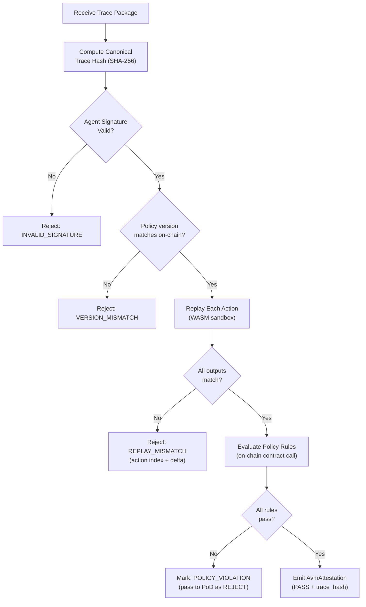

# Trace Verification — Technical Specification

## Overview

Trace verification is the process by which validators confirm that an agent's submitted reasoning trace is:

1. **Authentic** — signed by the claimed agent identity
2. **Unmodified** — hash matches the canonical trace
3. **Deterministically reproducible** — replay produces the same outputs
4. **Policy-compliant** — execution state satisfies all Deployment Contract rules

**Trace format**: JSON-LD  
**Hashing**: SHA-256 over canonical JSON (sorted keys, excluded `signature` field)  
**Replay runtime**: Rust + WASM sandbox (`wasmtime`)  
**Future**: ZK-proof path (zkLLM-style, privacy-preserving)  

---

## Trace Format (JSON-LD)

Traces are serialized as JSON-LD with the MaatProof trace context:

```json
{
  "@context": "https://maat.dev/trace/v1",
  "trace_id": "550e8400-e29b-41d4-a716-446655440000",
  "agent_id": "did:maat:agent:xyz789abc",
  "policy_ref": "0xDeployPolicyContractAddress",
  "policy_version": 3,
  "artifact_hash": "sha256:a3f8b2c1d4e5f6a7b8c9d0e1f2a3b4c5d6e7f8a9b0c1d2e3f4a5b6c7d8e9f0a1",
  "deploy_environment": "production",
  "timestamp": "2025-01-15T14:32:00Z",
  "human_approval_ref": "0x9f8e7d6c5b4a3f2e1d0c9b8a7f6e5d4c3b2a1f0e",
  "actions": [
    {
      "action_id": "act-001",
      "action_type": "REASONING",
      "timestamp": "2025-01-15T14:31:45Z",
      "input": { "prompt": "Analyze test results for deployment readiness" },
      "output": { "reasoning": "Test coverage is 87%, no critical CVEs found..." },
      "tool_calls": []
    },
    {
      "action_id": "act-002",
      "action_type": "TOOL_CALL",
      "timestamp": "2025-01-15T14:31:50Z",
      "input": { "tool": "run_tests", "args": { "suite": "integration" } },
      "output": { "coverage": 87, "passed": 142, "failed": 0 },
      "tool_calls": [
        {
          "tool_name": "run_tests",
          "tool_input": { "suite": "integration" },
          "tool_output": { "coverage": 87, "passed": 142, "failed": 0 },
          "duration_ms": 4200
        }
      ]
    },
    {
      "action_id": "act-003",
      "action_type": "DECISION",
      "timestamp": "2025-01-15T14:31:55Z",
      "input": { "context": "All checks passed" },
      "output": { "decision": "PROCEED_TO_DEPLOY", "confidence": 0.95 },
      "tool_calls": []
    }
  ],
  "signature": "a1b2c3d4e5f6a7b8c9d0e1f2a3b4c5d6e7f8a9b0c1d2e3f4a5b6c7d8e9f0a1b2c3d4e5f6a7b8c9d0e1f2a3b4c5d6e7f8a9b0c1d2e3f4a5b6c7d8e9f0a1b2c3"
}
```

### Field Definitions

| Field | Type | Required | Description |
|---|---|---|---|
| `@context` | string | ✓ | JSON-LD context URL |
| `trace_id` | UUID v4 | ✓ | Unique ID per trace; validators reject duplicate trace IDs |
| `agent_id` | DID string | ✓ | W3C DID of the agent |
| `policy_ref` | address | ✓ | On-chain Deployment Contract address |
| `policy_version` | uint32 | ✓ | Policy version at time of submission |
| `artifact_hash` | sha256 | ✓ | Hash of the deployment artifact |
| `deploy_environment` | string | ✓ | Target environment |
| `timestamp` | ISO 8601 | ✓ | Trace submission time |
| `human_approval_ref` | tx hash | conditional | Required if policy `requireHumanApproval = true` |
| `actions` | array | ✓ | Ordered list of agent actions |
| `signature` | hex string | ✓ | Ed25519 over trace hash (excl. `signature` field) |

---

## Hashing Algorithm

```rust
use sha2::{Sha256, Digest};
use serde_json::Value;
use std::collections::BTreeMap;

/// Compute SHA-256 over the canonical trace representation.
/// Canonical = JSON with BTreeMap (sorted keys), signature field excluded.
pub fn canonical_trace_hash(trace_json: &str) -> String {
    let mut v: Value = serde_json::from_str(trace_json).expect("Invalid JSON");

    // Remove signature before hashing
    if let Some(obj) = v.as_object_mut() {
        obj.remove("signature");
    }

    // Re-serialize with sorted keys via BTreeMap
    let sorted: BTreeMap<String, Value> =
        serde_json::from_value(v).expect("Cannot sort keys");
    let canonical = serde_json::to_string(&sorted).expect("Serialization failed");

    let hash = Sha256::digest(canonical.as_bytes());
    format!("sha256:{}", hex::encode(hash))
}
```

---

## Replay Procedure

Validators replay traces deterministically using the AVM WASM sandbox:

```rust
pub struct TraceReplayer {
    sandbox: AvmSandbox,
    policy_client: DeployPolicyClient,
}

impl TraceReplayer {
    pub async fn verify(&self, trace: &DeploymentTrace) -> VerificationResult {
        // Step 1: Verify agent signature
        let trace_hash = canonical_trace_hash(&serde_json::to_string(trace).unwrap());
        let agent_key = self.policy_client.get_agent_pubkey(&trace.agent_id).await?;
        if !verify_trace_signature(&trace_hash, &trace.signature, &agent_key) {
            return VerificationResult::InvalidSignature;
        }

        // Step 2: Replay each action in sandbox
        for (i, action) in trace.actions.iter().enumerate() {
            let replayed_output = self.sandbox.replay_action(action).await?;
            if replayed_output != action.output {
                return VerificationResult::ReplayMismatch {
                    action_index: i,
                    expected: action.output.clone(),
                    got: replayed_output,
                };
            }
        }

        // Step 3: Evaluate policy
        let policy_result = self.policy_client
            .evaluate(&trace, &self.extract_execution_state(trace))
            .await?;

        VerificationResult::Complete { trace_hash, policy_result }
    }
}
```

---

## Non-Determinism Handling

LLM outputs are inherently non-deterministic (temperature > 0). MaatProof handles this by:

- **Recorded outputs are authoritative** — during replay, the sandbox uses the recorded `output` field, not re-sampled LLM output
- **Tool call outputs are verified** — tool call results that are deterministic (e.g., test runners) are re-executed and compared
- **LLM reasoning steps** are verified by signature and hash only — not re-sampled
- **Future ZK path** — zkLLM proofs will allow cryptographic verification that an LLM produced a given output without re-running the model

---

## ZK-Proof Path (Future)

In Protocol Phase 5, trace verification will support a ZK-proof mode:

```
zkLLM Proof:
  - Prover (agent): generates ZK proof that model M with weights W
                    produced output O given input I
  - Verifier (validator): verifies proof without re-running the model
  - Privacy: internal reasoning steps can be kept private;
             only policy-relevant outputs are revealed
```

This enables:
- **Privacy-preserving verification** — proprietary reasoning not exposed
- **Faster validator throughput** — proof verification is faster than model re-execution
- **Smaller trace packages** — only ZK proofs, not full reasoning transcripts

---

## Verification Flow


