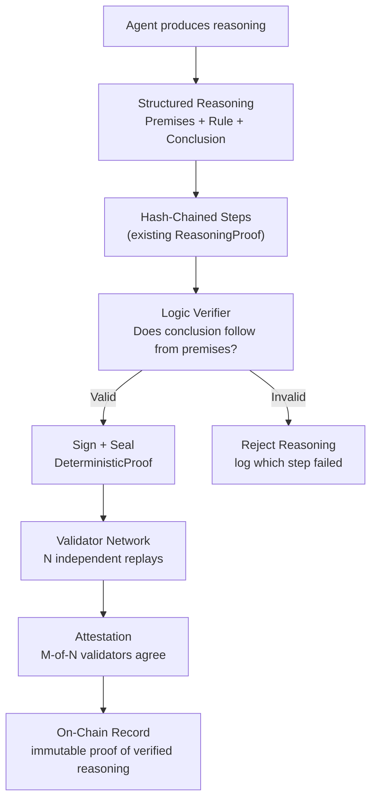
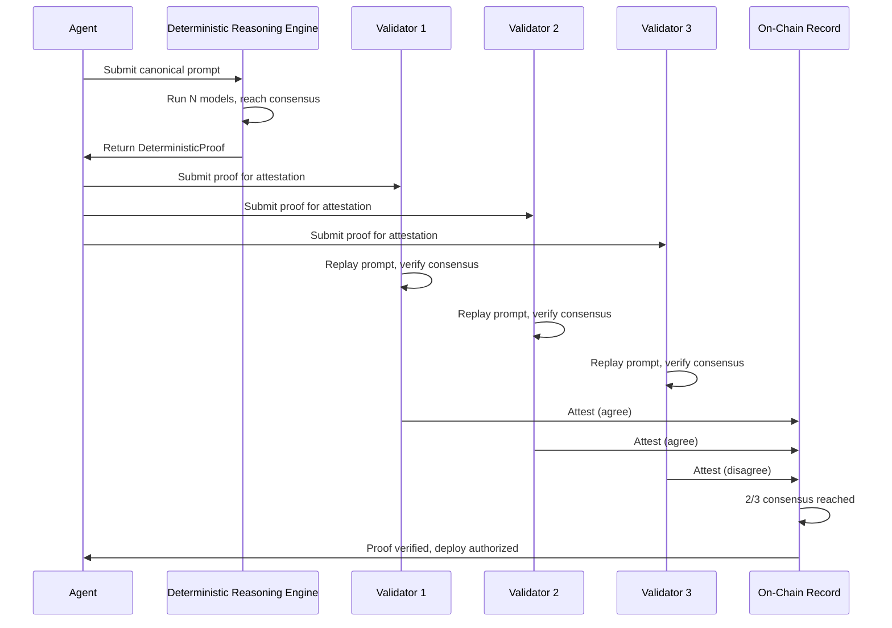

# Verifiable Reasoning Protocol (VRP) — Specification

## Problem Statement

Current `ReasoningProof` proves **integrity** (the chain wasn't tampered with) and **authenticity** (it was signed by this key). It does NOT prove **correctness** -- that the conclusion logically follows from the premises.

The Verifiable Reasoning Protocol (VRP) adds **logical entailment verification** so that every reasoning step can be independently checked for validity without trusting the LLM.

## Architecture



## Core Components

### 1. Structured Reasoning Steps

Replace free-text reasoning with **structured logical steps** that can be machine-verified.

```python
@dataclass
class VerifiableStep:
    step_id: int
    premises: List[str]         # What we know to be true (inputs, prior conclusions)
    inference_rule: str         # Named rule applied (modus_ponens, conjunction, etc.)
    conclusion: str             # What we derive
    confidence: float           # 0.0-1.0 model confidence
    evidence: Dict[str, Any]    # Supporting data (file paths, test results, metrics)
    timestamp: float
    step_hash: str = ""
```

**Supported inference rules:**

| Rule | Form | Example |
|------|------|---------|
| `modus_ponens` | If P then Q; P; therefore Q | "If all tests pass then deploy is safe; all tests pass; therefore deploy is safe" |
| `conjunction` | P and Q; therefore P&Q | "Lint passes and compile passes; therefore code quality gates pass" |
| `disjunctive_syllogism` | P or Q; not P; therefore Q | "Either fix the test or escalate; fix failed; therefore escalate" |
| `induction` | P(1), P(2), ..., P(n); therefore for-all P | "Test 1 passes, test 2 passes, ..., test N passes; therefore all tests pass" |
| `abduction` | Q is observed; P would explain Q; therefore P is likely | "Error rate spiked; bad deploy would explain spike; therefore rollback" |
| `data_lookup` | Query D for X; D returns Y; therefore X=Y | "Check CVE database for package X; no CVEs found; therefore X is safe" |
| `threshold` | X > T; therefore condition met | "Coverage is 94%; threshold is 90%; therefore coverage requirement met" |

### 2. Logic Verifier

A **deterministic, non-LLM component** that validates each step's logical structure.

```python
class LogicVerifier:
    def verify_step(self, step: VerifiableStep, prior_conclusions: List[str]) -> VerificationResult:
        """
        Check:
        1. All premises are either axioms (input data) or prior step conclusions
        2. The inference rule is valid for the given premises
        3. The conclusion follows from the premises under the stated rule
        """
```

**Verification checks:**
1. **Premise validity**: Every premise must be either:
   - An input axiom (provided context, file contents, test results)
   - A conclusion from a prior step in the chain
   - A data lookup result (verifiable by re-querying the source)
2. **Rule applicability**: The inference rule must be valid for the number and type of premises
3. **Conclusion derivability**: The conclusion must logically follow from the premises under the stated rule
4. **Evidence consistency**: If evidence is cited, it must be verifiable (file exists, test result matches)

### 3. Proof-of-Reasoning Consensus

Multiple **independent validators** replay the reasoning and attest to its validity.



**Validator responsibilities:**
1. Receive the `DeterministicProof` with `prompt_hash` and `response_hash`
2. Re-run the same canonical prompt on the same models
3. Verify they reach the same consensus response hash
4. Run the `LogicVerifier` on every reasoning step
5. Attest (agree/disagree) with their own signed proof
6. Stake $MAAT tokens -- slashed if they attest dishonestly

### 4. Attestation Record

```python
@dataclass
class Attestation:
    validator_id: str
    proof_id: str               # The DeterministicProof being attested
    verdict: str                # "agree" | "disagree"
    replay_response_hash: str   # Hash from validator's independent replay
    logic_check_passed: bool    # Did all reasoning steps pass LogicVerifier?
    stake_amount: float         # $MAAT staked on this attestation
    signature: str              # Validator's cryptographic signature
    timestamp: float
```

### 5. Verification Levels

| Level | Requirements | Authority Granted |
|-------|-------------|-------------------|
| **Self-verified** | Agent's own DeterministicProof | Can deploy to dev |
| **Peer-verified** | 3/5 validators attest agree | Can deploy to staging |
| **Fully-verified** | 5/5 validators attest agree + all logic checks pass | Can deploy to production |

## Acceptance Criteria

- [ ] VerifiableStep captures premises, inference rule, and conclusion as structured data
- [ ] LogicVerifier validates all 7 inference rules without using an LLM
- [ ] Invalid reasoning steps are rejected with specific error (which premise failed, which rule violated)
- [ ] Validators can independently replay and verify proofs
- [ ] Attestation records are signed and hash-chained
- [ ] End-to-end: Agent reasons -> DRE consensus -> Logic verification -> Validator attestation -> Production deploy authorized
- [ ] No human in the loop for fully-verified deployments
