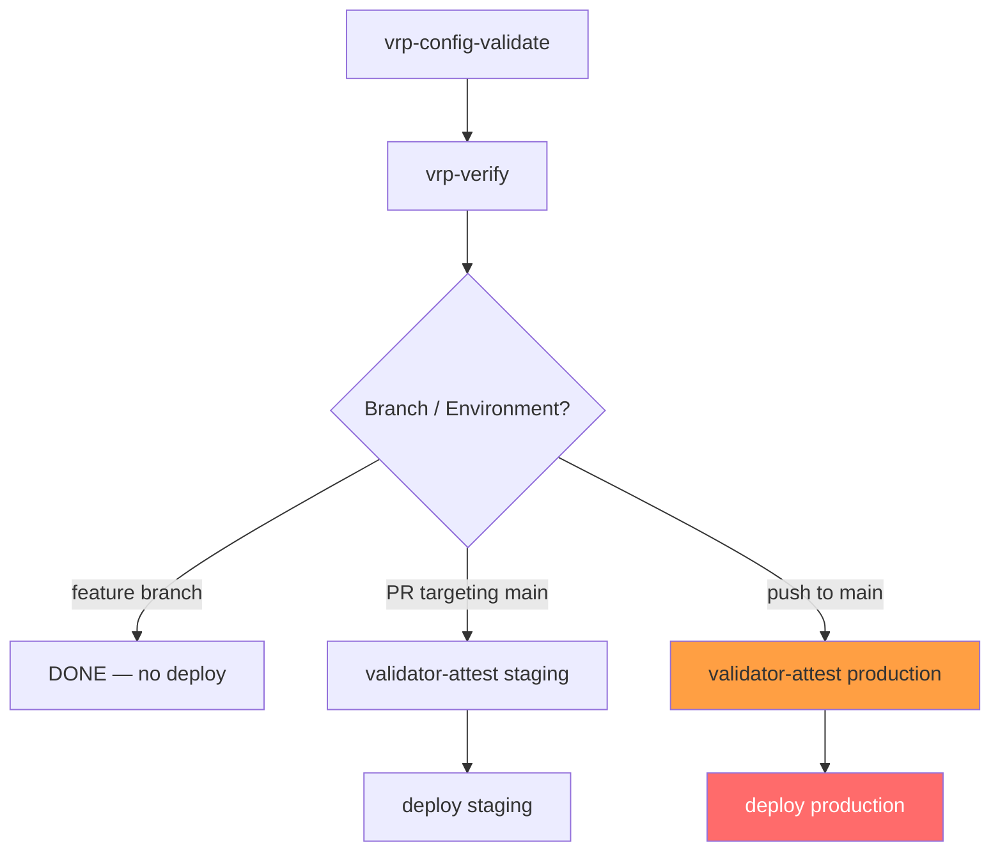

# VRP CI/CD Workflow — Technical Specification

**Version**: 1.0  
**Status**: Draft  
**Issue**: #123 — [VRP CI/CD Workflow]  
**Part of**: #29  
**Blocked by**: #116 (VRP Configuration)  
**Related Specs**: `specs/vrp-spec.md`, `specs/vrp-config-spec.md`, `specs/vrp-data-model-spec.md`, `specs/ada-spec.md`, `CONSTITUTION.md`

<!-- Addresses EDGE-C001 through EDGE-C080 (VRP CI/CD Workflow edge cases) -->

---

## Overview

This specification defines the GitHub Actions CI/CD pipeline for the Verifiable Reasoning Protocol
(VRP). It governs:

- When and how the workflow triggers
- The `vrp-verify` job (runs `LogicVerifier` against proof artifacts)
- The `validator-attest` job (collects attestation signatures from the validator network)
- The production `deploy` job (gated on fully-verified attestation — no manual approval)
- Secret/credential management for CI runners
- CI security hardening (fork safety, token scoping, log sanitization)
- Concurrency, scale limits, and audit trail requirements for CI

**Key invariant**: For `fully_verified` (production) deployments, **no manual approval step is
permitted** in the workflow. Authorization is provided entirely by the 7-condition ADA check and
the 2/3 validator quorum (`CONSTITUTION.md §3, §8`; `specs/ada-spec.md`).

---

## Workflow Trigger Specification

<!-- Addresses EDGE-C001, EDGE-C003, EDGE-C004, EDGE-C005 -->

### Trigger Events

```yaml
on:
  push:
    branches:
      - 'feat/**'
      - 'fix/**'
      - 'chore/**'
      - 'refactor/**'
  pull_request:
    types: [opened, synchronize, reopened]
    branches:
      - main
```

**Rules:**

| Event | Verification Level | Deploy Target | Notes |
|-------|-------------------|---------------|-------|
| `push` to feature branch | `self_verified` | None (verify only) | No deploy on feature branches |
| `pull_request` (non-main target) | `peer_verified` | Staging | Only PRs targeting `main` trigger production deploy |
| `pull_request` → `main` | `peer_verified` | Staging | `vrp-verify` + `validator-attest` for staging |
| `push` to `main` (post-merge) | `fully_verified` | Production | Full ADA 7-condition gate + validator quorum |

**Rule**: PRs targeting branches other than `main` (e.g., `release/v2`) trigger `vrp-verify` and
`validator-attest` for `staging` level only. They never trigger a production deploy.

**Bot / Dependabot PRs**: <!-- Addresses EDGE-C005 -->  
Automated bot PRs (identified by `github.actor` matching known bot accounts, e.g.,
`dependabot[bot]`, `renovate[bot]`) trigger `vrp-verify` for `self_verified` only. They do NOT
trigger `validator-attest` or `deploy`. Bot PRs cannot authorize deployments.

### Fork PR Security

<!-- Addresses EDGE-C002, EDGE-C048 -->

**The workflow MUST use `pull_request` (not `pull_request_target`) for all jobs that access
secrets.** The `pull_request_target` trigger runs in the context of the base branch and has access
to repository secrets, making it dangerous for fork PRs.

```yaml
# ✅ CORRECT — fork PRs run in restricted context, no secret access
on:
  pull_request:
    types: [opened, synchronize]

# ❌ FORBIDDEN — fork PRs would get secret access
# on:
#   pull_request_target:
```

For fork PRs, `vrp-verify` runs in read-only mode (no validator contact, no secret access). Fork
PRs cannot trigger `validator-attest` or `deploy` jobs. A maintainer must approve the fork PR via
the GitHub Actions "approve and run" gate before secrets-bearing jobs execute.

---

## Job Dependency Graph

<!-- Addresses EDGE-C030 -->



**Dependency enforcement**: Every job that accesses deployment infrastructure MUST declare
`needs: [validator-attest]` in its GitHub Actions job definition. A `deploy` job without this
`needs:` dependency is a **constitutional violation** (`CONSTITUTION.md §2`) and MUST fail
the linting step (`vrp-workflow-lint`).

```yaml
jobs:
  vrp-config-validate:
    # ... validates config files before anything else

  vrp-verify:
    needs: [vrp-config-validate]
    # ... runs LogicVerifier

  validator-attest:
    needs: [vrp-verify]
    # ... collects attestation signatures

  deploy:
    needs: [validator-attest]         # ← REQUIRED; deploy cannot skip attestation
    if: github.ref == 'refs/heads/main'
    # ... IaC deploy
```

---

## `vrp-config-validate` Job

<!-- Addresses EDGE-C031, EDGE-C056, EDGE-C057, EDGE-C058, EDGE-C059, EDGE-C060 -->

Runs before `vrp-verify`. Validates all config files in `config/` using `VRPConfig.load()`.

```yaml
vrp-config-validate:
  runs-on: ubuntu-latest
  steps:
    - uses: actions/checkout@v4
    - uses: actions/setup-python@v5
      with:
        python-version: '3.11'
    - run: pip install -r requirements.txt
    - name: Validate VRP config files
      run: python -m maatproof.config.validator --all-environments --strict
      # Fails with exit code 1 on any VRPConfigError.
      # Error messages are forwarded to GitHub Actions step summary.
```

**Failure behavior**: Any `VRPConfigError` (including `CONFIG_FILE_NOT_FOUND`,
`VERIFICATION_LEVEL_MISMATCH`, `QUORUM_ZERO`, `FEATURE_DRY_RUN_IN_PROD`,
`HUMAN_IN_LOOP_INVALID`, `TIMEOUT_OUT_OF_RANGE`) causes this job to fail with the full
error message in the GitHub Actions step summary.

---

## `vrp-verify` Job — LogicVerifier Interface

<!-- Addresses EDGE-C006, EDGE-C007, EDGE-C008, EDGE-C009, EDGE-C010, EDGE-C011,
     EDGE-C012, EDGE-C013, EDGE-C014, EDGE-C015, EDGE-C016, EDGE-C017,
     EDGE-C061, EDGE-C062, EDGE-C063, EDGE-C065, EDGE-C066, EDGE-C073, EDGE-C075 -->

### LogicVerifier Python Module

`LogicVerifier` is a Python class in `maatproof.vrp.verify` that validates all proof artifact
files in a designated directory.

```python
class LogicVerifier:
    """
    Validates all VerifiableStep-based ProofChain artifacts in a directory.

    Usage:
        verifier = LogicVerifier(
            artifacts_dir="proof-artifacts/",
            environment="production",
            config=VRPConfig.load("config/vrp-production.toml", "production"),
        )
        result = verifier.verify_all()
        if not result.all_valid:
            sys.exit(1)

    Exit codes:
        0 — All artifacts valid
        1 — One or more artifacts invalid or missing
        2 — Configuration error (before verification begins)
        3 — Dependency error (import failure, missing package)
    """

    def verify_all(self) -> VerificationResult:
        """
        Verify all .proof.json files in artifacts_dir.
        Returns a VerificationResult with per-artifact outcomes.

        Rules:
        1. If artifacts_dir is empty (no .proof.json files), returns
           VerificationResult(all_valid=False, error="No proof artifacts found.
           At least one .proof.json file is required per vrp-cicd-spec.md §vrp-verify")
        2. Each file is loaded, schema-validated, and integrity-checked.
        3. Verification continues through ALL files (no early exit) to produce
           a complete failure report. Exit code 1 is returned after all files
           are processed if any failed.
        4. Each invalid artifact produces a structured error entry.
        5. Artifacts larger than MAX_PROOF_ARTIFACT_SIZE_BYTES are rejected
           before deserialization.
        """
        ...

@dataclass
class VerificationResult:
    all_valid:     bool
    total:         int
    passed:        int
    failed:        int
    errors:        List[ArtifactError]    # per-artifact errors

@dataclass
class ArtifactError:
    file_path:     str
    error_type:    str    # see §Error Types below
    message:       str
    step_id:       Optional[int]   # which step failed (if applicable)
```

### Empty Artifacts Directory

<!-- Addresses EDGE-C006 -->

If `artifacts_dir` contains no `*.proof.json` files, `LogicVerifier.verify_all()` returns
`VerificationResult(all_valid=False)` with the error:

```
VRP-VERIFY-001: No proof artifacts found in 'proof-artifacts/'.
At least one .proof.json file must be present. Ensure the VRP reasoning
pipeline ran before this CI step and produced proof artifacts.
```

This is treated as a build failure (exit code 1). An empty directory is NOT a pass.

### Artifact Size Limit

<!-- Addresses EDGE-C066 -->

```python
MAX_PROOF_ARTIFACT_SIZE_BYTES = 10 * 1024 * 1024  # 10 MB

# Before deserialization:
if file_size > MAX_PROOF_ARTIFACT_SIZE_BYTES:
    raise VRPVerifyError(
        error_type="ARTIFACT_TOO_LARGE",
        message=f"Proof artifact {path!r} is {file_size} bytes, "
                f"exceeding 10 MB limit. AVM mempool rejects artifacts > 10 MB."
    )
```

### Scale Limit

<!-- Addresses EDGE-C065 -->

| Parameter | Limit | Behavior on Exceeded |
|-----------|-------|----------------------|
| Max `.proof.json` files per run | 500 | `VRP-VERIFY-012: Too many proof artifacts` — fail fast |
| Max single artifact size | 10 MB | `ARTIFACT_TOO_LARGE` — fail that artifact |
| Max total artifacts size | 200 MB | `TOTAL_SIZE_EXCEEDED` — fail the job |
| Max processing time per artifact | 60s | Timeout → `ARTIFACT_TIMEOUT` |

### Partial Artifact Signing

<!-- Addresses EDGE-C063 -->

If both a signed and an unsigned version of the same artifact exist (e.g., `service.artifact`
and `service.artifact.sig`), `vrp-verify` checks:

1. Only artifacts with a valid companion `.sig` file are accepted as evidence.
2. If an artifact exists without a `.sig` file, it is flagged as `ARTIFACT_UNSIGNED` (error,
   not warning) and causes exit code 1.
3. An artifact with a `.sig` file that fails signature verification is flagged as
   `ARTIFACT_SIG_INVALID`.

### Low-Confidence Steps

<!-- Addresses EDGE-C010 -->

If any `VerifiableStep` in a `ProofChain` has `confidence < 0.70`, `vrp-verify` must:

1. Record the step as `LOW_CONFIDENCE` in the verification result.
2. If the deploy target is `production` (`fully_verified` level):
   - Fail the `vrp-verify` job with exit code 1.
   - Error: `VRP-VERIFY-008: Step {step_id} has confidence {confidence:.2f} < 0.70.
     Production deployments require all steps to meet the 0.70 threshold
     (specs/avm-spec.md §Confidence Scoring).`
3. If the deploy target is `staging` or `dev`:
   - Log a warning but do not fail the job.

### Verification Level Enforcement

<!-- Addresses EDGE-C012 -->

`LogicVerifier` cross-checks each `ProofChain.verification_level` against the expected level
for the current CI environment:

| CI Environment | Expected `verification_level` | Mismatch Action |
|----------------|-------------------------------|-----------------|
| `production` | `fully_verified` | Fail with `VRP_LEVEL_MISMATCH` |
| `staging` | `peer_verified` | Fail with `VRP_LEVEL_MISMATCH` |
| `development` | `self_verified` | Fail with `VRP_LEVEL_MISMATCH` |

Error message format:
```
VRP-VERIFY-007: ProofChain in 'myservice.proof.json' has verification_level='peer_verified'
but this CI run targets production (requires 'fully_verified').
Rebuild the proof chain with the correct verification level for this environment.
```

### LLM Hallucination / Fabricated Tool Results

<!-- Addresses EDGE-C061 -->

`LogicVerifier` does not re-execute the LLM reasoning but does verify:

1. Every `VerifiableStep.inference_rule` is a known `InferenceRule` enum value.
2. For steps using `DATA_LOOKUP`: at least one `evidence` reference must be present (not empty).
3. For steps claimed as TOOL_CALL outputs: the `evidence` list must contain a content-addressed
   reference to the tool output artifact. An empty `evidence` list on a `DATA_LOOKUP` step is
   flagged as `EVIDENCE_MISSING`.
4. The `confidence` value is within `[0.0, 1.0]` (enforced by schema; `LogicVerifier` double-checks).

### Audit Entry on Crash

<!-- Addresses EDGE-C073 -->

`LogicVerifier` uses a `try/finally` block to ensure an audit entry is always written, even on
unexpected crash:

```python
try:
    result = self._verify_all_internal()
    self._emit_audit_entry("VRP_VERIFY_COMPLETE", result)
    return result
except Exception as e:
    self._emit_audit_entry("VRP_VERIFY_CRASH", {"error": str(e)})
    raise
finally:
    self._flush_audit_log()
```

The audit entry is written to the append-only audit log (CONSTITUTION.md §7) with an
HMAC-SHA256 signature before the process exits.

---

## `validator-attest` Job

<!-- Addresses EDGE-C018, EDGE-C019, EDGE-C020, EDGE-C021, EDGE-C022, EDGE-C023,
     EDGE-C024, EDGE-C026, EDGE-C028, EDGE-C029, EDGE-C033, EDGE-C040,
     EDGE-C041, EDGE-C042, EDGE-C052, EDGE-C053, EDGE-C069 -->

### Behavior Overview

The `validator-attest` job:
1. Loads the finalized `ProofChain` from the `vrp-verify` job output.
2. Calls each configured validator endpoint via gRPC TLS.
3. Collects `AttestationRecord` responses.
4. Checks quorum as attestations arrive (**fast-exit when quorum is met**).
5. Outputs the attestation collection as a signed JSON file for the `deploy` job.
6. Fails fast with a descriptive error if quorum is not reached within `timeout_seconds`.

### Fast-Exit After Quorum

<!-- Addresses EDGE-C042 -->

The `validator-attest` job MUST implement early termination:

```python
async def collect_attestations(chain: ProofChain, config: VRPConfig) -> AttestationCollection:
    """
    Dispatch attestation requests to all validators concurrently.
    Return as soon as quorum is reached (fast-exit).
    Cancel remaining pending requests.
    """
    attestations: List[AttestationRecord] = []
    tasks = {asyncio.create_task(attest(ep, chain)): ep for ep in config.validator_endpoints}

    total_stake = await chain_client.get_total_validator_stake()
    deadline = time.monotonic() + config.timeout_seconds

    while tasks:
        # Wait for the next task to complete, up to the remaining timeout
        remaining = deadline - time.monotonic()
        if remaining <= 0:
            for t in tasks:
                t.cancel()
            break

        done, _ = await asyncio.wait(tasks, timeout=remaining, return_when=asyncio.FIRST_COMPLETED)
        for task in done:
            tasks.pop(task, None)
            rec = task.result()  # raises on error
            if rec is not None:
                attestations.append(rec)
                # Fast-exit: cancel remaining requests if quorum already met
                if chain.is_quorum_reached(total_stake):
                    for remaining_task in tasks:
                        remaining_task.cancel()
                    return AttestationCollection(attestations=attestations, quorum_reached=True)

    quorum_reached = chain.is_quorum_reached(total_stake)
    return AttestationCollection(attestations=attestations, quorum_reached=quorum_reached)
```

### Timeout and Descriptive Errors

<!-- Addresses EDGE-C019, EDGE-C040, EDGE-C041 -->

If `timeout_seconds` is reached without quorum:

```
VRP-ATTEST-001: Validator attestation quorum NOT reached within 30s timeout.

Summary:
  Required:   3 attestations (quorum_threshold from config)
  Received:   1 attestations
  Timed out:  2 validators (grpcs://validator2.example.com:9443,
                            grpcs://validator3.example.com:9443)
  Rejected:   0 validators

Action:
  Check validator availability. If the validator network is degraded, the
  deployment is blocked until quorum can be achieved.
  Operator reference: specs/vrp-config-spec.md §Validator Endpoint Validation

Exit code: 1
```

The workflow step `timeout-minutes` MUST be set to enforce GitHub Actions job-level timeout:

```yaml
validator-attest:
  timeout-minutes: 15   # GH Actions hard cap; prevents 6-hour runner stall
  steps:
    - name: Collect validator attestations
      timeout-minutes: 10   # step-level; allows job cleanup before job timeout
      run: python -m maatproof.vrp.attest ...
```

<!-- Addresses EDGE-C041 -->
The GitHub Actions `timeout-minutes` on the job (15 min max for attestation) prevents the 6-hour
default runner timeout. If the job-level timeout fires before `validator-attest` completes,
GitHub Actions cancels the job and marks it failed — the deploy job does not run because
`needs: [validator-attest]` is unsatisfied.

### Validator Error Handling

<!-- Addresses EDGE-C021, EDGE-C022, EDGE-C023 -->

| Validator Response | Action |
|--------------------|--------|
| `ACCEPT` with valid signature | Count toward quorum |
| `REJECT` with reason | Log rejection reason; do not count toward quorum |
| `DISPUTE` | Fail the job immediately: `VRP-ATTEST-004: Validator opened DISPUTE — deploy blocked pending governance resolution. Dispute reference: {dispute_id}` |
| gRPC `UNAVAILABLE` / 503 | Retry once with 5s backoff; if still unavailable, skip this validator |
| gRPC `INTERNAL` / 500 | Log error; skip this validator; do not retry (transient vs. permanent unclear) |
| TLS handshake failure | Treat as UNAVAILABLE; log certificate expiry if detected |
| Invalid ECDSA signature | Reject attestation: `VRP-ATTEST-005: Attestation from {validator_id} has invalid ECDSA signature — possible key compromise or tampering. Not counted toward quorum.` |
| Timestamp > 60s from local clock | Reject: `VRP-ATTEST-006: Attestation timestamp diverges > 60s from CI clock. Possible replay or NTP misconfiguration.` |

<!-- Addresses EDGE-C028 -->
**Clock skew tolerance**: The `validator-attest` job rejects any `AttestationRecord.timestamp`
that is more than **60 seconds** in the future or more than **300 seconds** in the past,
relative to the CI runner's system clock. Timestamps outside this window are rejected with
`VRP-ATTEST-006`. This prevents stale or future-dated attestation replay.

### Concurrent Attestation Race Condition

<!-- Addresses EDGE-C029, EDGE-C003 -->

Multiple CI runs may simultaneously request attestations from the same validator network.
Validators handle this via the mempool deduplication check (`specs/pod-consensus-spec.md §Mempool
Management`): duplicate `trace_id` requests are deduplicated, but different runs (different
`chain_id` values) are processed independently.

The `validator-attest` job sets a **unique `chain_id`** per CI run (derived from the ProofChain
UUID). There is no cross-run attestation sharing.

**GitHub Actions concurrency** for simultaneous PRs:

```yaml
concurrency:
  group: validator-attest-${{ github.event.pull_request.number || github.sha }}
  cancel-in-progress: false    # Do NOT cancel in-progress attestation (lose quorum)
```

### Key Rotation During Active CI Run

<!-- Addresses EDGE-C053 -->

If the HMAC or ECDSA signing key is rotated while a `validator-attest` job is in flight:

1. Attestations signed with the old key before rotation remain valid for the duration of the
   30-day challenge window (`specs/agent-identity-spec.md §Identity Lifecycle`).
2. The `validator-attest` job does NOT automatically retry with the new key. The CI run
   completes with the key that was active at the start of the job.
3. If the old key is revoked (not just rotated) before attestation completes:
   - Validators reject attestations signed with the revoked key.
   - The job fails with `VRP-ATTEST-007: Signing key revoked during active attestation.
     Restart the CI run to use the current signing key.`
4. Operators MUST NOT revoke signing keys while CI runs are in flight. Key rotation
   should be coordinated with the CI pipeline state.

### Deployment Failure After Attestation

<!-- Addresses EDGE-C033 -->

If the `deploy` job fails after `validator-attest` succeeds:

1. The `AttestationCollection` output artifact is **not consumed** — it remains available
   as a GitHub Actions artifact for up to 24 hours.
2. The operator MAY re-run the failed `deploy` job (via "Re-run failed jobs" in GitHub Actions)
   within 24 hours **without** re-running `validator-attest`, provided:
   - The same git SHA is being deployed (no new commits).
   - The attestation TTL has not expired (5 minutes per `specs/pod-consensus-spec.md §Mempool
     Management` for on-chain submission; 24 hours for CI artifact retention).
3. After the 24-hour window, or if a new commit is pushed, `validator-attest` must run again.

---

## Production Deploy Job

<!-- Addresses EDGE-C030, EDGE-C032, EDGE-C034, EDGE-C035, EDGE-C036, EDGE-C037 -->

### No Manual Approval Step

<!-- Addresses EDGE-C035 -->

The production `deploy` job **MUST NOT** include a GitHub Actions `environment` with a
`required_reviewers` list configured for the `production` environment if `human_in_loop = false`
in the VRP config. This is the ADA autonomous mode (`CONSTITUTION.md §8`; `specs/ada-spec.md`).

```yaml
deploy:
  needs: [validator-attest]
  runs-on: ubuntu-latest
  # ✅ ADA mode — no 'environment: production' with required_reviewers
  # environment: production    ← This gate is REMOVED for fully_verified ADA mode
  if: github.ref == 'refs/heads/main'
  steps:
    - name: Verify attestation quorum output
      run: python -m maatproof.vrp.deploy_gate --attestation ${{ needs.validator-attest.outputs.attestation_path }}
    - name: Run IaC deploy (Bicep / Terraform)
      run: |
        # IaC tool invocation here
        ...
```

**Exception**: If the Deployment Contract declares `require_human_approval` (policy primitive per
`CONSTITUTION.md §3`), then and only then should a GitHub Actions environment with
`required_reviewers` be configured. This is an opt-in for regulated workloads — it is not the
default.

### IaC Tooling Requirements

<!-- Addresses EDGE-C032 -->

The `deploy` job runner MUST have the following tools available. These are declared in the
workflow via `setup` steps or pre-installed on the runner image:

| Tool | Minimum Version | Installation |
|------|----------------|--------------|
| Bicep CLI | 0.22+ | `az bicep install` |
| Terraform CLI | 1.6+ | `hashicorp/setup-terraform@v3` |
| Azure CLI | 2.54+ | Pre-installed on `ubuntu-latest` |

```yaml
    - name: Install Bicep CLI
      run: az bicep install
    - name: Verify IaC tooling
      run: |
        bicep --version || { echo "VRP-DEPLOY-001: Bicep CLI not installed"; exit 1; }
        terraform version || { echo "VRP-DEPLOY-001: Terraform CLI not installed"; exit 1; }
```

If a required tool is not installed, the step fails with `VRP-DEPLOY-001: {tool} not installed.
Add the setup step to the workflow per specs/vrp-cicd-spec.md §IaC Tooling Requirements.`

### Simultaneous Production Deploys

<!-- Addresses EDGE-C034 -->

The `deploy` job uses GitHub Actions concurrency to prevent simultaneous production deploys:

```yaml
deploy:
  concurrency:
    group: deploy-production
    cancel-in-progress: false   # Queue second deploy; do NOT cancel first
```

This ensures that if two commits land on `main` in rapid succession, the second deploy
waits for the first to complete. `cancel-in-progress: false` prevents a half-deployed
state that could corrupt infrastructure.

### Environment Enforcement

<!-- Addresses EDGE-C036 -->

Before invoking IaC tooling, the `deploy` job verifies that the attestation output's
`deploy_environment` field matches the CI target:

```python
def verify_deploy_environment(attestation: AttestationCollection, expected_env: str) -> None:
    """
    Verify that the attested ProofChain targets the correct environment.

    Raises:
        VRPDeployError if deploy_environment != expected_env.

    <!-- Addresses EDGE-C036 -->
    """
    if attestation.deploy_environment != expected_env:
        raise VRPDeployError(
            f"VRP-DEPLOY-003: Attestation was collected for "
            f"deploy_environment='{attestation.deploy_environment}' but this "
            f"CI job targets '{expected_env}'. Aborting deploy to prevent "
            "cross-environment deployment."
        )
```

### Runtime Guard Integration

<!-- Addresses EDGE-C037 -->

After IaC deployment succeeds, the `deploy` job starts the **Runtime Guard observation window**
(as declared in the ADA authorization's `RuntimeGuard` struct, `specs/ada-spec.md §Condition 7`).

```yaml
    - name: Start Runtime Guard observation
      run: |
        python -m maatproof.ada.runtime_guard \
          --deployment-id "${{ steps.deploy.outputs.deployment_id }}" \
          --observation-window-secs "${{ steps.attest.outputs.observation_window_secs }}" \
          --thresholds-file runtime-guard-thresholds.json \
          --on-rollback "python -m maatproof.ada.rollback --emit-proof"
```

If the Runtime Guard triggers an auto-rollback during the observation window:
1. The rollback executes automatically (no manual step).
2. A `RollbackProof` is emitted and submitted to the chain (`specs/ada-spec.md §Rollback Proof Structure`).
3. The CI job exits with code `2` (rollback triggered; not a generic failure).
4. The GitHub Actions step summary displays: `⚠️ Auto-rollback triggered: {reason}. RollbackProof: {proof_hash}`.

---

## Verification Level Determination

<!-- Addresses EDGE-C012, EDGE-C036 -->

The CI workflow determines the verification level from the trigger context:

```python
def determine_verification_level(
    github_ref: str,
    github_event_name: str,
) -> tuple[str, str]:
    """
    Returns (environment, verification_level) based on the CI trigger context.

    <!-- Addresses EDGE-C001, EDGE-C012 -->
    """
    if github_event_name == "push" and github_ref.startswith("refs/heads/main"):
        return ("production", "fully_verified")
    elif github_event_name in ("pull_request", "pull_request_review"):
        # All PRs use staging/peer_verified; production deploy only on merge to main
        return ("staging", "peer_verified")
    elif github_event_name == "push":
        # Feature branch push
        return ("development", "self_verified")
    else:
        raise VRPCIError(f"Unrecognized trigger context: event={github_event_name}, ref={github_ref}")
```

The `config_file` is selected based on `environment`:

| Environment | Config File |
|-------------|-------------|
| `production` | `config/vrp-production.toml` |
| `staging` | `config/vrp-staging.toml` |
| `development` | `config/vrp-dev.toml` |

---

## Secret and Credential Management

<!-- Addresses EDGE-C026, EDGE-C047, EDGE-C049, EDGE-C051, EDGE-C052, EDGE-C054, EDGE-C055, EDGE-C076 -->

### Required GitHub Secrets

<!-- Addresses EDGE-C051 -->

| GitHub Secret | Purpose | Required For |
|---------------|---------|--------------|
| `AZURE_CLIENT_ID` | Federated identity for OIDC auth to Azure Key Vault | `validator-attest`, `deploy` |
| `AZURE_TENANT_ID` | Azure tenant for OIDC | `validator-attest`, `deploy` |
| `AZURE_SUBSCRIPTION_ID` | Azure subscription for IaC | `deploy` |
| `VRP_VALIDATOR_NETWORK_TOKEN` | Bearer token for gRPC attestation requests | `validator-attest` |

If any required secret is missing, the job fails at startup with:
```
VRP-CI-001: Required GitHub Secret '{secret_name}' is not configured.
See specs/vrp-cicd-spec.md §Required GitHub Secrets for setup instructions.
```

### Azure Key Vault Authentication (OIDC Federated Identity)

<!-- Addresses EDGE-C052 -->

CI runners authenticate to Azure Key Vault using **OIDC Workload Identity Federation**, not
service principal passwords. This eliminates long-lived secrets from GitHub Secrets.

```yaml
permissions:
  id-token: write    # Required for OIDC token generation
  contents: read

steps:
  - name: Authenticate to Azure
    uses: azure/login@v2
    with:
      client-id: ${{ secrets.AZURE_CLIENT_ID }}
      tenant-id: ${{ secrets.AZURE_TENANT_ID }}
      subscription-id: ${{ secrets.AZURE_SUBSCRIPTION_ID }}
```

If Azure authentication fails (misconfigured federated credential, wrong audience):
```
VRP-CI-002: Azure OIDC authentication failed. Ensure the GitHub Actions workflow
is registered as a federated credential in the Azure App Registration.
See: https://docs.microsoft.com/en-us/azure/active-directory/develop/workload-identity-federation
```

### Log Sanitization — Preventing Secret Leakage

<!-- Addresses EDGE-C049, EDGE-C076 -->

The following values MUST NOT appear in GitHub Actions job logs:

| Value | Why Sensitive |
|-------|---------------|
| `signing_key_ref` Key Vault URI (with version) | Tells attacker exact key version to target |
| `stake_amount` of specific validators | Reveals validator economic position |
| Agent DID (`agent_id`) | Personally identifiable agent identity |
| Raw `signature` values from `AttestationRecord` | Could enable targeted forgery analysis |

**Masking rule**: Any field named `signing_key_ref` MUST be masked in log output using
`::add-mask::` before it is printed:

```yaml
- name: Mask sensitive values
  run: |
    SIGNING_KEY_REF=$(python -m maatproof.config.get_field --field signing_key_ref \
      --config config/vrp-${{ env.VRP_ENVIRONMENT }}.toml)
    echo "::add-mask::$SIGNING_KEY_REF"
```

The `validator_id` (agent DID) MAY appear in logs for traceability but MUST be labeled as
`[AGENT_DID]` to distinguish it from human identifiers.

### GITHUB_TOKEN Permission Scope

<!-- Addresses EDGE-C047 -->

The `GITHUB_TOKEN` in VRP CI/CD workflows MUST be scoped minimally:

```yaml
permissions:
  contents: read        # Read repo for checkout
  id-token: write       # OIDC for Azure auth
  pull-requests: write  # Post status comments
  checks: write         # Post check run results
  # issues: write       ← Only if the workflow posts issue comments
  # deployments: write  ← Only for deploy job
```

**Prohibited permissions for agent workflows**:
- `pull-requests: write` MUST NOT be used to approve pull requests by the agent workflow.
  PRs require human approval (`CONSTITUTION.md §10`). Approving a PR via GITHUB_TOKEN is a
  constitutional violation and MUST be flagged by the `vrp-workflow-lint` step.

---

## Workflow Concurrency Settings

<!-- Addresses EDGE-C003, EDGE-C029, EDGE-C034 -->

Full concurrency configuration for the VRP CI/CD workflow:

```yaml
concurrency:
  # Per-PR concurrency: cancel stale runs on same PR when new commit pushed
  group: vrp-cicd-${{ github.event.pull_request.number || github.sha }}
  cancel-in-progress: true    # Cancel stale PR runs when new commit arrives

jobs:
  # Jobs that do NOT hold state (verify, config-validate): cancel-in-progress OK
  # Jobs that hold state (validator-attest, deploy): must NOT be cancelled mid-run

  validator-attest:
    concurrency:
      group: validator-attest-${{ github.ref }}
      cancel-in-progress: false   # Never cancel mid-attestation (partial quorum is lost)

  deploy:
    concurrency:
      group: deploy-${{ env.VRP_ENVIRONMENT }}
      cancel-in-progress: false   # Never cancel mid-deploy (infrastructure state)
```

---

## Audit Trail for CI Runs

<!-- Addresses EDGE-C073, EDGE-C074, EDGE-C075, EDGE-C076 -->

### CI Audit Entry Types

Each CI job produces `VRPConfigAuditEntry`-compatible records in the append-only audit log
(`CONSTITUTION.md §7`). Additional CI-specific event types:

| `event_type` | Emitted When |
|-------------|--------------|
| `VRP_VERIFY_START` | `vrp-verify` job begins processing |
| `VRP_VERIFY_COMPLETE` | All artifacts processed; result (pass/fail) recorded |
| `VRP_VERIFY_CRASH` | `vrp-verify` exits unexpectedly |
| `VRP_ATTEST_START` | `validator-attest` job begins |
| `VRP_ATTEST_QUORUM_MET` | Quorum reached; fast-exit executed |
| `VRP_ATTEST_QUORUM_FAILED` | Timeout or insufficient attestations |
| `VRP_ATTEST_VALIDATOR_REJECT` | Individual validator returns REJECT |
| `VRP_ATTEST_VALIDATOR_DISPUTE` | Individual validator returns DISPUTE |
| `VRP_DEPLOY_START` | `deploy` job begins IaC execution |
| `VRP_DEPLOY_SUCCESS` | IaC deployment completed successfully |
| `VRP_DEPLOY_ROLLBACK` | Runtime Guard triggered rollback |
| `VRP_DEPLOY_FAILURE` | IaC deployment failed |

All audit entries include an **HMAC-SHA256 signature** per `CONSTITUTION.md §7`.

### Long-Term Audit Log Retention

<!-- Addresses EDGE-C074 -->

GitHub Actions workflow logs default to 90-day retention — insufficient for SOX (7 years)
and HIPAA (6 years) requirements (`docs/07-regulatory-compliance.md`).

**Required CI audit log export**:

1. The `vrp-verify` and `validator-attest` jobs MUST export their structured audit entries
   (as JSON with HMAC signatures) to a durable external store:
   - Azure Blob Storage (immutable storage policy, locked container)
   - Retention configured for ≥ 7 years (SOX requirement)
2. Audit entries are uploaded as a named GitHub Actions artifact AND sent to external storage.
3. The `deploy` job MUST NOT proceed if the audit export step fails — compliance evidence
   must be preserved before the deployment takes effect.

```yaml
    - name: Export audit log to durable storage
      run: |
        python -m maatproof.audit.export \
          --output audit-log-${{ github.run_id }}.jsonl \
          --destination "https://${{ env.AUDIT_STORAGE_ACCOUNT }}.blob.core.windows.net/ci-audit-logs/"
      # This step is NOT allowed to be skipped. failure_mode: fail
```

---

## CI Security Hardening Summary

<!-- Addresses EDGE-C002, EDGE-C047, EDGE-C048 -->

| Requirement | Implementation |
|-------------|----------------|
| Fork PRs cannot access secrets | Use `pull_request` trigger (not `pull_request_target`) |
| Fork PRs cannot trigger production deploy | `deploy` job only runs on `github.ref == 'refs/heads/main'` |
| Agent cannot approve own PRs | `pull-requests: write` MUST NOT be used for approvals |
| Signing key URI not logged in plaintext | `::add-mask::` applied before any logging |
| Sensitive validator data not in public logs | `validator_id`, `stake_amount` excluded from step summaries |
| IaC credentials scoped to deploy job only | `AZURE_SUBSCRIPTION_ID` only in `deploy` job context |
| GITHUB_TOKEN minimal permissions | Declared per-workflow, per-job minimum scope |
| Workflow file linting | `vrp-workflow-lint` step validates job graph on every PR |

---

## Error Code Reference for CI

<!-- Addresses EDGE-C040 -->

| Code | Job | Description |
|------|-----|-------------|
| `VRP-VERIFY-001` | `vrp-verify` | No proof artifacts found |
| `VRP-VERIFY-007` | `vrp-verify` | `verification_level` mismatch for environment |
| `VRP-VERIFY-008` | `vrp-verify` | Step confidence below 0.70 threshold |
| `VRP-VERIFY-009` | `vrp-verify` | Artifact integrity check failed (`verify_integrity() = False`) |
| `VRP-VERIFY-010` | `vrp-verify` | Schema version unsupported (`VRPVersionError`) |
| `VRP-VERIFY-011` | `vrp-verify` | Chain not finalized (`root_hash = ""`) |
| `VRP-VERIFY-012` | `vrp-verify` | Too many proof artifacts (> 500) |
| `VRP-VERIFY-013` | `vrp-verify` | Artifact too large (> 10 MB) |
| `VRP-VERIFY-014` | `vrp-verify` | Missing Python dependency (`ModuleNotFoundError`) |
| `VRP-VERIFY-015` | `vrp-verify` | Evidence missing on `DATA_LOOKUP` step |
| `VRP-VERIFY-016` | `vrp-verify` | Artifact unsigned (no `.sig` companion file) |
| `VRP-ATTEST-001` | `validator-attest` | Quorum timeout — descriptive error with counts |
| `VRP-ATTEST-002` | `validator-attest` | All validators unreachable |
| `VRP-ATTEST-003` | `validator-attest` | Quorum not met (enough validators responded but disagreed) |
| `VRP-ATTEST-004` | `validator-attest` | Validator opened DISPUTE |
| `VRP-ATTEST-005` | `validator-attest` | Invalid ECDSA signature from validator |
| `VRP-ATTEST-006` | `validator-attest` | Attestation timestamp outside ±60s/+300s window |
| `VRP-ATTEST-007` | `validator-attest` | Signing key revoked during active attestation |
| `VRP-DEPLOY-001` | `deploy` | Required IaC tool not installed |
| `VRP-DEPLOY-002` | `deploy` | ADA conditions not met (< 7 conditions satisfied) |
| `VRP-DEPLOY-003` | `deploy` | `deploy_environment` mismatch in attestation |
| `VRP-DEPLOY-004` | `deploy` | Runtime Guard rollback triggered |
| `VRP-CI-001` | all | Required GitHub Secret not configured |
| `VRP-CI-002` | all | Azure OIDC authentication failed |
| `VRP-CI-003` | all | Audit log export failed |

---

## Dependency Installation

<!-- Addresses EDGE-C017 -->

All CI jobs that invoke `maatproof` Python modules MUST include a dependency installation step:

```yaml
    - uses: actions/setup-python@v5
      with:
        python-version: '3.11'
        cache: 'pip'
    - name: Install dependencies
      run: |
        pip install --upgrade pip
        pip install -r requirements.txt
        # Verify critical packages are importable
        python -c "from maatproof.vrp import VerifiableStep, ProofChain; from cryptography.hazmat.primitives.asymmetric import ec; print('Dependencies OK')" \
          || { echo "VRP-VERIFY-014: Required Python packages not installed. Run 'pip install -r requirements.txt'."; exit 3; }
```

Exit code 3 (dependency error) is distinct from exit code 1 (verification failure) so that CI
dashboards can distinguish "couldn't run" from "ran and found issues".

---

## Scale and Resource Limits Summary

<!-- Addresses EDGE-C065, EDGE-C066, EDGE-C067, EDGE-C068 -->

| Parameter | Limit | Enforcement |
|-----------|-------|-------------|
| Max proof artifact files per CI run | 500 | `VRP-VERIFY-012` |
| Max single proof artifact size | 10 MB | `VRP-VERIFY-013` |
| Max total proof artifact size per run | 200 MB | Job pre-check |
| Max `validator-attest` job duration | 15 min | `timeout-minutes: 15` |
| Max attestation response size | 5 MB | gRPC max message size config |
| Max `deploy` job duration | 60 min | `timeout-minutes: 60` |
| GitHub Actions artifact retention | 24 hours (attestation output) | `retention-days: 1` |
| Audit log retention | ≥ 7 years (external storage) | Azure Blob immutable |

**Memory limits for validators**: The `validator-attest` job sets gRPC max message receive size
to 5 MB. Responses larger than 5 MB are rejected with `VRP-ATTEST-008: Validator response
exceeds 5 MB limit. Possible malicious validator or misconfiguration.`

---

## References

- Issue #123 — [VRP CI/CD Workflow]
- Issue #116 — [VRP Configuration]
- Issue #29 — [VRP Epic]
- `specs/vrp-spec.md` — Verifiable Reasoning Protocol
- `specs/vrp-config-spec.md` — VRP Configuration
- `specs/vrp-data-model-spec.md` — VRP Data Model
- `specs/ada-spec.md` — Autonomous Deployment Authority
- `specs/pod-consensus-spec.md` — Proof-of-Deploy Consensus
- `CONSTITUTION.md` §3, §7, §8, §10 — Pipeline Constitution
- `docs/06-security-model.md` — Security Model
- `docs/07-regulatory-compliance.md` — Regulatory Compliance (audit retention)
- GitHub Actions hardening: https://docs.github.com/en/actions/security-guides
