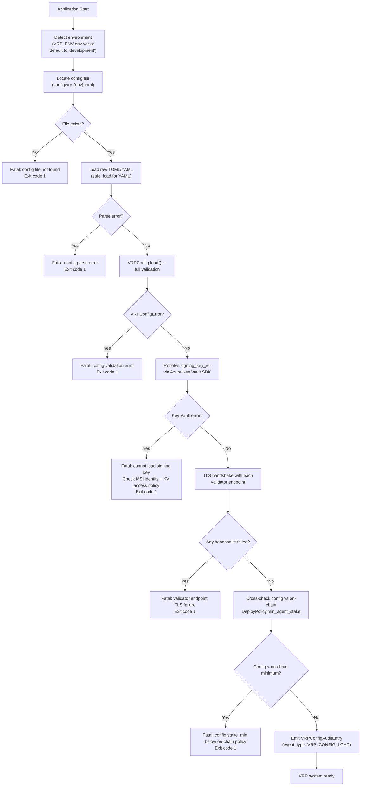

# VRP Configuration — Technical Specification

**Version**: 1.0
**Status**: Draft
**Language**: Python, YAML / TOML
**Secrets Manager**: Azure Key Vault (primary), AWS Secrets Manager / GCP Secret Manager (alternative)
**Related Issues**: #116 (VRP Configuration), Part of #29
**Related Specs**: `specs/vrp-spec.md`, `specs/vrp-data-model-spec.md`, `specs/agent-identity-spec.md`, `docs/06-security-model.md`

<!-- Addresses EDGE-001 through EDGE-078 -->

---

## Overview

This specification defines the **environment-specific configuration schema** for the
Verifiable Reasoning Protocol (VRP) system. It governs how validator network endpoints,
signing key references, MAAT stake thresholds, quorum requirements per verification level,
and feature-flag toggles are declared and loaded across development, staging (UAT), and
production environments.

**Design constraints:**
1. Secrets (signing keys, HMAC keys) are **never stored as plain text** in config files or environment variables. All secrets are referenced by Key Vault URI only.
2. The configuration schema is validated at application startup and on reload. Invalid configurations cause a hard startup failure (not a degraded mode).
3. Every configuration change is recorded in the audit trail (see CONSTITUTION.md §7).
4. Production configurations are immutable at runtime: hot-reload is disabled in production.

---

## Verification Level → Environment Mapping

<!-- Addresses EDGE-006, EDGE-010, EDGE-013, EDGE-018, EDGE-048, EDGE-051 -->

Each environment MUST declare exactly one `verification_level`. The protocol enforces the
following invariant:

| Environment | Required `verification_level` | Min Validators | Min `quorum_threshold` | `maat_stake_min` | `human_in_loop` |
|---|---|---|---|---|---|
| `development` | `self_verified` | 1 (local only) | N/A (single-node) | `0` (no staking) | N/A |
| `staging` | `peer_verified` | ≥ 2 | N/A (any peer ack) | ≥ `1000` (non-zero) | N/A |
| `production` | `fully_verified` | ≥ 3 | ≥ `3` | ≥ `10000` | `false` |

**Rule**: A configuration file for `production` that sets `verification_level` to anything other than `fully_verified` is rejected at startup with `VRPConfigError: verification_level mismatch for production environment`.

**Rule**: A configuration file for `staging` that sets `maat_stake_min = 0` is rejected with `VRPConfigError: maat_stake_min must be > 0 for peer_verified level`.

These invariants align with:
- `docs/05-tokenomics.md` §Staking — agent minimum stakes per environment
- `specs/vrp-data-model-spec.md` §Verification Levels
- `CONSTITUTION.md` §3 — ADA is the default; human approval is a policy primitive

---

## Configuration File Format

<!-- Addresses EDGE-001, EDGE-002, EDGE-003, EDGE-004, EDGE-052, EDGE-053, EDGE-054 -->

Configuration is stored as **TOML** (preferred) or **YAML** files, one file per environment.
Config values may be overridden by environment variables using the `VRP_` prefix (see §Environment Variable Overrides).

### File Naming Convention

```
config/
  vrp-dev.toml          ← development environment
  vrp-staging.toml      ← staging (UAT) environment
  vrp-production.toml   ← production environment
```

### TOML Schema (Canonical)

```toml
# vrp-production.toml — Example production configuration
# All secret values MUST use Key Vault URI references.
# Plain-text secrets will be rejected by the config validator.

[environment]
name              = "production"                 # string; must be "development" | "staging" | "production"
verification_level = "fully_verified"            # string enum; must match environment invariant table above
human_in_loop     = false                        # bool; must be false for production (ADA autonomous mode)

[validators]
# validator_endpoints: list of gRPC TLS endpoints for the VRP validator network.
# Must use grpcs:// scheme (TLS required). Plain grpc:// is rejected in staging and production.
# Development may use grpc:// for the single local validator only.
# Minimum count enforced by environment: dev≥1, staging≥2, production≥3.
endpoints = [
  "grpcs://validator1.maat.example.com:9443",
  "grpcs://validator2.maat.example.com:9443",
  "grpcs://validator3.maat.example.com:9443",
]

# quorum_threshold: integer; number of validator ACCEPT attestations required.
# For fully_verified: must be ≥ 3.
# For peer_verified: must be ≥ 1 (but ≥ 2 recommended for high availability).
# For self_verified: field is ignored (single-node; no external validators).
quorum_threshold = 3

# timeout_seconds: maximum seconds to wait for validator attestations before failing.
timeout_seconds = 30

[signing]
# signing_key_ref: Azure Key Vault URI for the agent Ed25519 signing key.
# Format: https://{vault-name}.vault.azure.net/keys/{key-name}/{version}
# Must not be a plain-text key value. The config validator rejects any value that
# does not start with "https://" and match the Key Vault URI pattern.
# For dev only: file:// URIs are permitted for local key files (not Key Vault).
signing_key_ref  = "https://maat-prod-kv.vault.azure.net/keys/vrp-signing-key/a1b2c3d4e5f6"

# signing_algorithm: must be "Ed25519" for self_verified and peer_verified levels.
# Must be "Ed25519" for fully_verified (validator attestation uses ECDSA P-256;
# see vrp-data-model-spec.md §Signature Helpers — but the agent signing key is Ed25519
# per specs/agent-identity-spec.md).
# NOTE: AttestationRecord.sign_ecdsa() uses ECDSA P-256 for validator-side attestation
# (vrp-data-model-spec.md §FULLY_VERIFIED). The agent's signing key is always Ed25519.
signing_algorithm = "Ed25519"

[staking]
# maat_stake_min: minimum MAAT stake in whole tokens (not wei).
# Must satisfy: dev=0, staging≥1000, production≥10000.
# Config validator cross-checks against the on-chain DeployPolicy minimum at startup.
maat_stake_min = 10000

# stake_lock_days: number of days stake is locked post-deployment.
# Must be ≥ 30 (matches specs/agent-identity-spec.md §Identity Lifecycle).
stake_lock_days = 30

[feature_flags]
# Feature flags are boolean toggles. Security-relevant flags are audited on change.
# Feature flags CANNOT override the verification_level or quorum_threshold.
# Attempting to do so is treated as a configuration error.

# enable_vrp_merkle_dag: enables Merkleized DAG reasoning packages (see specs/vrp-spec.md).
enable_vrp_merkle_dag = true

# enable_partial_proof: enables selective disclosure of reasoning sub-trees.
enable_partial_proof  = true

# enable_zk_trace: enables ZK proof path (Phase 5; requires zkLLM support).
enable_zk_trace       = false

# enable_dry_run: if true, all deployments are simulated only (no production side-effects).
# MUST be false in production. Config validator rejects enable_dry_run=true in production.
enable_dry_run        = false
```

---

## YAML Schema (Alternative Format)

<!-- Addresses EDGE-004, EDGE-054, EDGE-059, EDGE-060 -->

YAML is supported but TOML is preferred. YAML files MUST be parsed with a safe loader
(`yaml.safe_load()`) to prevent Python object injection via YAML tags (`!!python/object`).

```yaml
# vrp-staging.yaml — Example staging configuration

environment:
  name: "staging"
  verification_level: "peer_verified"
  human_in_loop: null   # not applicable at staging level

validators:
  endpoints:
    - "grpcs://validator1.maat-staging.example.com:9443"
    - "grpcs://validator2.maat-staging.example.com:9443"
  quorum_threshold: 1   # peer_verified: ≥1 attestation required
  timeout_seconds: 30

signing:
  signing_key_ref: "https://maat-staging-kv.vault.azure.net/keys/vrp-signing-key/b2c3d4e5f6a7"
  signing_algorithm: "Ed25519"

staking:
  maat_stake_min: 1000
  stake_lock_days: 30

feature_flags:
  enable_vrp_merkle_dag: true
  enable_partial_proof: true
  enable_zk_trace: false
  enable_dry_run: false
```

**YAML Injection Prevention** (<!-- Addresses EDGE-060 -->):
- The VRP config loader calls `yaml.safe_load()`, not `yaml.load()`.
- `yaml.safe_load()` rejects all YAML tags (e.g., `!!python/object`, `!!python/exec`).
- Any YAML parsing exception causes a `VRPConfigError` at startup.
- YAML anchors and aliases (`&anchor`, `*alias`) are permitted for non-security fields but MUST NOT be used to inherit one environment's `verification_level`, `quorum_threshold`, or `maat_stake_min` into another environment's block.
- CI lint step (`vrp-config-lint`) validates that anchors do not cross environment boundaries.

---

## Per-Environment Config Reference

<!-- Addresses EDGE-006, EDGE-007, EDGE-008, EDGE-009, EDGE-010, EDGE-011, EDGE-012, EDGE-013, EDGE-014, EDGE-015, EDGE-016, EDGE-017, EDGE-018, EDGE-019 -->

### Development (`self_verified`)

```toml
# vrp-dev.toml

[environment]
name               = "development"
verification_level = "self_verified"
human_in_loop      = null             # not applicable at dev level

[validators]
# Single local validator for self_verified. Plain grpc:// allowed for localhost only.
# Must be exactly 1 endpoint (self_verified: single-node, no consensus).
endpoints        = ["grpc://localhost:9440"]
quorum_threshold = 0                  # ignored for self_verified; field must still be present
timeout_seconds  = 10

[signing]
# Dev may use a local key file instead of Key Vault.
# Accepted URI schemes: https:// (Key Vault) or file:// (local key file, dev only).
# The file:// URI is REJECTED in staging and production.
signing_key_ref   = "file:///etc/maat/dev-key.pem"
signing_algorithm = "Ed25519"

[staking]
maat_stake_min = 0              # No staking requirement for development
stake_lock_days = 0             # No lock for development

[feature_flags]
enable_vrp_merkle_dag = false   # Simplified for dev
enable_partial_proof  = false
enable_zk_trace       = false
enable_dry_run        = true    # Allowed in dev
```

**Dev-specific invariants:**
- `maat_stake_min` MUST be `0` for development. Any non-zero value is a configuration error.
- `validators.endpoints` MUST have exactly 1 entry with scheme `grpc://` (localhost only).
- `enable_dry_run = true` is allowed in development; rejected in staging and production.
- `file://` scheme for `signing_key_ref` is allowed in development only.

### Staging (`peer_verified`)

**Staging-specific invariants:**
- `maat_stake_min` MUST be `> 0` (i.e., ≥ 1000 per tokenomics minimums).
- `validators.endpoints` MUST have ≥ 2 entries (for high availability).
- All validator endpoint URIs MUST use `grpcs://` scheme (TLS required in staging and production).
- `signing_key_ref` MUST be a Key Vault URI (`https://`); `file://` is rejected.
- `enable_dry_run` MUST be `false`.
- `quorum_threshold` MUST be ≥ 1; ≥ 2 is strongly recommended.

### Production (`fully_verified`)

**Production-specific invariants:**
- `verification_level` MUST be `"fully_verified"`.
- `human_in_loop` MUST be `false` (ADA autonomous mode per ADA spec §Authorization Flow).
- `validators.endpoints` MUST have ≥ 3 entries.
- `quorum_threshold` MUST be ≥ 3.
- `maat_stake_min` MUST be ≥ 10,000 (matches tokenomics.md §Agent Staking for production).
- `signing_key_ref` MUST be an Azure Key Vault URI (`https://*.vault.azure.net/keys/*/*`).
- `enable_dry_run` MUST be `false`. Config validator raises `VRPConfigError` if `true`.
- Production config hot-reload is **disabled**. Configuration changes require a rolling restart.

---

## Key Vault URI Format

<!-- Addresses EDGE-020, EDGE-021, EDGE-022, EDGE-023, EDGE-024, EDGE-025, EDGE-026 -->

### Azure Key Vault URI

The `signing_key_ref` field MUST conform to the Azure Key Vault key URI format:

```
https://{vault-name}.vault.azure.net/keys/{key-name}/{key-version}
```

| Component | Validation Rule |
|---|---|
| Scheme | Must be `https://` (staging and production). `file://` allowed for dev only. |
| Vault name | Must match `^[a-zA-Z][a-zA-Z0-9-]{1,22}[a-zA-Z0-9]$` |
| Path prefix | Must be `/keys/` |
| Key name | Must match `^[a-zA-Z0-9-]{1,127}$` |
| Key version | Must be a 32-character hexadecimal string (specific version pinning required) |

**Specific version pinning is required** — `latest` is not an accepted version. Pinning to a specific version prevents silent key rotation from changing the signing key mid-deployment.

```python
import re

KEY_VAULT_URI_PATTERN = re.compile(
    r'^https://[a-zA-Z][a-zA-Z0-9-]{1,22}[a-zA-Z0-9]\.vault\.azure\.net'
    r'/keys/[a-zA-Z0-9-]{1,127}'
    r'/[a-f0-9]{32}$'
)

DEV_FILE_URI_PATTERN = re.compile(r'^file:///.+\.(pem|p8|key)$')

def validate_signing_key_ref(ref: str, environment: str) -> None:
    """
    Validate a signing_key_ref value.

    Raises VRPConfigError if the URI is invalid for the given environment.

    <!-- Addresses EDGE-020, EDGE-021, EDGE-022, EDGE-024, EDGE-026 -->
    """
    if environment == "development":
        if KEY_VAULT_URI_PATTERN.match(ref) or DEV_FILE_URI_PATTERN.match(ref):
            return  # both are valid for dev
        raise VRPConfigError(
            f"signing_key_ref for development must be a Key Vault URI or a file:// path, got: {ref!r}"
        )
    # staging and production: must be Key Vault URI only
    if not KEY_VAULT_URI_PATTERN.match(ref):
        raise VRPConfigError(
            f"signing_key_ref for {environment} must be a Key Vault URI "
            f"(https://{{vault}}.vault.azure.net/keys/{{name}}/{{version}}), got: {ref!r}. "
            "Plain-text keys are not permitted. file:// URIs are only allowed in development."
        )
```

### Plain-Text Secret Detection

<!-- Addresses EDGE-025, EDGE-063 -->

A config file is rejected if `signing_key_ref` appears to contain a raw secret value instead of a URI. The following heuristics detect plain-text secrets:

| Pattern | Rejection Reason |
|---|---|
| Does not start with `https://` or `file://` | Not a URI |
| Matches `^[A-Za-z0-9+/]{40,}={0,2}$` (base64) | Likely raw key material |
| Matches `^-----BEGIN` | PEM private key in plain text |
| Contains whitespace | Keys don't have whitespace; likely a mistake |
| Length > 512 characters without `://` | Likely raw key material |

**CI enforcement**: The `vrp-config-validate` job in CI runs `python -m maatproof.config.validator` against all config files on every PR. Any plain-text secret detection causes the job to fail with exit code 1.

**Pre-commit hook**: A pre-commit hook (`hooks/vrp-config-check.sh`) runs the same validation locally before any commit. This prevents secrets from ever reaching the git history.

---

## Validator Endpoint Validation

<!-- Addresses EDGE-037, EDGE-038, EDGE-039, EDGE-040, EDGE-041, EDGE-042 -->

Each entry in `validators.endpoints` MUST pass the following checks:

```python
import re

GRPCS_URI_PATTERN = re.compile(
    r'^grpcs://[a-zA-Z0-9.-]+(:[0-9]{1,5})?$'
)
GRPC_LOCALHOST_PATTERN = re.compile(
    r'^grpc://localhost(:[0-9]{1,5})?$'
)

def validate_validator_endpoints(
    endpoints: list,
    environment: str,
    quorum_threshold: int,
) -> None:
    """
    Validate validator endpoint list.

    <!-- Addresses EDGE-037–EDGE-042, EDGE-032, EDGE-033 -->
    """
    if not isinstance(endpoints, list) or len(endpoints) == 0:
        raise VRPConfigError("validators.endpoints must be a non-empty list")

    min_endpoints = {"development": 1, "staging": 2, "production": 3}
    required = min_endpoints.get(environment, 3)
    if len(endpoints) < required:
        raise VRPConfigError(
            f"validators.endpoints must have ≥ {required} entries for {environment}, "
            f"got {len(endpoints)}"
        )

    # Reject duplicates
    seen = set()
    for ep in endpoints:
        if ep in seen:
            raise VRPConfigError(f"Duplicate validator endpoint: {ep!r}")
        seen.add(ep)

    for ep in endpoints:
        if environment == "development":
            if not (GRPCS_URI_PATTERN.match(ep) or GRPC_LOCALHOST_PATTERN.match(ep)):
                raise VRPConfigError(
                    f"Invalid validator endpoint {ep!r}. "
                    "Development: grpcs:// or grpc://localhost only."
                )
        else:
            # staging and production: must use grpcs:// (TLS required)
            if not GRPCS_URI_PATTERN.match(ep):
                raise VRPConfigError(
                    f"Invalid validator endpoint {ep!r} for {environment}. "
                    "Must use grpcs:// scheme (TLS required in staging and production)."
                )

    # quorum_threshold must not exceed endpoint count
    # (quorum_threshold validators must all be reachable)
    if environment != "development" and quorum_threshold > len(endpoints):
        raise VRPConfigError(
            f"quorum_threshold ({quorum_threshold}) cannot exceed number of "
            f"validator endpoints ({len(endpoints)}). "
            "At least quorum_threshold endpoints must be configured."
        )

    # Warn if all endpoints share the same host (single point of failure)
    hosts = set()
    for ep in endpoints:
        # extract hostname from grpcs://hostname:port
        match = re.match(r'^grpcs?://([^:]+)', ep)
        if match:
            hosts.add(match.group(1))
    if len(hosts) == 1 and len(endpoints) > 1:
        # Not a hard error, but logged as a warning
        import warnings
        warnings.warn(
            f"All {len(endpoints)} validator endpoints share the same host {list(hosts)[0]!r}. "
            "This creates a single point of failure. Use distinct hosts for each validator.",
            VRPConfigWarning,
            stacklevel=2,
        )
```

**TLS Certificate Validation**: At startup, the VRP client attempts a TLS handshake with each configured `grpcs://` endpoint. If a certificate is expired or untrusted, startup fails with `VRPConfigError: TLS handshake failed for endpoint {ep}`. This prevents deploying with a silently broken validator network.

---

## Quorum Threshold Validation

<!-- Addresses EDGE-032, EDGE-033, EDGE-034, EDGE-035, EDGE-036 -->

```python
def validate_quorum_threshold(
    quorum_threshold: int,
    environment: str,
    endpoint_count: int,
    verification_level: str,
) -> None:
    """
    Validate quorum_threshold for the given environment.

    <!-- Addresses EDGE-032–EDGE-036 -->
    """
    if verification_level == "self_verified":
        return  # quorum_threshold is ignored for self_verified

    if not isinstance(quorum_threshold, int):
        raise VRPConfigError(
            f"quorum_threshold must be an integer, got: {type(quorum_threshold).__name__} "
            f"({quorum_threshold!r}). Fractional thresholds are not supported."
        )
    if quorum_threshold <= 0:
        raise VRPConfigError(
            f"quorum_threshold must be a positive integer, got: {quorum_threshold}. "
            "quorum_threshold=0 would accept any deployment without attestation — "
            "this is a security violation."
        )

    if environment == "production":
        if quorum_threshold < 3:
            raise VRPConfigError(
                f"quorum_threshold must be ≥ 3 for production fully_verified mode, "
                f"got: {quorum_threshold}. "
                "A threshold of 1 or 2 provides insufficient Byzantine fault tolerance."
            )

    if environment == "staging":
        if quorum_threshold < 1:
            raise VRPConfigError(
                f"quorum_threshold must be ≥ 1 for staging peer_verified mode, "
                f"got: {quorum_threshold}."
            )

    if quorum_threshold > endpoint_count:
        raise VRPConfigError(
            f"quorum_threshold ({quorum_threshold}) cannot exceed "
            f"validator endpoint count ({endpoint_count}). "
            "Quorum can never be reached with fewer validators than the threshold."
        )
```

---

## MAAT Stake Minimum Validation

<!-- Addresses EDGE-043, EDGE-044, EDGE-045, EDGE-046, EDGE-047 -->

```python
# Minimum MAAT stakes per environment (whole tokens, not wei).
# Source: docs/05-tokenomics.md §Agent Staking
STAKE_MINIMUMS = {
    "development": 0,
    "staging":     1_000,
    "production":  10_000,
}

def validate_maat_stake_min(
    maat_stake_min: int,
    environment: str,
) -> None:
    """
    Validate maat_stake_min for the given environment.

    <!-- Addresses EDGE-043–EDGE-047 -->
    """
    if not isinstance(maat_stake_min, int) or isinstance(maat_stake_min, bool):
        raise VRPConfigError(
            f"maat_stake_min must be an integer (whole MAAT tokens), "
            f"got: {type(maat_stake_min).__name__} ({maat_stake_min!r}). "
            "Do not use floats or strings for stake amounts."
        )

    if maat_stake_min < 0:
        raise VRPConfigError(
            f"maat_stake_min must be ≥ 0, got: {maat_stake_min}"
        )

    protocol_minimum = STAKE_MINIMUMS[environment]

    if environment == "development" and maat_stake_min != 0:
        raise VRPConfigError(
            f"maat_stake_min must be 0 for development (no staking requirement), "
            f"got: {maat_stake_min}"
        )

    if environment in ("staging", "production") and maat_stake_min < protocol_minimum:
        raise VRPConfigError(
            f"maat_stake_min={maat_stake_min} is below the protocol minimum "
            f"of {protocol_minimum} MAAT for {environment}. "
            f"See docs/05-tokenomics.md §Agent Staking."
        )
```

**On-Chain Cross-Check**: The config's `maat_stake_min` is also cross-checked against the on-chain `DeployPolicy.min_agent_stake` at startup (via `PolicyEvaluator.evaluate()`). If the config specifies a value lower than the on-chain policy minimum, startup fails. This prevents a scenario where the config is correct but the on-chain policy was updated to require more stake.

---

## Feature Flag Security Specification

<!-- Addresses EDGE-027, EDGE-028, EDGE-029, EDGE-030, EDGE-031 -->

### Feature Flag Invariants

Feature flags are boolean configuration toggles that control non-security-critical feature availability. The following constraints apply:

| Flag | Dev | Staging | Production | Security Constraint |
|---|---|---|---|---|
| `enable_vrp_merkle_dag` | any | any | any | none |
| `enable_partial_proof` | any | any | any | none |
| `enable_zk_trace` | any | any | any | none |
| `enable_dry_run` | any | `false` only | `false` only | **`true` in staging/prod = config error** |

**Invariant**: Feature flags cannot override security-critical config fields. The following are not configurable via feature flags:
- `verification_level` — set in `[environment]` section only
- `quorum_threshold` — set in `[validators]` section only
- `maat_stake_min` — set in `[staking]` section only
- `human_in_loop` — set in `[environment]` section only

Any attempt to include a flag named `verification_level`, `quorum_threshold`, `maat_stake_min`, or `human_in_loop` under `[feature_flags]` is rejected with `VRPConfigError: Security-critical field {name!r} cannot be set as a feature flag`.

### Feature Flag Hot-Reload Policy

<!-- Addresses EDGE-031 -->

| Environment | Hot-Reload Allowed | Notes |
|---|---|---|
| Development | Yes | Flags reload on file change (inotify/polling) |
| Staging | Yes, with restrictions | Only non-security flags reload. Any reload during an active VRP consensus round is deferred until the round reaches a terminal state (FINALIZED / REJECTED / DISCARDED). |
| Production | **No** | Config changes require a rolling restart. The config is immutable after the process starts. |

**Round-boundary enforcement for staging reload**:
If a feature flag reload is triggered while a staging deployment is in the `DRE_EXECUTING` or `VERIFYING` state (see `specs/pod-consensus-spec.md` §Round Lifecycle), the reload is queued and applied only after the round reaches a terminal state. This prevents inconsistent state mid-round.

---

## Config Validation — Python Reference Implementation

<!-- Addresses EDGE-001 through EDGE-005, EDGE-052, EDGE-053 -->

```python
from dataclasses import dataclass, field
from typing import List, Optional
import re
import tomllib  # Python 3.11+; use 'tomli' for older versions

class VRPConfigError(Exception):
    """Raised on invalid or dangerous VRP configuration."""

class VRPConfigWarning(UserWarning):
    """Non-fatal configuration warning (e.g., all validators on same host)."""

SUPPORTED_ENVIRONMENTS = frozenset({"development", "staging", "production"})
VERIFICATION_LEVEL_MAP = {
    "development": "self_verified",
    "staging":     "peer_verified",
    "production":  "fully_verified",
}

@dataclass
class VRPConfig:
    """
    Validated VRP configuration for one environment.
    Construct via VRPConfig.load(path, environment).
    """
    environment:        str
    verification_level: str
    human_in_loop:      Optional[bool]
    validator_endpoints: List[str]
    quorum_threshold:   int
    timeout_seconds:    int
    signing_key_ref:    str
    signing_algorithm:  str
    maat_stake_min:     int
    stake_lock_days:    int
    feature_flags:      dict = field(default_factory=dict)

    @classmethod
    def load(cls, path: str, environment: str) -> "VRPConfig":
        """
        Load and validate a VRP config file (TOML or YAML).

        Raises:
            VRPConfigError on validation failure.
            FileNotFoundError if the config file does not exist.
            ValueError if the environment is not recognized.
        """
        if environment not in SUPPORTED_ENVIRONMENTS:
            raise ValueError(
                f"Unknown environment {environment!r}. "
                f"Must be one of: {sorted(SUPPORTED_ENVIRONMENTS)}"
            )

        raw = _load_raw_config(path)   # delegates to _load_toml or _load_yaml
        return cls._validate(raw, environment)

    @classmethod
    def _validate(cls, raw: dict, environment: str) -> "VRPConfig":
        """Full validation of the raw config dict."""
        env_section    = raw.get("environment", {})
        val_section    = raw.get("validators", {})
        sig_section    = raw.get("signing", {})
        stake_section  = raw.get("staking", {})
        flags_section  = raw.get("feature_flags", {})

        # --- environment ---
        config_env = env_section.get("name", "")
        if config_env != environment:
            raise VRPConfigError(
                f"Config file declares environment={config_env!r} but "
                f"was loaded for environment={environment!r}. "
                "Use the correct config file for this environment."
            )

        verification_level = env_section.get("verification_level", "")
        expected_level = VERIFICATION_LEVEL_MAP[environment]
        if verification_level != expected_level:
            raise VRPConfigError(
                f"verification_level={verification_level!r} is not valid for "
                f"{environment} environment. Expected: {expected_level!r}"
            )

        human_in_loop = env_section.get("human_in_loop", None)
        if environment == "production" and human_in_loop is not False:
            raise VRPConfigError(
                f"human_in_loop must be false for production (ADA autonomous mode). "
                f"Got: {human_in_loop!r}. See specs/ada-spec.md §Authorization Flow."
            )

        # --- validators ---
        endpoints = val_section.get("endpoints", [])
        quorum_threshold = val_section.get("quorum_threshold", 0)
        timeout_seconds = val_section.get("timeout_seconds", 30)

        validate_validator_endpoints(endpoints, environment, quorum_threshold)
        validate_quorum_threshold(quorum_threshold, environment, len(endpoints), verification_level)

        # --- signing ---
        signing_key_ref = sig_section.get("signing_key_ref", "")
        if not signing_key_ref:
            raise VRPConfigError("signing.signing_key_ref must not be empty")
        validate_signing_key_ref(signing_key_ref, environment)

        signing_algorithm = sig_section.get("signing_algorithm", "")
        if signing_algorithm not in ("Ed25519",):
            raise VRPConfigError(
                f"signing.signing_algorithm must be 'Ed25519', got: {signing_algorithm!r}. "
                "Only Ed25519 is supported for agent signing keys "
                "(see specs/agent-identity-spec.md)."
            )

        # --- staking ---
        maat_stake_min = stake_section.get("maat_stake_min", -1)
        stake_lock_days = stake_section.get("stake_lock_days", -1)
        validate_maat_stake_min(maat_stake_min, environment)

        if not isinstance(stake_lock_days, int) or stake_lock_days < 0:
            raise VRPConfigError(
                f"staking.stake_lock_days must be a non-negative integer, got: {stake_lock_days!r}"
            )
        if environment in ("staging", "production") and stake_lock_days < 30:
            raise VRPConfigError(
                f"staking.stake_lock_days must be ≥ 30 for {environment}, "
                f"got: {stake_lock_days}. "
                "30-day challenge window required per specs/agent-identity-spec.md §Identity Lifecycle."
            )

        # --- feature_flags ---
        _validate_feature_flags(flags_section, environment)

        return cls(
            environment=environment,
            verification_level=verification_level,
            human_in_loop=human_in_loop,
            validator_endpoints=endpoints,
            quorum_threshold=quorum_threshold,
            timeout_seconds=timeout_seconds,
            signing_key_ref=signing_key_ref,
            signing_algorithm=signing_algorithm,
            maat_stake_min=maat_stake_min,
            stake_lock_days=stake_lock_days,
            feature_flags=flags_section,
        )


def _validate_feature_flags(flags: dict, environment: str) -> None:
    """
    Validate feature flags section.
    <!-- Addresses EDGE-027, EDGE-028, EDGE-029, EDGE-030 -->
    """
    SECURITY_CRITICAL_FIELDS = {
        "verification_level", "quorum_threshold", "maat_stake_min", "human_in_loop"
    }
    for flag_name in flags:
        if flag_name in SECURITY_CRITICAL_FIELDS:
            raise VRPConfigError(
                f"Security-critical field {flag_name!r} cannot be set as a feature flag. "
                "Set it in the appropriate config section instead."
            )

    enable_dry_run = flags.get("enable_dry_run", False)
    if environment in ("staging", "production") and enable_dry_run:
        raise VRPConfigError(
            f"enable_dry_run must be false in {environment}. "
            "Dry-run mode is only allowed in development."
        )


def _load_raw_config(path: str) -> dict:
    """Load raw config from TOML or YAML file."""
    if path.endswith(".toml"):
        with open(path, "rb") as f:
            return tomllib.load(f)
    elif path.endswith((".yaml", ".yml")):
        import yaml
        with open(path, "r", encoding="utf-8") as f:
            result = yaml.safe_load(f)  # safe_load prevents !!python/object injection
            if not isinstance(result, dict):
                raise VRPConfigError(f"Config file {path!r} did not parse to a dict")
            return result
    else:
        raise VRPConfigError(
            f"Unsupported config file format: {path!r}. Use .toml or .yaml"
        )
```

---

## Environment Variable Overrides

<!-- Addresses EDGE-055, EDGE-063 -->

Environment variables may override non-security config fields using the `VRP_` prefix.
Security-critical fields (`signing_key_ref`, `maat_stake_min`, `quorum_threshold`,
`verification_level`, `human_in_loop`) **cannot** be overridden via environment variables.
This prevents an attacker who has injected a malicious environment variable from downgrading
the security posture.

| Environment Variable | Overrides | Allowed in Prod? |
|---|---|---|
| `VRP_VALIDATOR_TIMEOUT` | `validators.timeout_seconds` | Yes |
| `VRP_FEATURE_DRY_RUN` | `feature_flags.enable_dry_run` | No (`VRPConfigError` if `true`) |
| `VRP_FEATURE_ZK_TRACE` | `feature_flags.enable_zk_trace` | Yes |
| `VRP_SIGNING_KEY_REF` | `signing.signing_key_ref` | **No — rejected** |
| `VRP_MAAT_STAKE_MIN` | `staking.maat_stake_min` | **No — rejected** |
| `VRP_QUORUM_THRESHOLD` | `validators.quorum_threshold` | **No — rejected** |
| `VRP_VERIFICATION_LEVEL` | `environment.verification_level` | **No — rejected** |

The config loader emits a `VRPConfigError` if an attempt is detected to override a security-critical field via an environment variable.

---

## Config Audit Trail

<!-- Addresses EDGE-070, EDGE-071, EDGE-072 -->

Every VRP configuration load and reload event is recorded in the append-only audit log
(CONSTITUTION.md §7). The audit entry includes:

```python
@dataclass
class VRPConfigAuditEntry:
    """Audit record emitted whenever VRP config is loaded or changed."""
    entry_id:           str    # UUID v4
    event_type:         str    # "VRP_CONFIG_LOAD" | "VRP_CONFIG_RELOAD" | "VRP_CONFIG_ERROR"
    environment:        str    # "development" | "staging" | "production"
    config_file_path:   str    # absolute path to config file
    config_file_hash:   str    # SHA-256 of config file contents (hex)
    verification_level: str    # the verification_level in the loaded config
    quorum_threshold:   int    # the quorum_threshold in the loaded config
    signing_key_ref:    str    # the signing_key_ref (URI only; key material never logged)
    timestamp:          float  # Unix timestamp
    operator_id:        str    # DID of the operator/process that triggered the load
    error_message:      str    # populated on VRP_CONFIG_ERROR; empty otherwise
```

The `signing_key_ref` URI (not the key material itself) is recorded to enable auditability.

**Compliance note**: This audit record satisfies SOC 2 CC8.1 (change management) and
SOX ITGC requirements for configuration change tracking (see `docs/07-regulatory-compliance.md`).

---

## Environment Promotion Rules

<!-- Addresses EDGE-048, EDGE-049, EDGE-050, EDGE-051 -->

Before a configuration file is promoted from staging to production (or from dev to staging),
the `vrp-config-promote` tool runs a promotion validation:

```
vrp-config-promote --from staging --to production --file config/vrp-staging.toml
```

The promotion validator enforces:

| Check | Failure Action |
|---|---|
| `verification_level` matches target environment | Reject |
| `quorum_threshold` meets target minimum | Reject |
| `maat_stake_min` meets target minimum | Reject |
| `signing_key_ref` is a Key Vault URI (not `file://`) | Reject |
| `signing_key_ref` vault domain matches target environment (`prod`) | Warn |
| No staging signing key used in production URI | Reject if staging key name detected |
| `human_in_loop = false` (production only) | Reject if true |
| `enable_dry_run = false` | Reject if true |
| All validator endpoints use `grpcs://` | Reject if any `grpc://` found |
| At least 3 validator endpoints (production) | Reject |

**Shared signing key detection** (<!-- Addresses EDGE-050 -->):
The promotion tool compares `signing_key_ref` values across all environment configs.
If two different environments share the same Key Vault URI, a warning is emitted:
`WARNING: Staging and production share the same signing_key_ref. Use separate keys per environment.`
If both share the **same key name** (regardless of version), it is treated as a **rejection**.

---

## Startup Validation Flow

<!-- Addresses EDGE-052, EDGE-056, EDGE-057, EDGE-074 -->



---

## Signing Algorithm Clarification

<!-- Addresses EDGE-065, EDGE-066, EDGE-067, EDGE-068, EDGE-069 -->

There are two distinct signing operations in the VRP system; both are specified here to
resolve potential confusion:

| Operation | Algorithm | Key Owner | Spec Reference |
|---|---|---|---|
| **Agent request signing** (`DeploymentTrace.signature`) | Ed25519 | Agent (via Key Vault) | `specs/agent-identity-spec.md` §Keypair Generation |
| **Validator AttestationRecord (SELF/PEER_VERIFIED)** | HMAC-SHA256 | Validator (shared secret) | `specs/vrp-data-model-spec.md` §AttestationRecord |
| **Validator AttestationRecord (FULLY_VERIFIED)** | ECDSA P-256 | Validator (per-node key) | `specs/vrp-data-model-spec.md` §AttestationRecord |

The `signing_algorithm` field in `[signing]` refers to the **agent request signing key**
only. It MUST be `"Ed25519"`. The validator attestation algorithms (HMAC-SHA256 for lower
levels, ECDSA P-256 for fully_verified) are managed internally by the validator node and
are not configurable via this config file.

**Key isolation rule**: The agent Ed25519 signing key (`signing_key_ref`) MUST NOT be the
same Key Vault entry as any validator ECDSA P-256 key. Sharing a key between agent and
validator roles violates the principle of least privilege.

---

## Capacity Limits

<!-- Addresses EDGE-076, EDGE-077, EDGE-078 -->

| Parameter | Limit | Config Field | Notes |
|---|---|---|---|
| Max validator endpoints | 100 | `validators.endpoints` | Practical limit; quorum math still applies |
| Max endpoint URI length | 256 chars | `validators.endpoints[]` | Reject longer URIs |
| Min validator endpoints | 1 / 2 / 3 | per environment | dev / staging / production |
| Validator attestation timeout | 30s default | `validators.timeout_seconds` | Range: 5–120s |
| Max signing_key_ref URI length | 512 chars | `signing.signing_key_ref` | Reject longer URIs |

---

## Network Partition During Startup

<!-- Addresses EDGE-076 -->

If all validator endpoints are unreachable during startup TLS check:
- The system does **not** start in a degraded mode.
- Startup fails with `VRPConfigError: All validator endpoints unreachable`.
- The operator must resolve network connectivity before restarting.
- **Rationale**: Starting in a degraded mode with no reachable validators would allow deployments that can never be properly attested, creating a false sense of security.

---

## IPv6 Validator Endpoints

<!-- Addresses EDGE-077 -->

IPv6 addresses in `grpcs://` URIs MUST be enclosed in square brackets per RFC 3986:

```toml
# Valid IPv6 endpoint
endpoints = ["grpcs://[2001:db8::1]:9443"]

# Invalid — square brackets required for IPv6
# endpoints = ["grpcs://2001:db8::1:9443"]  ← rejected
```

The endpoint validator detects IPv6 literals without brackets and rejects them with
`VRPConfigError: IPv6 address in endpoint must be enclosed in square brackets`.

---

## Error Reference

<!-- Addresses EDGE-001, EDGE-002, EDGE-003, EDGE-004, EDGE-005 -->

| Error Code | Class | Description |
|---|---|---|
| `CONFIG_FILE_NOT_FOUND` | `VRPConfigError` | Config file does not exist at expected path |
| `CONFIG_PARSE_FAILED` | `VRPConfigError` | TOML/YAML syntax error in config file |
| `ENV_NAME_MISMATCH` | `VRPConfigError` | `environment.name` does not match the requested environment |
| `VERIFICATION_LEVEL_MISMATCH` | `VRPConfigError` | `verification_level` does not match environment requirements |
| `HUMAN_IN_LOOP_INVALID` | `VRPConfigError` | `human_in_loop` must be `false` for production |
| `QUORUM_THRESHOLD_TOO_LOW` | `VRPConfigError` | `quorum_threshold` below environment minimum |
| `QUORUM_EXCEEDS_ENDPOINTS` | `VRPConfigError` | `quorum_threshold` > number of validator endpoints |
| `QUORUM_NOT_INTEGER` | `VRPConfigError` | `quorum_threshold` is not an integer |
| `QUORUM_ZERO` | `VRPConfigError` | `quorum_threshold` is zero (security violation) |
| `ENDPOINT_COUNT_TOO_LOW` | `VRPConfigError` | Fewer endpoints than environment minimum |
| `ENDPOINT_DUPLICATE` | `VRPConfigError` | Duplicate endpoint URI in list |
| `ENDPOINT_NO_TLS` | `VRPConfigError` | `grpc://` endpoint in staging/production |
| `ENDPOINT_TLS_HANDSHAKE_FAILED` | `VRPConfigError` | TLS handshake failed at startup |
| `SIGNING_KEY_REF_EMPTY` | `VRPConfigError` | `signing_key_ref` is empty |
| `SIGNING_KEY_REF_INVALID_URI` | `VRPConfigError` | Not a valid Key Vault URI or file:// path |
| `SIGNING_KEY_REF_PLAIN_TEXT` | `VRPConfigError` | Detected raw key material in `signing_key_ref` |
| `SIGNING_KEY_REF_FILE_IN_PROD` | `VRPConfigError` | `file://` URI used in staging/production |
| `SIGNING_KEY_KV_UNAVAILABLE` | `VRPConfigError` | Azure Key Vault unreachable (MSI/credentials issue) |
| `SIGNING_ALGORITHM_INVALID` | `VRPConfigError` | `signing_algorithm` is not `"Ed25519"` |
| `STAKE_MIN_TYPE_ERROR` | `VRPConfigError` | `maat_stake_min` is not an integer |
| `STAKE_MIN_DEV_NONZERO` | `VRPConfigError` | `maat_stake_min > 0` for development |
| `STAKE_MIN_BELOW_PROTOCOL` | `VRPConfigError` | `maat_stake_min` below tokenomics minimum |
| `STAKE_MIN_BELOW_ONCHAIN` | `VRPConfigError` | `maat_stake_min` below on-chain DeployPolicy minimum |
| `STAKE_LOCK_TOO_SHORT` | `VRPConfigError` | `stake_lock_days < 30` in staging/production |
| `FEATURE_FLAG_SECURITY_FIELD` | `VRPConfigError` | Security-critical field set under `[feature_flags]` |
| `FEATURE_DRY_RUN_IN_PROD` | `VRPConfigError` | `enable_dry_run = true` in staging/production |
| `ENV_VAR_OVERRIDE_REJECTED` | `VRPConfigError` | Attempted env var override of security-critical field |
| `IPFS_OUTAGE_FALLBACK` | N/A | Handled by vrp-data-model-spec.md §Persistence & Recovery |

---

## Additional Edge Case Coverage

### Unknown / Extra Configuration Fields

<!-- Addresses EDGE-004 -->

Extra fields in the config file that are not part of the defined schema are **silently ignored**
by the config loader. This follows the "parse what you know, ignore what you don't" principle
for forward compatibility. However, CI lint (`vrp-config-lint`) MAY be configured to warn
on unknown fields to catch typos or misconfigured settings.

Explicit behavior: `VRPConfig.load()` does NOT raise an error for unknown TOML/YAML keys.
Implementors relying on this spec should document any such additional fields in a
config extension spec.

---

### Git History Secret Scanning

<!-- Addresses EDGE-025 -->

Pre-commit and CI enforcement are specified as follows:

1. **Pre-commit hook** (`hooks/vrp-config-check.sh`): The hook runs `python -m maatproof.config.validator --check-secrets` on every modified config file. If a plain-text secret is detected (matching the patterns in §Plain-Text Secret Detection), the commit is blocked.

2. **CI scan** (`vrp-config-validate` job): Every PR runs this job. It fails with exit code 1 if any config file in `config/` contains a `signing_key_ref` that is not a valid Key Vault URI or `file://` path.

3. **Git history audit**: The `vrp-config-audit` CLI tool (`python -m maatproof.config.audit --scan-git-history`) scans all git commits for config file changes that may have accidentally introduced plain-text secrets. This MUST be run as part of any security incident response involving config files.

4. **Revocation on accidental commit**: If a plain-text secret is discovered in git history, the operator MUST:
   a. Treat the secret as compromised immediately.
   b. Rotate the key in Azure Key Vault (per `docs/06-security-model.md` §Key Rotation).
   c. Invalidate all traces signed with the compromised key.
   d. Rewrite git history to remove the secret (using `git filter-repo`) and force-push to all branches.
   e. File a security incident report in the audit log (`VRPConfigAuditEntry` with `event_type = "SECURITY_INCIDENT"`).

---

### On-Chain Validator Registry Cross-Check

<!-- Addresses EDGE-035, EDGE-042 -->

At startup, after loading the config, the VRP client optionally cross-checks the configured
`validator_endpoints` against the on-chain validator registry:

```python
async def cross_check_validators_on_chain(
    config: VRPConfig,
    chain_client: MaatChainClient,
) -> None:
    """
    Verify that each configured validator endpoint corresponds to an active,
    sufficiently-staked validator registered on-chain.

    <!-- Addresses EDGE-035, EDGE-042 -->

    Raises VRPConfigError if:
    - A configured endpoint has no matching on-chain validator DID.
    - The on-chain validator's stake is below the minimum required for this environment.
    - The on-chain quorum_threshold (from DeployPolicy) is higher than config's quorum_threshold.
    """
    registered_validators = await chain_client.get_active_validators()
    registered_endpoints = {v.endpoint for v in registered_validators}

    for ep in config.validator_endpoints:
        if ep not in registered_endpoints:
            raise VRPConfigError(
                f"Validator endpoint {ep!r} is not registered on-chain. "
                "Config endpoints must match on-chain validator registrations."
            )

    # Cross-check quorum_threshold against on-chain DeployPolicy
    on_chain_quorum = await chain_client.get_deploy_policy_quorum_threshold()
    if config.quorum_threshold < on_chain_quorum:
        raise VRPConfigError(
            f"config quorum_threshold ({config.quorum_threshold}) is lower than "
            f"on-chain DeployPolicy quorum ({on_chain_quorum}). "
            "Config quorum_threshold must be ≥ on-chain policy quorum."
        )
```

This cross-check is **optional at startup** (controlled by `VRP_SKIP_CHAIN_CHECK=true` env var for
air-gapped dev environments) but **mandatory in production** (`VRP_SKIP_CHAIN_CHECK` is ignored
in production and defaults to `false`).

---

### Validator Certificate Expiry Mid-Round

<!-- Addresses EDGE-041 -->

The TLS startup check verifies certificates at process start. If a validator certificate expires
**during an active deployment round**, the behavior is:

| Scenario | Behavior |
|---|---|
| Cert expires during `DRE_EXECUTING` | Continue with remaining validators. If quorum is still achievable, proceed. |
| Cert expires during `VERIFYING` | Validator is marked `INACTIVE` for this round; its vote is not counted. If remaining validators can still reach quorum, proceed. |
| Cert expiry causes quorum to be unreachable | Round enters `DISCARDED` state (not `REJECTED`). Agent may resubmit. Operator is alerted via audit log. |
| Cert expiry in production causes all validators unreachable | Emergency: deploy blocked; PagerDuty alert emitted; on-call operator must rotate certificates. |

**Certificate expiry alerting**: The VRP client monitors the TLS certificate expiry dates for all
configured endpoints and emits a warning log 30 days before expiry and a critical alert 7 days before
expiry. This gives operators time to rotate certificates before they affect deployment availability.

---

### Config File Path Sanitization

<!-- Addresses EDGE-064 -->

The config file path passed to `VRPConfig.load()` is sanitized before use:

```python
import os
import pathlib

def sanitize_config_path(path: str) -> str:
    """
    Resolve and validate the config file path.
    Prevents path traversal (e.g., ../../prod-config.yaml).

    <!-- Addresses EDGE-064 -->
    """
    resolved = pathlib.Path(path).resolve()
    allowed_base = pathlib.Path("config").resolve()

    # In production, config files must be in the 'config/' directory
    # (or the path specified by VRP_CONFIG_BASE_DIR env var)
    config_base = pathlib.Path(
        os.environ.get("VRP_CONFIG_BASE_DIR", "config")
    ).resolve()

    try:
        resolved.relative_to(config_base)
    except ValueError:
        raise VRPConfigError(
            f"Config file path {path!r} resolves to {resolved} which is outside "
            f"the allowed config directory {config_base}. "
            "Path traversal is not permitted."
        )

    if not resolved.is_file():
        raise VRPConfigError(f"Config file not found: {resolved}")

    return str(resolved)
```

---

## References

- Issue #116 — VRP Configuration
- `specs/vrp-spec.md` — Verifiable Reasoning Protocol (core protocol spec)
- `specs/vrp-data-model-spec.md` — VRP Data Model (VerifiableStep, ProofChain, AttestationRecord)
- `specs/agent-identity-spec.md` — Agent Identity (Ed25519 key management, Key Vault)
- `specs/pod-consensus-spec.md` — Proof-of-Deploy Consensus (quorum, round lifecycle)
- `specs/ada-spec.md` — Autonomous Deployment Authority (human_in_loop=false default)
- `docs/05-tokenomics.md` — $MAAT Tokenomics (agent staking minimums per environment)
- `docs/06-security-model.md` — Security Model (multi-cloud KMS, key rotation)
- `docs/07-regulatory-compliance.md` — Regulatory Compliance (SOC2, SOX, HIPAA audit trail)
- `CONSTITUTION.md` §7 — Audit Trail requirement
