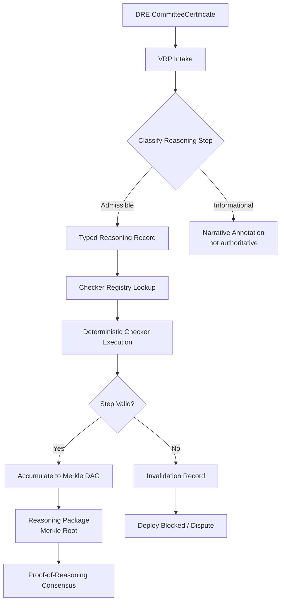
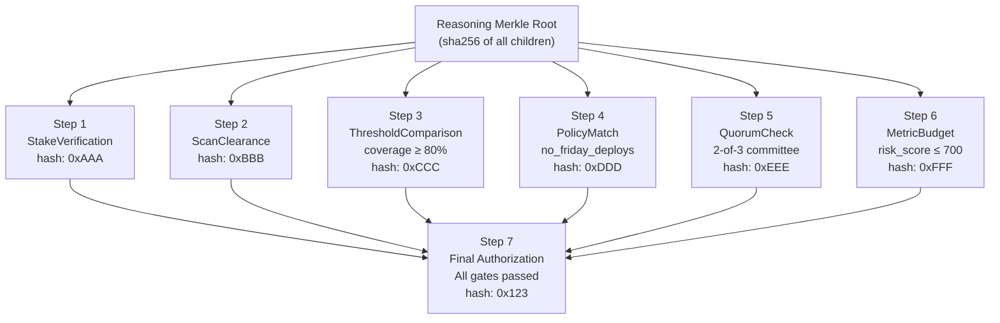
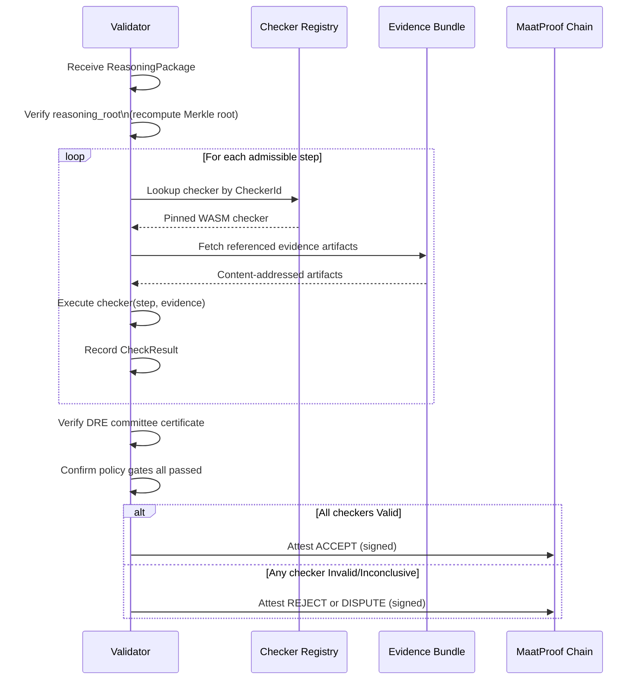

# Verifiable Reasoning Protocol (VRP) Specification

## Overview

The Verifiable Reasoning Protocol (VRP) defines how every deploy-authorizing reasoning step is
represented as a typed, machine-checkable record — and how validators independently verify that
the conclusion follows from the evidence and policy.

Integrity is not enough. A hashed reasoning trace proves a trace was not modified, but it does
not prove the trace is logically correct. The VRP closes this gap.

## Whitepaper Reference

Section 3.5 — "Verifiable Reasoning Protocol (VRP)"

> "MaatProof separates reasoning into two classes: Admissible reasoning — machine-checkable
> steps that may authorize deployment. Informational reasoning — narrative explanations that are
> useful for humans but are not authoritative. Only admissible reasoning may finalize a production
> deploy."

## Architecture



## Reasoning Record Types

Every admissible reasoning step is represented as a typed record with five required fields:

```rust
#[derive(Serialize, Deserialize, Clone)]
pub struct ReasoningRecord {
    /// Unique step identifier (content-addressed)
    pub step_id: [u8; 32],

    /// References to prior steps or input evidence this step depends on
    pub premises: Vec<PremiseRef>,

    /// The specific inference rule being applied
    pub inference_rule: InferenceRule,

    /// Content-addressed links to underlying artifacts
    pub evidence_references: Vec<EvidenceRef>,

    /// The claim that follows from applying the rule to the premises
    pub conclusion: Conclusion,

    /// Identifies the deterministic verifier that validates this step
    pub checker_id: CheckerId,
}

#[derive(Serialize, Deserialize, Clone)]
pub struct PremiseRef {
    /// Step ID of the prior record, or evidence hash for base facts
    pub ref_id: [u8; 32],
    pub ref_type: PremiseType,
}

#[derive(Serialize, Deserialize, Clone, PartialEq)]
pub enum PremiseType {
    PriorStep,
    EvidenceArtifact,
    PolicyRule,
    EnvironmentFact,
}
```

## Inference Rules (Admissible)

Only the following rule types produce admissible reasoning that may authorize deployment:

| Rule Type | Description | Checker |
|---|---|---|
| `ThresholdComparison` | Numeric value meets minimum/maximum | `threshold_checker` |
| `PolicyMatch` | Policy rule evaluates to true | `policy_eval_checker` |
| `SignatureVerification` | Ed25519 signature valid over payload | `crypto_checker` |
| `QuorumCheck` | N-of-M committee agreement confirmed | `quorum_checker` |
| `MetricBudget` | Deterministic risk score within threshold | `risk_score_checker` |
| `HashEquality` | Two content addresses are equal | `hash_checker` |
| `ScanClearance` | Security scan finds zero critical findings | `scan_checker` |
| `StakeVerification` | Agent stake meets minimum requirement | `stake_checker` |
| `RollbackReady` | Rollback artifact and thresholds declared | `rollback_checker` |

```rust
#[derive(Serialize, Deserialize, Clone)]
pub enum InferenceRule {
    ThresholdComparison { metric: String, operator: CompareOp, threshold: i64 },
    PolicyMatch { rule_id: String, policy_hash: [u8; 32] },
    SignatureVerification { signer_did: String, payload_hash: [u8; 32] },
    QuorumCheck { required: usize, achieved: usize, total: usize },
    MetricBudget { score: u32, max_allowed: u32 },
    HashEquality { left: [u8; 32], right: [u8; 32] },
    ScanClearance { scanner_id: String, severity_cap: Severity },
    StakeVerification { agent_did: String, staked: u64, required: u64 },
    RollbackReady { artifact_hash: [u8; 32], thresholds_hash: [u8; 32] },
}
```

## Reasoning Classes

### Admissible Reasoning

Admissible reasoning steps are:
- Typed against one of the InferenceRule variants above
- Independently verifiable by a registered Checker
- Included in the Merkle DAG as authoritative nodes
- The only basis on which a production deployment may be authorized

**Rule:** A production deployment is authorized if and only if all required admissible reasoning
steps are present in the Merkle DAG and all checkers return `Valid`.

### Informational Reasoning

Informational reasoning includes:
- LLM narrative summaries ("The test suite passed, indicating stable behavior…")
- Diagnostic explanations of why a rule passed
- Change impact descriptions
- Risk assessments in natural language

Informational reasoning:
- Is captured in the trace for human auditability
- Is stored outside the Merkle DAG (in a sidecar annotation list)
- **Cannot authorize or block a deployment**
- Cannot be elevated to admissible status at runtime

```rust
#[derive(Serialize, Deserialize)]
pub struct InformationalAnnotation {
    pub annotation_id: [u8; 32],
    pub related_step_id: Option<[u8; 32]>,
    pub content: String, // Free-form narrative
    pub source_model: String,
    pub timestamp: u64,
}
```

## Evidence References

Every admissible reasoning step must link to content-addressed evidence:

```rust
#[derive(Serialize, Deserialize, Clone)]
pub struct EvidenceRef {
    /// IPFS CID or local content hash
    pub content_address: String,

    /// Type of evidence artifact
    pub artifact_type: EvidenceType,

    /// SHA-256 of the artifact content
    pub sha256: [u8; 32],
}

#[derive(Serialize, Deserialize, Clone)]
pub enum EvidenceType {
    TestOutput,
    ScanReport,
    BuildArtifact,
    PolicyContract,
    EnvironmentSnapshot,
    StakeRecord,
    CommitteeCertificate,
    RollbackManifest,
    HumanAttestation, // when human approval is a declared policy gate
}
```

## Checker Registry

Checkers are deterministic programs registered on-chain. Each checker maps to a `CheckerId` and
is versioned. Validators use the same pinned checker version referenced in the reasoning package.

```rust
#[derive(Serialize, Deserialize, Clone, PartialEq, Eq, Hash)]
pub struct CheckerId {
    pub name: String,
    pub version: String,
    pub wasm_hash: [u8; 32], // Content hash of the WASM checker binary
}

pub trait Checker: Send + Sync {
    fn check(
        &self,
        record: &ReasoningRecord,
        evidence: &EvidenceBundle,
    ) -> CheckResult;
}

#[derive(Serialize, Deserialize)]
pub enum CheckResult {
    Valid,
    Invalid { reason: String, evidence_hash: [u8; 32] },
    Inconclusive { reason: String },
}
```

## Merkleized DAG Structure

The full reasoning package is committed as a **Merkleized DAG**, not a linear hash chain. This
enables selective disclosure, partial proof generation, and independent invalidation at audit time.



### Merkle Root Computation

```rust
pub fn compute_reasoning_root(steps: &[ReasoningRecord]) -> [u8; 32] {
    // Sort steps by step_id for canonical ordering
    let mut sorted = steps.to_vec();
    sorted.sort_by_key(|s| s.step_id);

    // Leaf hashes: sha256(step_id || inference_rule_hash || evidence_hash)
    let leaves: Vec<[u8; 32]> = sorted.iter()
        .map(|s| sha256(&[
            s.step_id.as_slice(),
            &hash_inference_rule(&s.inference_rule),
            &hash_evidence_refs(&s.evidence_references),
        ].concat()))
        .collect();

    merkle_root(&leaves)
}
```

## Reasoning Package

The complete output of the VRP is a `ReasoningPackage` consumed by Proof-of-Reasoning Consensus:

```rust
#[derive(Serialize, Deserialize)]
pub struct ReasoningPackage {
    /// The PromptBundle that initiated reasoning
    pub prompt_bundle_hash: [u8; 32],

    /// DRE committee certificate
    pub committee_certificate: CommitteeCertificate,

    /// All admissible reasoning steps
    pub admissible_steps: Vec<ReasoningRecord>,

    /// Informational annotations (non-authoritative)
    pub informational_annotations: Vec<InformationalAnnotation>,

    /// Merkle root over admissible_steps
    pub reasoning_root: [u8; 32],

    /// Evidence bundle (content-addressed artifacts)
    pub evidence_bundle: EvidenceBundle,

    /// The final authorization decision
    pub authorization: AuthorizationDecision,

    /// VRP version
    pub vrp_version: String,
}

#[derive(Serialize, Deserialize)]
pub struct AuthorizationDecision {
    pub authorized: bool,
    pub decision_tuple_hash: [u8; 32],
    pub all_checkers_passed: bool,
    pub failed_checkers: Vec<CheckerId>,
    pub timestamp: u64,
}
```

## Validator Verification Flow



## Partial Proof and Selective Disclosure

The Merkleized DAG structure enables:

1. **Selective disclosure** — share proof that a specific policy gate passed without revealing other gates
2. **Partial proof** — a third-party auditor can verify one branch of the DAG independently
3. **Independent invalidation** — a single step can be flagged as invalid without re-evaluating the whole package

This is essential for regulated environments (HIPAA, SOX) where full trace disclosure is not permissible
but audit evidence of specific compliance gates is required.

## Security Considerations

### Checker Pinning

- All checkers are identified by `wasm_hash` — an attacker cannot swap a checker binary
- Checker updates require on-chain governance vote
- Validators reject reasoning packages that reference unregistered or deprecated checkers

### Evidence Tampering

- Every evidence reference includes a `sha256` — the validator re-hashes the fetched artifact
- A mismatch causes immediate step rejection
- IPFS content addressing provides additional tamper evidence

### Informational Poisoning

- A malicious agent cannot embed authorization logic in informational annotations
- The VRP enforces structural separation at parse time
- Any step lacking a valid `InferenceRule` variant is classified as informational and stripped

## Environment Configuration

<!-- Addresses EDGE-001 through EDGE-078 (VRP Configuration edge cases) -->

Per-environment configuration for the VRP system (validator endpoints, signing key references,
MAAT stake thresholds, quorum requirements, feature flags) is defined in a separate spec:

**See: [`specs/vrp-config-spec.md`](vrp-config-spec.md)**

That spec defines:
- TOML/YAML configuration schema for dev, staging, and production environments
- Environment-specific invariants (verification level, quorum threshold, stake minimums)
- Azure Key Vault URI format and secret management rules
- Feature flag security constraints
- Startup validation flow and error codes
- Config audit trail requirements

## References

- Whitepaper §3.5 — Verifiable Reasoning Protocol
- Whitepaper §3.6 — Proof-of-Reasoning Consensus
- [`specs/vrp-config-spec.md`](vrp-config-spec.md) — VRP Configuration (issue #116)
- [`specs/vrp-data-model-spec.md`](vrp-data-model-spec.md) — VRP Data Model (issue #31)
- Proof-carrying code [13]: Necula, 1997
- Proof-carrying code completions [14]: Kamran et al., 2024
- zkLLM [16]: Sun et al., 2024
- End-to-end verifiable AI pipelines [17]: Balan et al., 2025
